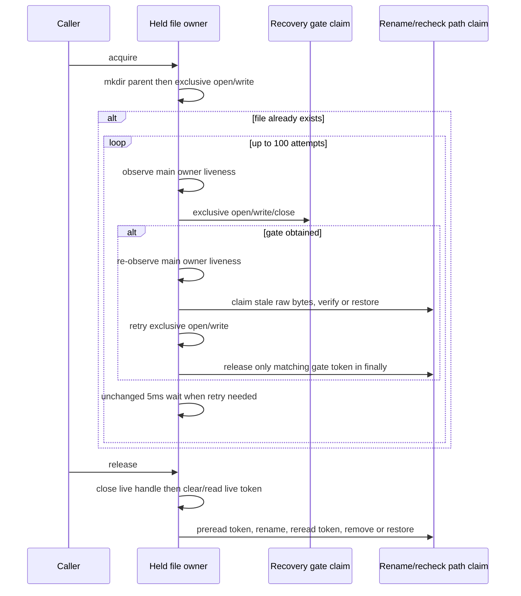

# Data-root lock acquisition, recovery gate and path claims

Continue the same native branch/PR after the complete diagnostic export batch
`33f812b483582dd6a6152618b4a57406b94a15ea`. Select the whole
`packages/server-cli/src/runtime/lock.ts`. Bounded source reconciliation finds its
renamed upstream record at packages/zcode-server-cli/src/runtime/lock.ts. Replacing
only the three Knorvia Studio Server literals with ZCode Server reproduces exactly
7257 bytes and recorded SHA256
`514b56ea3c44e2d4da1d7c47699d5eda7a7a010625e48451e0b5a23df2aea825`.
Current unreviewed/null-upstream inventory is not evidence of an independent
candidate. No matching accepted receipt/history replacement surfaced.

One mutable held-file owner controls the existing handle/token pair. One path
claim owns each atomic rename-to-quarantine/restore-or-remove transaction. Pure
record parsing remains separate from native IO. Gate operations retain their
existing finite sequencing; no new second lock/session/process authority.

Keep exact DataRootLockInspection union and exported DataRootLock class surface:
constructor(path), inspect(), acquire(), release(), public isHolderAlive(pid).
Preserve public method receiver/override behavior in internal liveness calls.
No export/signature/schema/data format changes. Stored lock JSON remains ordered
pid, acquiredAt(Date.now), ownerToken(randomUUID), followed by LF; mkdir parent
recursive/mode0700 and open wx/mode0600. All path suffixes/messages/numbers/ordinary
native expressions remain retained compatibility material, not originality proof.

inspect reads UTF8: Error+code ENOENT ->missing, any other IO failure unreadable
with original error. JSON parse failure invalid. Only non-null object with pid
number/integer/>0 is valid; isHolderAlive decides active/stale with that PID.
Alive returns false for undefined, true for current process.pid, otherwise calls
process.kill(pid,0), true on success, and true only for Error+code EPERM on failure.
Preserve native throw/accessor behavior, without PID normalization/process epochs.

Exclusive main attempt creates UUID before IO; open then write receipt, install
handle/token only on successful write. Error+EEXIST returns false immediately,
including an unusual write EEXIST without new cleanup. Other failures best-effort
close, read main owner; if matching attempt token invoke token release (which
rechecks), then throw original error unless awaited cleanup fails first.

Acquire mkdirs then tries main once. On collision loop exactly100: read owner;
if present and alive throw exact busy message. Attempt gate at path+.recovery;
no token waits5ms then next iteration. If token: inside try reread main owner,
throw busy if alive; stale observation invokes raw-byte path claim; try main once,
return on success. Finally always release owned gate token. If no acquisition
wait5ms then repeat; exhaustion throws same busy error. No eager retry, deadline,
backoff, cancellation, heartbeat or forced deletion.

Gate creates UUID, opens wx0600, writes same receipt, awaits close and returns
token; finally best-effort closes again. Non-EEXIST failure first best-effort
closes, reads owner, releases matching token, then throws (with existing awaited
cleanup precedence), and finally closes again. EEXIST exits through finally,
then reads gate owner. Missing/stale gate returns null; if stale observation is
present claim raw bytes first. Active gate also returns null. Preserve the two
successful close observations and every existing error/clock/UUID order.

read-owner catches IO to null; JSON parse/access errors return {raw,record:{}}.
Otherwise ownerToken admitted only string and pid only number/integer/>0, in
that property order. Primitive/null/array JSON keeps its existing native results.
No malformed-record deletion policy or schema upgrade.

Stale claim constructs path.stale-pid-UUID, renames; Error+ENOENT returns, others
throw. Read quarantined raw UTF8 catch-null. Exact expected raw means rm force
(errors propagate); mismatch/missing means rename back catch-ignore. Token release
prereads owner; mismatched token returns before UUID/rename. Construct path.release-
pid-UUID, rename any failure returns. Reread claimed owner; matching token rm force,
else restore catch-ignore. Protect later owners with both preread and post-rename
checks; do not use observation alone as deletion authority.

Release awaits the live stored handle.close best-effort, clears handle, then reads
and clears the live token, releasing when truthy. Preserve this ordering even if
another call changes ownership during the close await; no new memoized release,
captured-on-entry token, implicit reference count or concurrency policy.

## Startup facade and source decision

startupRecovery.ts also has an exact renamed upstream match after its single
product-label normalization:739 bytes, SHA256
`0bb40677b5a0c0ae7eb76ae62fa860c0b9374d7c499d33e3b1d71912a5dcb88a`.
Its 23-line flow checks the uninstall marker (only Error ENOENT accepted), then
delegates recoverInterruptedUpdate, awaits failure notification and rethrows with
the existing callback-error precedence. It contains no separate recovery algorithm
or mutable owner: that authority remains ReleaseManager. Retain the exact facade,
count zero new reconstruction/originality credit and record its digest/mapping.
This is a retained compatibility surface, not independent-source/MIT acceptance.
Integration must add the missing renamed source relationship and decide expression/
rights disposition; it must not mark unreviewed as original automatically.

## Deferred evidence

Same source-exposed agent curated and authors complete held-file/path-claim/gate
implementation; no isolated/fresh author or whole-file independence/rights grant.
Add just two supplied-filesystem/process/UUID/clock scenarios for uncontended
receipt/release/liveness and stale recovery/post-rename later-owner protection.
All unrun; no actual lock, process.kill, timer, filesystem/user data, application
or local-computer operation. No tests, lint, types, build, format/architecture/full
audit. Freeze full draft, exact selected current/upstream records and retained
facade/callers before source diff. Global source/license records stay untouched;
final integration owns consumer/platform and expression/rights acceptance.

## Authorized final-stage fixture repair

Read the final native-selected failure record at integration commit
19f6ccf74ba1064ca81d93194b4f25a36030e361: fourteen supplied-port scenarios,
twelve passed and two lock fixtures failed to load (duplicate port declaration),
log SHA2568bdb3c3bf13a1195ff0069344dc50fa6faadf66586d8d7aef9a9cd3daddec00a.
The current root runner admits packages/server-cli/test through its ordinary
discovery; do not change that integrator-owned entry or run the complete runner.
Selected lock/test bytes match this lane at f7ad7efa3e5e1bec72eaba818db6bce43fa33d97.

esbuild treats banner as raw output text, outside its symbol renaming. The
inherited fixture banner declares const port, while bundled virtual modules emit
var port in the same final ESM scope. Give only the banner's supplied-state binding
a unique fixture identifier. Keep virtual imports, fake IO/process/clock/UUID,
both scenarios and all assertions exact; production lock/contracts are unchanged.

Parent has entered final concentrated acceptance and now explicitly authorizes
only the two affected lock scenarios. Run their single file under pinned Node
24.14.0 with isolated temporary test tools; record actual command, versions,
source digests and actual test-runner output. No full suites, lint, types, product builds or
global provenance audit in this lane. Passing these supplied-port scenarios
does not establish real filesystem/process/platform, whole-tree or MIT acceptance.
Deliver a new commit on the same branch for integration PR13; PR17 stays closed.
