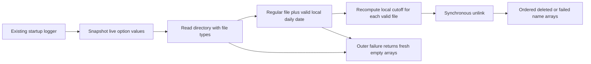

# Desktop daily-log retention owner

Continue the persistent native branch/PR after
`d926f6f2f843f12f6499d34c74acb33c42dee4c1`. Select only
`packages/desktop/src/main/logRetention.ts`. Its current bytes still match the
recorded unchanged upstream blob/digest. Bounded receipt/review search surfaced
no installed whole-owner replacement or HOLD for this exact source. Do not
replace the already installed data-size scanner/client owners; their exact
root-data-preview receipt remains inheritance with zero new credit.

The existing logger invokes retention synchronously at startup. Keep that API;
no timer, asynchronous migration, new cleanup authority, logger/export/feedback
behavior, UI or log-format change is authorized. Same source-exposed author
curates behavior and authors the whole policy/traversal candidate; this is not
an isolated-author, origin/rights or MIT decision.

Retain exported `LOG_RETENTION_DAYS=14` and `cleanupExpiredLogFiles(logDir,
options?)` returning `{deletedFiles:string[],failedFiles:string[]}`. Options
read `now` then `retentionDays`, each using nullish default; their getter errors
escape before the filesystem try. Preserve the original Date reference and
retention number without validation/clamping beyond the cutoff formula. No
public types or exports are added.

Inside the outer try allocate result arrays and read `readdirSync(logDir,
{withFileTypes:true})`. Traverse in returned order. Invoke `entry.isFile()` with
the entry receiver before reading its name; directories/symlinks are ignored.
Accept only `^(\d{4})-(\d{2})-(\d{2})\.log$`, in that case and with complete
anchor matching, including native JavaScript `$` acceptance before a final
newline; the raw entry name still reaches join/unlink. Convert year/month/day
with Number, create the native local
Date(year,month-1,day), then reject any year/month/day rollover, including native
0..99 year adjustment. Ignore malformed/impossible names, other extensions or
suffixes. No stat, recursive traversal, path validation or hidden-file policy.

For each valid name create a local midnight Date from the live `now` getters,
then setDate(current day - Math.max(retentionDays-1,0)). Delete only fileDate <
cutoff. Keep cutoff equality, future files, native fractional/negative/NaN/
infinite-number and invalid-Date behavior; calendar arithmetic preserves DST
semantics. Do not precompute cutoff once: a caller-held Date mutated during an
earlier unlink affects later comparisons exactly as before.

Only after expiry admission join logDir with a fresh entry.name read. Join and
all metadata/date errors belong to the outer try. Within the per-file try unlink
synchronously then push another live entry.name into deletedFiles. On any inner
failure append the current name to failedFiles and continue. Preserve the member
receiver/entry-name read points and ordered results. Any outer failure returns
two fresh empty arrays, even if an earlier deletion already happened; no partial
result repair, fallback or extra filesystem action is introduced.

Author four fake-filesystem scenarios for local cutoff/valid names, per-file
failure/continuation, outer failure reset versus option getter propagation, and
live Date mutation across deletions. All are unrun. Freeze the complete draft
and retained logger caller bytes before source diff. No tests, lint, types,
builds, format/architecture checks or audit; no actual log directory/files,
application, UI, user data or local-computer operation. Final integration owns
native/platform/consumer acceptance and source/rights review. Existing licensing,
attribution and global inventory remain untouched.
