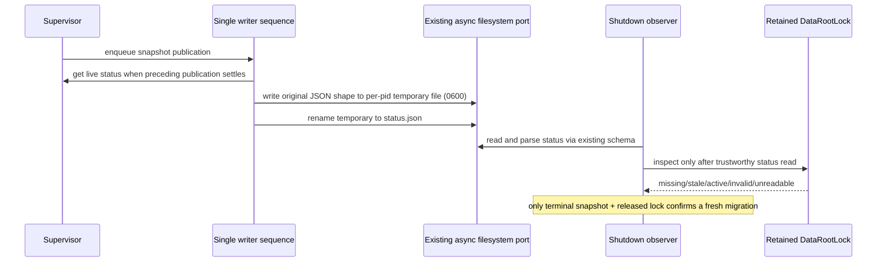

# Supervisor snapshot persistence and shutdown confirmation

Continue the native lane on `rewrite/native-20261003` / draft PR #17. Select only
`packages/server-cli/src/runtime/statusSnapshot.ts` and `shutdownWait.ts`; both
current blobs still match the recorded renamed-upstream snapshot, with no
matching accepted owner receipt in the bounded search. Retain the unreviewed
DataRootLock, startup recovery and service-installation implementations pending
origin reconciliation rather than inferring that missing reviews make them new
or requiring another rewrite. No other lane, global policy or schema is edited.

## Behavior and ownership

One writer sequence owns the append-only chain of snapshot publications. A read
operation owns only its current observation. The existing DataRootLock owns lock
inspection; Supervisor retains its lifecycle admission, generation, Core and
accepted business state. Shutdown observation combines status and lock facts;
neither alone grants service migration or offline uninstall admission.

`readPersistedStatusDetailed(layout)` returns exactly:

- `{state:'valid',status}` with the existing schema's exact parsed result.
- `{state:'missing',status:null}` only for a file-read Error whose code is ENOENT.
- `{state:'unreadable',status:null,error}` for every other file-read failure,
  preserving the exact thrown value.
- `{state:'invalid',status:null,error}` for JSON or schema failure, including an
  ENOENT-shaped parsing exception. Never confuse parsing failure with missing IO.

The filesystem call is `readFile(layout.statusFile,'utf8')`. Layout/getter/native
throws remain caught by that read boundary. JSON.parse precedes schema.parse;
do not add validation, normalization, legacy fallback or file migration.
`readPersistedStatus(layout = resolveServerLayout())` keeps the same public
Promise/status/null surface and delegates once to the detailed read.

`createStatusPersister<T>(statusFile,getStatus,onError)` returns an async no-arg
publication callback. Every invocation appends to one initially resolved Promise
chain. When its predecessor fulfills, form `${statusFile}.${process.pid}.tmp`,
then invoke getStatus unbound at execution time, stringify with two-space indent
and trailing newline, await writeFile with `{encoding:'utf8',mode:0o600}`, then
await rename to the supplied statusFile. Never capture the status at enqueue,
coalesce/drop writes, start parallel writers, add fsync/mkdir or clean up failed
temporary files. Get/JSON/write/rename failures pass unchanged to the unbound
onError callback. A returning callback recovers the chain; its thrown/rejected
failure leaves the next queued work skipped until a later onError invocation
recovers it. Preserve native Promise assimilation and separate caller awaits.
Snapshot keys/version, existing data paths and temporary-file naming are fixed.

`waitForServerStopped(layout,minUpdatedAt=0,requireFreshSnapshot=false)` sets
deadline to Date.now()+6000 and checks Date.now()<deadline before each iteration.
Read detailed status first. Invalid/unreadable status throws
`Cannot verify Server shutdown status` and never inspects the lock. Construct a
fresh existing DataRootLock(layout.lockFile) each iteration, then await inspect.
Invalid/unreadable lock throws `Cannot verify Server shutdown (${description})`
using the unchanged describeLockInspection port. Evaluate released state, then
terminal status, then freshness in that order. Released means only missing/stale;
terminal means only stopped/uninstalled; fresh means nonnull status with
updatedAt strictly greater than minUpdatedAt. Return only when released and
(terminal and (fresh or freshness not required)), or released + missing status
when freshness is not required. Otherwise await a referenced 100ms timer and
retry. On deadline throw `Timed out waiting for Server shutdown (${statusFile})`.
Preserve current file/schema/inspection/description/native throws; no capability,
PID policy, timeout normalization or permission change. Lock source remains exact.

Implement the read with one explicit IO-versus-parse phase boundary, the writer
as a private sequence owner, and confirmation as a pure predicate over the two
observations. These complete candidates are authored from this contract by the
same source-exposed agent and frozen before source diff. No clean-room, rights or
MIT acceptance follows, including for the preserved schema and ordinary idioms.

## Deferred acceptance

Author fake-port scenarios for missing/invalid/unreadable distinctions and error
identity, deferred live snapshot reads and serial write/rename, failure recovery,
failure-callback poisoning/recovery, terminal/freshness/released-lock admission,
fail-closed observation order and exact deadline/polling. Do not execute them at
this stage. No tests, lint, types, builds, format/architecture checks or full audit.
No real processes, locks, filesystem/data directories, services or user data.
Final integrator must include server-cli tests in its root entry and verify real
CLI/Supervisor consumers, atomic file replacement and supported OS behavior.
