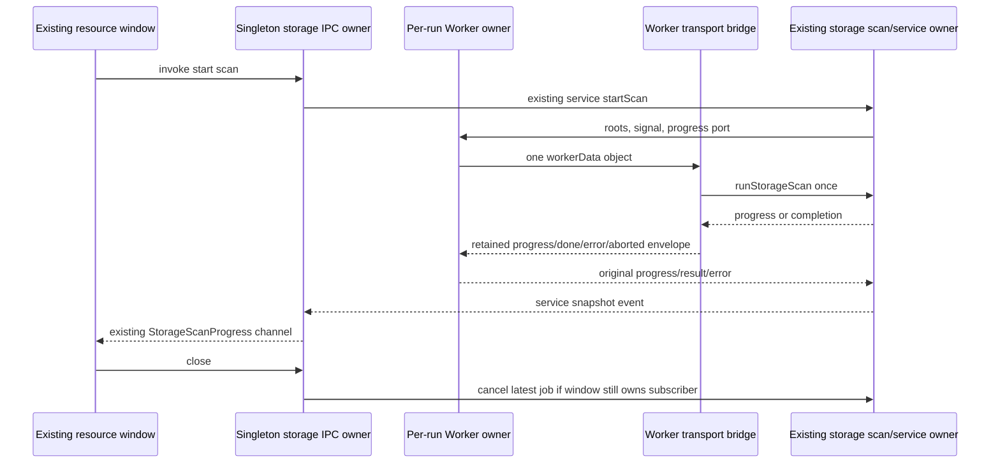

# Desktop storage worker and IPC ownership

Continue `rewrite/native-20261003` / draft PR #17 from lane checkpoint
`85ea4dcf9d0da20c14a487caaafc677a2f81f047`. Parent corrected the desktop allocation:
`packages/desktop/**` excluding every renderer path is this native lane.
Select complete `src/main/storageScanWorkerClient.ts`, `storageScanWorker.ts`
and `resourceManagerStorage.ts`. Their current source digests match recorded
upstream-modified snapshots and history contains only the initial snapshot;
bounded exact-path receipt search found no accepted installed replacements.
This is a selection observation, not independent origin/rights acceptance.
Retain storageScanWorkerProtocol, services storage algorithms, shared schemas,
renderer/preload, logger and all business owners. Same source-exposed author
curates and implements from this contract; no clean-room claim.

## One owner and event order

Main retains one service, latest job id and subscriber, with one roots resolver
created at module import from homedir/getDataBaseDir. Scan/service/cleaner and
protocol validation remain canonical public dependencies. Implement one private
IPC owner, one private per-run Worker owner and one Worker-entry bridge. No
accepted queue, service business state, second scan algorithm or hidden fallback.
Desktop continuous and mobile replayable RPC ownership remains untouched; this
is resource-manager invoke/Worker transport, not either session runtime.

## Worker runner contract

`createStorageScanWorkerRunner(options={})` snapshots URL and interval once:
workerUrl nullish defaults to new URL('./storageScanWorker.js',import.meta.url),
interval nullish defaults to 300. Return a plain object with one run function.
Each invocation returns a native Promise and creates exactly one Worker inside
its executor with `{workerData:{roots,progressIntervalMs}}`, retaining roots and
URL references. Constructor throws reject that Promise. No deduplication/retry.

Each run owns settled=false, latest nullable grace timer, abort callback and
Worker listeners. Register message, once-error, once-exit in that order before
examining signal.aborted. Retained message guard is the only admission check.
Progress is forwarded unbound only before settlement; exceptions propagate from
event delivery. Done resolves its exact progress; aborted rejects a new
DOMException('storage scan aborted','AbortError'); error rejects
Object.assign(new Error(message.message),{code:message.code}), retaining an own
undefined code. Nonzero exit rejects `storage scan worker exited with code ${code}`;
zero exit remains pending. Native Worker error is rejected by identity.

First settlement marks settled, removes the abort callback from the supplied
signal, clears a truthy current grace timer, invokes Worker.terminate without
awaiting/observing its returned Promise, then invokes the result callback.
Cleanup throws still prevent result delivery; repeated finish calls do nothing.
Do not remove other Worker listeners or suppress termination rejection.
If initially aborted, finish immediately after listener installation and return
without adding abort listener/unref. Otherwise add once-abort and Worker.unref.
An abort event first postMessages `{type:'abort'}`, then sets a 500ms timeout and
optionally calls its unref. Timer expiry finishes with AbortError. Post failure
does not get a new catch/rejection path. Completion during grace keeps its
original done result; no newly introduced cancellation priority or hardening.

## Worker-entry contract

Do nothing on main thread or null parentPort. On a worker with port, capture the
port once and create one AbortController. Register message callback before
invoking runStorageScan once. Retained command guard plus type abort calls
controller.abort. Input order and fields remain roots (same reference cast to
StorageRootSpec[]), signal, interval, onProgress. Progress sends
`{type:'progress',progress}`; fulfilled scan sends `{type:'done',progress}`.
Use the existing Promise then/catch chain so a thrown done post also follows
the rejection projection. Synchronous scan construction errors still escape.
Failure first checks Error/name AbortError, then computes Error.message or
String(error), then code only for a truthy object with a string code. Post
`{type:'aborted'|'error',message,code}`, including own undefined code. No scan,
port close, timeout, real filesystem walk or controller policy replacement.

## Singleton storage IPC contract

Register five handles in existing order and preserve callback arities:
StorageStartScan(1), StorageCancelScan(2), StorageGetSnapshot(0), StorageClean(2),
StorageRevealPath(2). No new handler cleanup or sender/frame authorization.
On first service use, createStorageService with properties in order roots,
scanRunner:createStorageScanWorkerRunner(), cleaner:createFsStorageCleaner().
Store the exact returned service before subscribing once to onScanProgress.
Send snapshots unchanged only to the current nondestroyed subscriber, preserving
WebContents.send receiver and the existing channel. Service creation/subscription
throws retain their current timing and partial singleton assignment.

Binding an event is a no-op when its sender is the current subscriber. Otherwise
assign sender before BrowserWindow.fromWebContents and attach optional once-closed.
The callback compares the current subscriber to the event's **live** sender,
clears subscriber, and when both latest job and service are truthy calls
cancelScan without awaiting then clears job. A throw from cancelScan prevents
that final clear. Previous-window closures must not cancel the new subscriber.
Keep the existing lack of additional resource-window validation.

Start binds subscriber, awaits service.startScan(), stores result.jobId and
returns the exact result. Concurrent starts retain completion-order assignment.
Cancel is a no-op without service, otherwise awaits cancelScan(jobId) and clears
latest only when equal at that later point. Snapshot returns service.getSnapshot
or null without constructing service. Clean binds and delegates the exact request
without introducing job state. Reveal awaits the existing roots resolver **before**
type checking the path. Resolve target; roots.some resolves each root.path then
relative; accept empty relative or one neither starting '..' nor absolute.
Warn `[resource-manager] refused to reveal path outside storage roots` with
`{absolutePath}` on denial, otherwise call shell.showItemInFolder with the original
supplied path. Preserve errors, path/native behavior, and no mutation of data.

## Deferred verification

Add bounded fake Worker/port/IPC scenarios for first settlement, progress and
abort/grace races, listener order, identity/error envelopes, singleton/subscriber
switching and root-scoped reveal. These are authored and not run. No tests,
lint, types, builds, architecture/format checks or audits are executed. Source
reading, diff review, exact draft/dependency byte bindings and Git/remote metadata
only. No actual Worker, scan, data cleanup, filesystem/user data, Electron app,
shell reveal or local computer operation. Final integration owns real services,
IPC/native platform and source/rights/MIT acceptance. No root inventory change.
