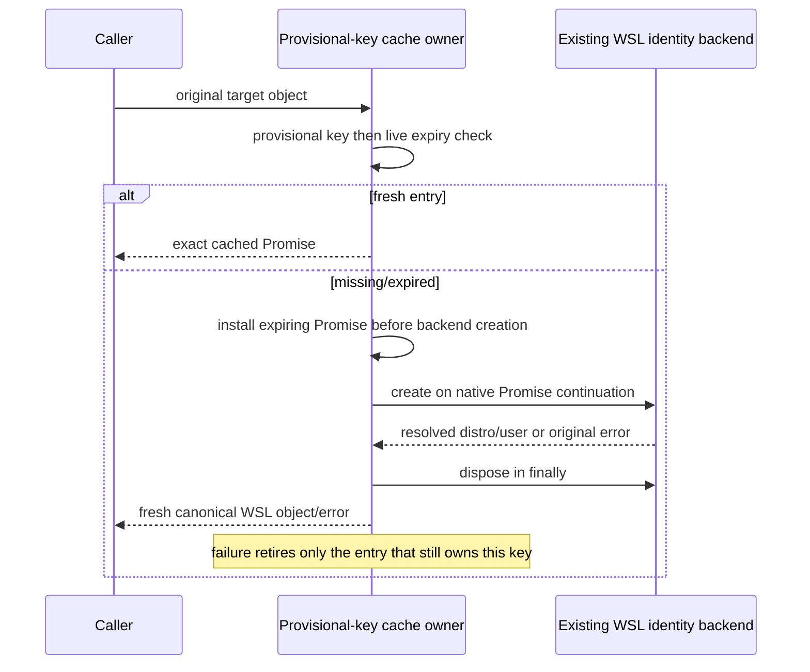

# Desktop WSL identity-resolution cache

Continue the same native branch/PR after
`bc5c7646de14ce2f4ace4bb43cb642b7af9314a5`. Select only
`packages/desktop/src/main/desktopWslTargetResolver.ts`. Its source still matches
the upstream-modified recorded digest, with only snapshot history and no matching
installed replacement receipt in the bounded search. Preserve RemoteTarget and
the existing WSLBackend public route/authority. No WSL command, provider/service,
UI, credential, workspace identity format or global source decision is changed.
Same source-exposed agent curates and authors the full cache owner; no isolated
author/independence/rights claim.

Public surface remains the exported const `resolveCanonicalWslTarget` with
`(WslTarget)=>Promise<WslTarget>`. Preserve private options/dependency surfaces,
while choosing one private cache owner. Factory snapshots createBackend first
(default new WSLBackend(target)), then ttl=Math.max(1,Math.floor(ttlMs??5000)),
then now=provided function or Date.now. NaN/infinity remain native; functions are
called unbound. No input validation or TTL normalization beyond this existing
formula. Build key at call time from trimmed/lowercased distro, then trimmed
case-sensitive user, each falsy value replaced by `<default>`, separated by NUL.
No remote schema change, path normalization, credentials or target cloning.

Read the Map once. Fresh means entry.expiresAt > now(), with now read only if an
entry exists; return its exact Promise by identity. For a miss/expiry read now
again for expiresAt=now()+ttl. Create Promise.resolve().then(async...), store
the entry immediately and register rejection retirement before returning it.
Native microtask ordering delays backend creation until after call/installation.
The callback gets the original live target reference. Create backend before try;
creation errors reject without disposal. Within try await resolveIdentity using
backend receiver, then return fresh `{kind:'wsl',distro:identity.distro,user:identity.user}`
in that order. Finally dispose with backend receiver; disposal failure can
override either success or the original failure. Preserve original values and
errors, without second cache, lease, connection, retry or fallback.

On rejection delete only if the Map still contains that exact entry. An expired
older request's failure must not erase a newer pending/success entry. Keep expired
success entries until replacement; no timer, eager purge, cancellation or error
cache is introduced. Native synchronous key/getter errors still escape the
non-async exported resolver. Desktop/mobile RPC remain existing owners.

Add three fake-backend/clock scenarios for Promise/reference identity, deferred
construction/live target reads, strict TTL boundary, pointer-safe late failure
and dispose error priority/retry. All are authored and unrun. No tests, lint,
types, builds, architecture/format checks or audit. Only source/diff reading,
draft/dependency byte binding and Git/remote metadata. No actual WSL, subprocess,
connection, filesystem, account, UI, user data or local computer operation.
Independent expression, provenance/rights and native/consumer acceptance remain
with final integration; no MIT or global inventory update.
