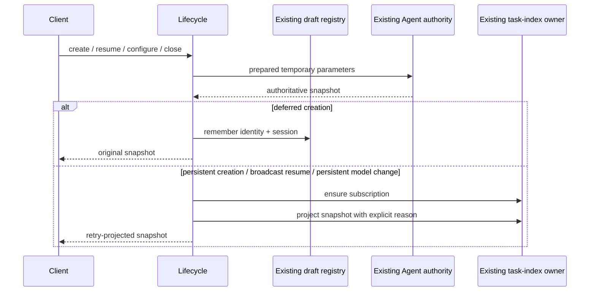

# Session lifecycle replacement contract

Baseline: `3b1ff0f715a43cbc51c576fd524479a08e58e203` on
`integration/backlog-20261003`. This continuing services lane owns
`packages/services/**` and `packages/provider/**`. The user explicitly allocates
sessionService/taskIndexSyncer implementation in this task, while requiring any
actual rights evidence HOLD to remain. The historical allocation/origin record is
retained at `packages/services/docs/NEXT-SERVICES-OWNER-HOLD-20261003.*`.

The exact sessionService predecessor is blob
`61db9dc9481ef85eb32bf05a70a0f9c3505367fc`, SHA-256
`dbbd02c0aa1d5ceee811e36d32beb40c1a50b31ef75f7db8c1a1f0dfd3d16199`.
Its recorded unreviewed/upstream-null/NOASSERTION facts are not evidence of
independent authorship. The new allocation permits implementation, without
clearing origin/rights review or accepting a historical private version. Global
licensing records and third-party notices remain owned by the integrator.

## Ownership and design

Keep the existing public factory and all fifteen service operations. Reconstruct
the complete operation coordinator from this behavior contract. Each factory has
one existing deferred-draft registry and one existing retry tracker. The Agent
continues to own sessions, settings and accepted inputs. The task-index syncer
continues to own subscriptions, repository projection and workspace events.
Stateless preparation/policy code owns no session cache, queue or persistence.

Use an operation projection port for subscription/publication and a common
retry/repair read pipeline. This replaces the inherited monolithic arrangement;
no inherited method is moved into a new file as the implementation strategy.
The author has read predecessor source to extract behavior and compare the
result. This is source-exposed authoring, not a clean-room assertion. Public
types, log messages, model encoding, workspace keys and policy values retain
their existing lineage and carry no independent-expression credit.

Desktop remains continuous. Mobile replay stays in the existing task/runtime
ports; promotion clears the same draft flag, while resume with snapshot broadcast
disabled avoids publishing an old terminal snapshot over a newly admitted input.
No new owner/lease, stream, snapshot schema or accepted-input path is introduced.

## Command behavior

- `initializeWorkspace` awaits Agent initialization with the original parameter
  object. Only an available result enables the workspace subscription, passing
  workspace path and identity. Return the original result. Runtime identity,
  workspace presentation, session list, message list and event list forward the
  same parameters and result promises directly.
- MCP preparation on create/resume first optionally obtains the creation server
  for a local target with neither workspaceIdentity nor remoteSessionId. A
  creation server replaces supplied servers of its name and is appended last.
  Apply the existing filesystem-workspace port, then the existing CUA resolver
  with the workspace path. Return the original prepared parameters when the MCP
  array identity is unchanged, otherwise a shallow copy. Never mutate user MCP
  configuration, authority policy, broker tokens or persistent settings.
- Create allocates a trace only when absent, prepares a shallow parameter copy,
  then calls Agent once. For persistence `deferred`, remember the snapshot's
  workspace/session identity (registry fallback unchanged) and return the raw
  snapshot: no retry projection, subscription, SQLite write or list event.
  Otherwise ensure the snapshot target subscription before retry projection;
  publish with `moveGroupedTaskToTop: true` and `task_meta_changed`. Preserve
  trace/timing diagnostics and return the projected snapshot even if index
  publication fails.
- Resume strips the service-only broadcast option with undefined default true,
  prepares MCP parameters, awaits Agent resume, applies retry projection,
  delegates imported-history repair, then reapplies retry projection. Requested
  thoughtLevel is trimmed. A disabled capability denies a differing request;
  absent/empty/invalid available choices permit it; nonempty valid choices admit
  only matching trimmed strings or object value strings. Equal current/request
  levels need no replay. Unsupported differing requests warn and are removed
  from the index override. A supported differing request calls setThoughtLevel
  with path/identity/session/level only and repeats the same repair pipeline.
- Resume subscribes using the prepared target and `includeSnapshot` equal to
  the broadcast option. Compute the model encoding after subscription. With
  broadcast enabled, publish using `task_status_changed`, adding only truthy
  model/thought overrides. With it disabled, only a truthy model override calls
  syncTaskModel; that failure propagates, and no snapshot or thought-only write
  occurs. Preserve timing and partial-snapshot diagnostic guards.
- Read delegates with the original parameter reference and uses the same
  retry/repair/retry pipeline and diagnostic fields. No subscription/write is
  introduced by a read.
- Promotion observes then forgets the existing registry entry. Only a remembered
  draft enables subscription and logs promotion. It returns a resolved void
  promise and does not create/promote Agent state itself.
- Unconditional close forgets the draft before calling Agent; resolve void
  regardless of the Agent boolean. Conditional draft close passes a shallow
  copy with expectedPersistence `deferred`, forgets only on true, and returns the
  boolean. An unsupported conditional close or other rejection warns and
  returns false. Never retry it with an unconditional close, since another
  client may have promoted the task.
- SetModel captures draft membership before the Agent await. A persistent task
  ensures its subscription first, then retry-projects and publishes with the
  encoded model override and `task_model_changed`. A captured draft skips all
  index effects. SetThoughtLevel and setMode only delegate and retry-project.

## Errors and data compatibility

Only snapshot index publication and conditional close catch their prescribed
failures. Other Agent, MCP, repair, model-only index and synchronous subscription
errors keep their original identity and rejection boundary. Logger failures are
not silently hidden. No new asynchronous admission queue or extra await in the
direct forwarding operations. Retained retry/draft/repair ports remain unchanged.

No UI files, database schemas/migrations, persisted field names, history formats,
workspace identity grammar, CLI contracts, provider credentials or user data are
changed. No import of another lane's private implementation. Provider candidates
already in the baseline retain their existing receipts; this lifecycle batch
does not reauthor them or grant a license to them.

## Deferred acceptance

Author new synthetic contract cases for identity-isolated drafts, publication
failures, replay suppression/capabilities, MCP temporary composition and
conditional-close authority. They use supplied fake ports and in-memory
snapshots exclusively. Per the user's current instruction, do not execute any
test, compiler/typecheck, lint, formatter, architecture checker, build, CI rerun
or full audit in this phase. Read source and Git differences and confirm the
published commit on the remote. Label all implementation and tests **UNVERIFIED**.

Final runtime/consumer/native/Desktop/mobile, source-expression and rights
acceptance belongs to the integrator's later unified pass. Neither new source
nor changed hashes clear the historical origin HOLD or establish MIT eligibility.
