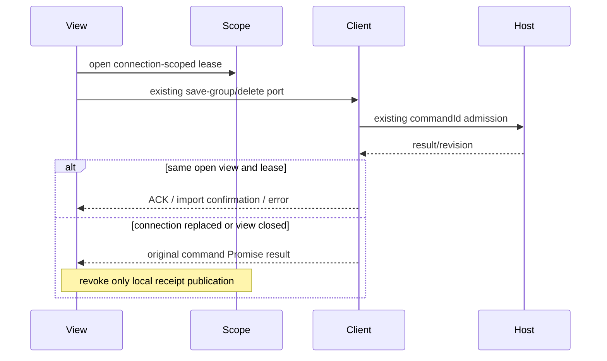

# Studio group ownership slice delegated to the services lane

Continue the original `lane/services-20261003` / draft PR16 at
`90e7d290c2deae3e0a75a73f34710d23a6daefa4`. The parent explicitly transferred only
five UI source files from the UI lane: groups/useStudioGroups.ts, groupModel.ts,
groupDefinitions.ts, groupSubmission.ts and store/studioGroupStore.ts, all below
packages/ui/src. Do not edit any other UI source, runtime client, JSX, CSS, public
Host contracts, global provenance or the UI lane's records.

Read UI PR15's frozen head `662b64276a7271324efcbc6de36497058250d521` and its
docs/lane-ui-20261003.md. Targeted Git comparison found all five source files and
the runtime-client public callers identical to this lane's current source.
Do not merge/rebase the whole active UI branch or count its work as this lane's.

## Existing feature candidates and actual pending owners

The examined source-path history includes snapshot
`7619e41b950bd52073ebf36754146cf25659d9fa` and definition-ownership feature commit
`530a64700d61d80715e4a120682a3942075395bc`. That latter published spec/source adds
baseUpdatedAt conflicts, Host-only definitions and draft-only v2 migration.
These are Knorvia feature implementations, not automatically inherited ZCode
bodies. The saved inventory's five exact rows are unreviewed/NOASSERTION, each
with upstream=null; no matching path or review row was found in the saved upstream
and reviews files. This bounded metadata does not prove whole-expression origin,
historical absence under another path or rights acceptance.

Retain groupModel.ts, groupDefinitions.ts and groupSubmission.ts as existing
source-exposed feature candidates. Keep kernel validation, ordered membership/
host fallback, defaults, limits and mention replacement; definition projection's
revision-authoritative ACK/deletion overlays and reference/order behavior; and
active-run selection, steer versus save/send, stop-epoch admission and
acknowledgement-driven draft clearing. Do not rewrite them for file counts.

Continue the two runtime owners that have actual unfinished lifecycle/migration
boundaries. Hook imports/save/delete can currently publish an old service reply
after connection replacement or unmount. Store retry currently writes v2 without
finishing v1 deletion after the earlier write/remove failure. The new designs
are a view-scope lease with unique import flights and a single draft ledger with
resumable write-before-remove migration. Shared/public rules and legacy codecs
retain lineage; new runtime design is not clean-room or rights acceptance.

## Hook owner and command acceptance

Host StudioRuntimeService remains the sole accepted definition/runtime writer.
StudioClient continues to own commandId deduplication, transport, snapshots and
connectionKey. One hook view-scope owner only grants permission to apply a reply
to this mounted view/store, tracks local import flights and cancels those local
permissions. No new Host queue, RPC cancellation or connection owner is added.

- Keep groupDefinition's draft exclusion and all useStudioGroups public return
  fields, runtime spread, Promise results/rejections and existing diagnostics.
  Save retains normalizer, now/UUID/createdAt, optional baseUpdatedAt selection
  from the editor's captured identity and current-definition presence. Delete
  retains its original Host command and markImported-before-delete action order.
- Each connectionKey gets a distinct view-scope owner. Opening the effect admits
  a lease; cleanup revokes it and all local flights. Effect replay can open a new
  lease. A current-view reference also denies the old owner between render-time
  connection replacement and passive cleanup. Target changes within the same
  connection do not cancel definition imports.
- An import flight has unique object identity per group and lease. Releasing an
  old flight cannot remove a newer flight for the same id. Keep imported/in-flight id skips,
  onlyIfAbsent, existing-definition confirmation, parallel import dispatch and
  the error latch/retry UI. Already-issued Host commands finish through their
  original client; only current-lease replies may markImported or publish errors.
- Publish overview definitions through ensureDraft before considering imports,
  preserving revision guards and acknowledged local overlays. Each store write
  and command dispatch is guarded by the current view lease. Late save ACKs must
  not acknowledge a definition in a replacement connection. Late delete ACKs
  must not delete that view's draft. Original caller Promise behavior remains.
- Import failures are scoped to their connection/lease, and retry clears only
  that scope's latch. Runtime error and readiness stay runtime-client facts.
  Return groups through the unchanged projectGroupDefinitions port whenever an
  overview exists; otherwise retain the existing local/legacy initial view.

## Draft ledger, codecs and durable migration

The store owns only unsent text, memory definition projections and ACK receipts.
One Map-based draft ledger owns both unattached and attached unsent text; public
groups are its projections. Definitions/revisions/importedIds never enter v2.
The factory, browser-storage fallback, Zustand selectors, exports and state action
signatures stay unchanged. No actual user storage is accessed during development.

- Preserve storage keys and `{version:2,drafts:{[id]:string}}` envelope, omission
  of empty drafts, v1 reader, schema/member/duplicate validation and all limits.
  Malformed/unreadable startup data blocks every write/remove for that store
  lifetime; never overwrite it on retry. Both initial keys must be read safely.
- Preserve the existing initial legacy display and its draft precedence if v1
  and v2 coexist for one id. Orphan v2 drafts attach when a Host definition
  arrives. Draft ids are data, including `constructor`/`__proto__`; do not read
  prototype properties as text or revision receipts. Map lookups and own-entry
  revision reads avoid those accidental aliases without changing persisted keys.
- ensureDraft defaults to infinite revision, ignores an older snapshot than an
  acknowledged receipt, retains draft text and uses the existing JSON equality
  bailout. acknowledgeDefinition ignores an older ACK, updates the overlay and
  revision and marks its id imported in memory; if this confirms the last legacy
  id, it also finishes the same write-before-remove migration. deleteGroup retains
  revision guards and clears only that id's text. Draft typing never changes updatedAt.
- saveDraft requires an existing projected group and valid length; equal text is
  a no-op. clearDraftIfUnchanged observes the current store text and clears only
  the submitted value. Storage write failure retains current memory text and the
  existing write-failed hint; retry persists the latest ledger, not a stale copy.
- A confirmed migration finishes in two durable stages: write the latest draft
  envelope successfully, then remove v1 only if every legacy id is confirmed.
  Any write/remove failure retains legacyGroups and write-failed. retrySave and
  a later successful draft persist resume the whole finalization; remove success
  alone clears legacyGroups. Partial imports keep v1 and its original content.
  Ordinary repeated markImported is idempotent. Do not infer confirmation from
  a timeout or failure; only a current Host receipt/existing definition qualifies.

## Delivery and deferred acceptance

Use the services lane's independent docs/lane-services-20261003.md and one new
exact five-source binding record; leave original source records and notices
untouched. Two runtime owners are delivered in this slice; retained helpers are
not newly counted implementations. Source-exposed authoring, existing candidate
confirmation, behavior acceptance and MIT rights decisions remain separate.

**UNVERIFIED:** no tests, lint, typecheck, build, formatter/architecture check,
full audit or CI rerun. The explicit phase instruction overrides executable
skill/repository checks. No test or extra UI files are added in this slice.

Final combined acceptance must run existing studio-group-store and second-pass
cases, plus late import/save/delete and stale-finally/service/unmount/effect-replay
cases, failed write/remove migration retry, prototype-named draft ids, orphan/
coexisting legacy text, conflict/save/stop interactions and actual React/store
consumers in desktop/Web. Any required runtime-client/JSX/contract or test changes
outside the five transferred files must be coordinated with the parent.
