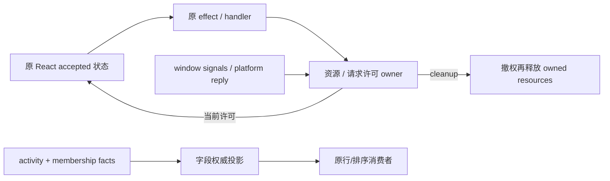

# 固定 UI 路最后五项 consumer 契约

父任务已把 Web、desktop renderer、Studio groups/store 和 v4 布局恢复转交原任务。
本路只继续 WorkspaceFileTree、row drag、installed editors/helpers、
WorkspaceGroupedTasksSection、taskListRowActivity 及其专用候选模块/记录。
同一分支/PR15；source-exposed，Apache 过渡与原归属保留，不宣称 MIT。

## Row drag、editors、helpers 与 activity（先行）

- row drag 的 React boolean/setter 是唯一拖拽状态；原 false 初始值与 functional
  updater API 保留。仅在 true 时安装 window dragend/drop/blur 的非 capture
  监听，任一信号置 false。资源 lease cleanup 先撤回 callback 许可，再尝试
  所有监听移除；安装/移除失败首错仍可见，未能移除的旧 listener 不回写。
- installed editors 的 accepted 数组仍由 React 拥有；每个 platform effect
  一次 getInstalledEditors，成功且当前许可有效时调用既有排序 helper。清理/
  替代撤销旧 success 接受权，失败保留原 warn 文案/错误转换（含旧失败日志）。
  不增加 host abort、请求重试或排序算法，不清掉既有数组以产生新 loading UI。
- helpers 保留 Error identity/String 异常传播、始终产生 Set 副本、不改输入；
  文件管理器名按 Mac→Windows→generic 的原规则；HTML 仅 file 且匹配原
  html/htm suffix 表达，URI 委托现有 toFileUrl。短表达、接口 shape、regexp
  与排序 alias 作为兼容材料保留，不将换名/搬出计作独立作者证明。
- activity sidecar 仍为 `__sessionActivity`、原 exports/types，不进入 shared
  schema/tasks-index。运行层只认 prewarming/running 或严格 true 的后台标志，
  attention 总数为原 permission+userInput，非零时 userInput>0 优先。
- membership 合并先保留完整两个 metadata own 字段/symbol；按字段权威表
  投影 createdAt/status（activityTask）、updatedAt（lastActivityAt）、unreadAt
  （membership own-property 存在优先，含 undefined，否则 activityTask），再
  绑定原 activity 引用。没有 activity 则直接返回 membership 原引用。

## 两个容器的边界

既有 JSX、class、国际化 key、28px/32px/0.5px 等 UI 数值、动画参数与资源保留。
accepted tree/grouped view、草稿/store/持久化 key 与 host 请求 payload 不迁移。
下一源码批次分别在本规格细化其动作、reveal、DOM、菜单与归档许可后实现。

## 未验证

不运行 tests、lint、types、build、格式/架构检查或审计。新增合同仅供最终
统一执行；必要源码阅读、Git 差异/提交/远端检查不等于行为、产物或权利验收。
