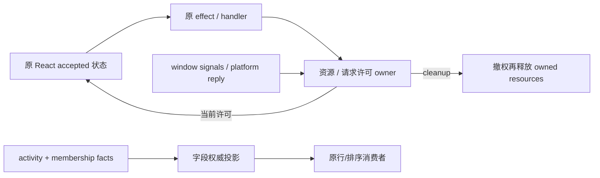

# 固定 UI 路最后五项 consumer 契约

父任务已把 Web、desktop renderer、Studio groups/store 和 v4 布局恢复转交原任务。
本路只继续 WorkspaceFileTree、row drag、installed editors/helpers、
WorkspaceGroupedTasksSection、taskListRowActivity 及其专用候选模块/记录。
同一分支/PR15；source-exposed，Apache 过渡与原归属保留，不宣称 MIT。

## Row drag、editors、helpers 与 activity（先行）

- row drag 的 React boolean/setter 是唯一拖拽状态；原 false 初始值与 functional
  updater API 保留。仅在 true 时安装 window dragend/drop/blur 的非 capture
  监听，任一信号置 false。资源 lease cleanup 先撤回 callback 许可，再尝试
  所有监听移除；安装/移除失败首错仍可见，未能移除的旧 listener 不回写。
- installed editors 的 accepted 数组仍由 React 拥有；每个 platform effect
  一次 getInstalledEditors，成功且当前许可有效时调用既有排序 helper。清理/
  替代撤销旧 success 接受权，失败保留原 warn 文案/错误转换（含旧失败日志）。
  不增加 host abort、请求重试或排序算法，不清掉既有数组以产生新 loading UI。
- helpers 保留 Error identity/String 异常传播、始终产生 Set 副本、不改输入；
  文件管理器名按 Mac→Windows→generic 的原规则；HTML 仅 file 且匹配原
  html/htm suffix 表达，URI 委托现有 toFileUrl。短表达、接口 shape、regexp
  与排序 alias 作为兼容材料保留，不将换名/搬出计作独立作者证明。
- activity sidecar 仍为 `__sessionActivity`、原 exports/types，不进入 shared
  schema/tasks-index。运行层只认 prewarming/running 或严格 true 的后台标志，
  attention 总数为原 permission+userInput，非零时 userInput>0 优先。
- membership 合并先保留完整两个 metadata own 字段/symbol；按字段权威表
  投影 createdAt/status（activityTask）、updatedAt（lastActivityAt）、unreadAt
  （membership own-property 存在优先，含 undefined，否则 activityTask），再
  绑定原 activity 引用。没有 activity 则直接返回 membership 原引用。

## 两个容器的边界

既有 JSX、class、国际化 key、28px/32px/0.5px 等 UI 数值、动画参数与资源保留。
accepted tree/grouped view、草稿/store/持久化 key 与 host 请求 payload 不迁移。
下一源码批次分别在本规格细化其动作、reveal、DOM、菜单与归档许可后实现。

## WorkspaceFileTree 动作与恢复（本批先行）

- 单一 panel owner 只持有 selected/query/changed 与 pending preview/search reveal，
  tree/expanded/Git/loading 不复制。路径或 identity 变化按原 effect 清选择/过滤，
  remote-only 不额外清 UI；scope cleanup 撤销异步加载序列并清 pending reveal。
- 外部 reveal 优先于 activePreview，trim 后只接受 workspace 内路径；原 ancestors
  顺序与显式 reveal 追加目标保留，逐级 load 深度为 index+1。input/effect 替代
  终止旧序列后续调用，已发出的 load 不 abort。可见后按原 normalized equality
  auto 滚动；search 目录恢复在退出搜索且行存在后 center 滚动。
- toggle 的 Set 副本按当前 expanded membership 决定折叠，移除全部 compacted
  paths；load 是否调用仍看 row.expanded，使用物理 path depth。search 目录先
  扩 ancestors/目标并选中、清 query，再按物理深度逐级加载；同 scope 操作保持
  原独立序列，卸载后不再发后续 load。
- Enter 总是 preventDefault 后 preview/目录动作；Right 对目录总 prevent，只有
  未 expanded 或搜索中才动作；Left 仅 expanded 目录 prevent+toggle，保留搜索
  情况边界。deleted 文件禁止 preview；code-viewer source、sticky start 对齐不改。
- refresh 仍先 loaded directories，再在搜索中刷新 index；文件管理器保留 WSL
  editor 路由/remoteTarget/identity 与原 fallback，失败 warn/toast 文案不变。
  clipboard 保留能力判断、原路径、成功 info 和异常 warn；不新增用户数据写入。
- viewport 的 native scroll 同帧写原 CSS offset，overflow/bottom 阈值仍为 1px；
  resize/observer 共用一帧 coalescing。初测、scroll passive、window resize、
  scroll/content observer 与 cleanup 顺序保留，异常尽量释放全部 owned 资源且
  首错仍可见。旧 callback/frame 在 cleanup 后不得写 UI。
- loading/error gate、32px mask、虚拟 count/28px/overscan12、JSX 与 labels 为
  保留呈现契约；非阻塞 root error 同 message 去重，成功/无错会重置去重许可。

## WorkspaceGroupedTasksSection 动作（本批先行）

- UI 模块内单一 interaction snapshot 拥有 archive-hidden keys、rename key/draft 和
  new-group setup id；原 hook 继续独占 authoritative/displayed view，父组件继续
  独占 collapse prefs，session store 继续独占持久草稿。presentation projection
  单次扫描生成菜单/ids，分别按原位置/字段比较复用数组；不增加 accepted view。
- 菜单 move/group/top 基于未 archive-filter 的 authoritative view，引用 no-op 不
  发请求。使用已有 applyOrder 的 canPublish port；最新结构操作或新拖拽撤销旧
  menu rollback/refresh 许可，已发 host 写入仍完成。drag session 本文算法保留，
  只在 section bridge 联结该许可，不复制 origin/preview/order owner。
- contextual draft 优先按当前活动 task key 求 placement；无 active id 才沿用当前
  grouped placement 或 top。group draft 解折叠仅在原 Set 含该 id 时复制，top 不
  改 prefs；显式关闭才调用原 path/identity clear。卸载/切 scope 不清 store 草稿。
  顶层 action 注册及 cleanup null 保留。toggle 永远用 Set 副本。
- rename 开始保留 title??空串；缺 key 返回、缺 task/service 或 trim no-op 关闭。
  host payload 保留仅 truthy identity 和 trim title。空 metadata/失败保留当前
  dialog 并原 toast；成功按原 replace→optimistic→query-cache 顺序更新捕获 task，
  只有同一 edit 许可仍有效时才关闭 dialog。新 edit/新提交/卸载不能被旧完成清空。
- unread 仍调用 scoped task service，成功先原 unread indicator，再当前 view、原
  optimistic 和 query mutation；没有 service 无操作，失败原 toast。rename/unread
  的逐 task 请求许可与当前 resolved service 限制本地 view 回写；成功的捕获
  host metadata 仍完成目标 store/cache 更新，不把组件卸载当作取消用户写入。
- archive 仍即时隐藏但不从权威结构删 task；每次原调用仍发 host 请求。成功按
  原 membership version→remove session state→truthy identity remote stores→query
  archived 顺序完成；隐藏直到 authoritative 确认缺失。失败只撤回对应当前 key
  许可并保留原 toast，旧失败不得撤回后发 archive 的隐藏。prune 同成员时保留
  Set 引用。archive 的 key lease 在 inactive 时暂停；新 scope 只有同一 key 的
  current ticket 和同一 resolved service 仍存在时才续接，服务替换释放未完成
  隐藏 lease，已成功隐藏仍等权威确认；不丢已成功的目标 store 写入。
- createGroup 完成后仅当前 scope 设置 setup id；ack 只有相同 id 清 setup。原
  create/rename/color/ungroup 的失败 message id 保留，现有 hook/save/payload 不改。
  本地 scope 遵循 grouped scopeSignature/base service；resolved service 替换会撤销
  其迟到 metadata 的本地接受权。所有 JSX、菜单项、labels、focus/select 和首屏
  painted latch 保留；短桥接和既有 view helper 不计新独立作者证明。

## WorkspaceGroupedTasksSection DOM 资源（本批先行）

- UI 模块内一个 DOM owner 通过 ports 获得当前 root/window/view 命令；唯一 owned
  resource 账本登记 frame、observer、listeners、cursor 和 animation。frame/element
  索引只指向账本条目。scope/单项 cleanup 先撤权再释放，全部 cleanup 尽量执行，
  首错可见；安装中抛错同样清已获得资源，不以 old callback 覆盖新布局或 overflow。
  DOM scope 是组件的物理生命周期；grouped service/scope 变化只释放 layout
  frame/animation。sticky/top-draft/cursor 按原 effect 依赖更新，不新增滚动动作。
- previous rect 按 layout/task kind 分桶保存，两个原 selector 各扫描一次、同 key
  最后 DOM 项覆盖。next element 同时有两个 key 时 layout 优先；key 为空不参加。
  capture 在原 setView 前，cancel 旧布局 frame 后只排一个新 frame；渲染后使用当前
  root，原 reduced-motion/no-root/empty previous gate 保留。
  同步重入的新 layout 许可会停止旧批次后续动画；不创建第二份 accepted view。
- 动画保持 delta previous-next、0.5px translation/height 阈值，只有 layout kind
  改 height；同 frame 参数仍为 150ms/cubic-bezier(0.2,0,0,1)，transform/height
  字符串与 undefined height 保留。开新动画前仍 cancel element 的全部 animations。
  owned animation 被替代/完成/cancel/卸载时同步还原其先前 overflow，撤掉两个
  once listener；旧 listener 不得晚到覆盖新 hidden。安装失败恢复 overflow 并清
  已获得 animation，原首错继续抛出。其他成功 element 的同批资源也会释放。
- task preview width 只测编码 task key 的首 DOM 命中，group width 首 raw id 命中，
  仍只在原 drag start 调用；不持有第二份 drag 宽度或布局 view。
- nearest scroller 仍从 parent 开始，overflowY 的 auto/scroll 与真实竖向 overflow
  同时成立。sticky 用原 group item/header selector、CSS.escape、collapsed 字符串
  和 headerHeight||32；headerTop<containerTop-0.5 且 groupBottom>
  containerTop+headerHeight+0.5，最后有效 group 优先。drag 中/no root/no ancestor
  仍发布 null。初测、passive scroll/window resize 和 optional root ResizeObserver
  保留，resize/scroll 合成一个 frame；cleanup 后无发布。
- top draft 按原 focusVersion/draft effect 排一帧、重新找当前祖先、scrollTo({top:0})，
  清理只撤销该 frame；不清持久 draft。drag cursor 沿用 grabbing 与原 previous
  cursor 还原。原 JSX、mask/style、drop animation、sensors、auto-scroll、sticky
  header 内容、workspace label 与首屏 latch 作为 retained presentation/bridge。
  数学短式、selector/DOM/React/API shape 不计独立作者权利结论。

## 未验证

不运行 tests、lint、types、build、格式/架构检查或审计。新增合同仅供最终
统一执行；必要源码阅读、Git 差异/提交/远端检查不等于行为、产物或权利验收。
