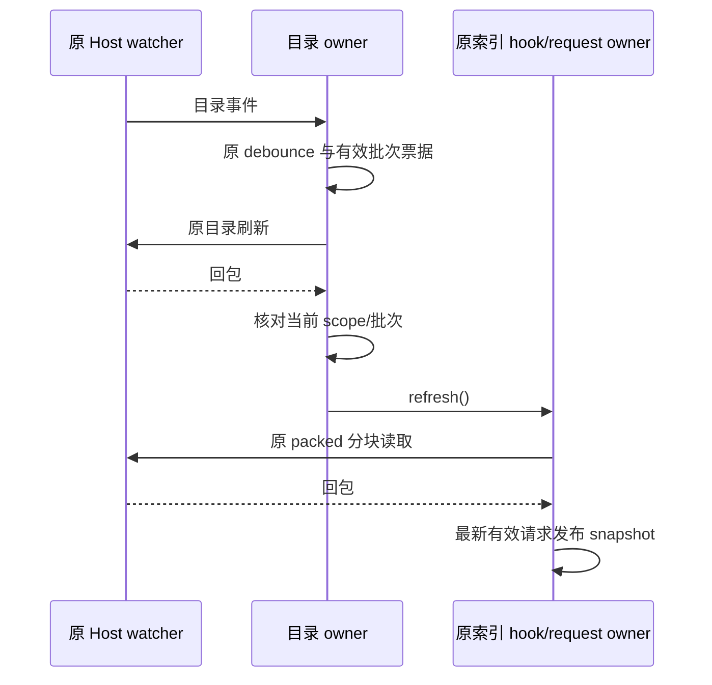

# UI 文件树生命周期：先行行为契约

固定分支 `rewrite/ui-20261003`，基线
`3b1ff0f715a43cbc51c576fd524479a08e58e203`，同一 draft PR #15。
本规格先于本批候选正文写入。作者已阅读旧 hook、服务签名及直接消费者，是
source-exposed；不声称 clean-room、行为已验收或文件已可授 MIT。

## Watch 资源 owner

- 输入仍是服务、原始目录路径 Set 和目录事件回调；只请求非递归 watch。
- 同一服务及路径最多拥有一个待返回请求或已安装订阅。保留仍需监听的订阅；
  新回调不重新安装已有订阅，已注册订阅继续使用其创建时捕获的回调。
- 折叠目录释放已安装订阅和 host watcher；若目录在待返回期间重新展开且请求
  仍属于同一服务世代，允许使用该请求。服务替换或卸载使全部旧请求失效。
- 迟到 watch 结果必须通过发起该请求的原服务 unwatch；不订阅过期 id。
  setup 失败保留原 watch 失败日志；异步 unwatch 失败保留停止监听失败日志。
- subscription.dispose 的同步异常仍可见，但该 id 的 unwatch 必须发出；批量
  清理继续释放其余 owned 资源，然后抛出第一个异常。订阅安装抛错也释放已分配 id。
- 修复边界：清除 pending 必须核对请求票据。旧服务同路径回包不能清除新服务
  的 pending；过期 unwatch rejection 也不能成为未处理 rejection。
- React effect replay 可重新使用 owner，不能因第一次 cleanup 永久关闭后续注册。
  owner 不新增全局监听或修改 services/RPC/共享协议。

## 搜索索引 owner

- 保留 `entries/loading/loaded/error/refresh` hook 接口，原 packed codec、分块拉取
  和 worker filter `{ requireQuery: true }`；查询文本和结果排序原样传递。
- scope 为 workspace path、identity、remote session；scope 变化清空索引和错误。
  服务替换或手工 refresh 发起新请求，同 scope 旧成功索引在刷新期间仍保留。
- 新请求 loading=true、error=null；成功替换 packed、loaded=true，失败转换 Error
  但保留已有成功索引及 loaded；只有当前请求完成才置 loading=false。
- 禁用不启动新请求，保留已完成索引；禁用、scope 切换、请求替代、卸载使旧请求
  无权回写。RPC 无 abort 接口，失效仅撤销接受权，不宣称取消 host 工作。
- 修复边界：禁用清理后 loading=false；identity/remote-only 切换在 enabled=true
  时也重新请求。旧 hook 仅 reset 而未重启此类请求，以及卸载/禁用仍接受回包的
  缺口按此契约修复。effect replay 必须能启动新的有效请求。
- 同一 React state snapshot 拥有 packed 与四个状态字段；request owner 只拥有
  接受权，不保存第二份索引。refresh 仍是无参数、稳定函数。

## Sticky 投影

- 保留原 row 引用及 index，不迁走虚拟行、不写 scrollTop、不改 JSX/CSS。
- enabled=false、无 virtualItems、无 rows、scrollOffset<=0.5 均为空。
- 以 28px 行高和累计 stack 高度探测下方 row；展开 directory 可成为 probe
  自己的 sticky，否则从前一行查找 depth-1。每层仅选前方最近的指定 depth
  expanded directory，不自行补齐缺失 depth，也不将未展开目录当祖先。
- 按从外到内顺序过滤 `rowStart <= scrollOffset + stackIndex*28 + 0.5`。
  固定点以 sticky 数量稳定判定，迭代上限保留 rows.length+1；scrollDirection
  不改变结果。保留深层压缩行的 depth 数值，不假设 rows 必定是连续深度树。
- 候选通过一次目录索引和按 depth 的前驱查询表达投影，不重复扫描全部前缀。

## 目录加载 / 刷新（后续同规格实现）

保留 root/expanded/loaded 集合、错误和 Git/ignored 投影接口。非 force 已加载
或正在加载时返回 loaded；目录请求按 workspace 世代、全局请求世代及每路径
票据判接受权。票据对象不会复用，prune 可以移除票据但不能让旧票据复活。
成功清错误、映射原 entry shape 并预取单一普通子目录；失败保留
旧 children 和原日志。watch 刷新失败才 prune subtree 并刷新 parent，手工失败
不 prune。ignore 回包只能写入同一有效目录请求。原超时、debounce、并发、bulk
threshold、重入屏障和 Git 可用性行为不改。

全 scope cleanup 必须撤销目录/Git/ignore/refresh 接受权并清除 debounce timer；
旧 hook cleanup 仅撤销 refresh batch 的缺口需显式修复。超时请求不能在重建
同路径后复活。不修改 host、数据库或存储格式。loaded ref 是同一 snapshot 的
读写入口，公开 setExpandedPaths/setLoadedDirectoryPaths 继续接受值或 updater。

修复边界：root watcher 回调旧闭包可能在 bulk flush 使用注册时的 expanded
集合；新 owner flush 读取当前 snapshot 的展开集合。手工 refresh 路径也读取
当前集合而非旧 callback 闭包。原去重顺序、阈值和并发数保持。scope 含 remote
session，即便服务对象未替换也撤销旧 scope。异常和 timeout 不新增 UI 消息。
数据 hook 给 registry 的稳定回调桥在 scope effect 中指向当前 owner；保留相同
watch service/path 的已安装订阅时，不得因 file/Git owner 替换而把事件送往已关闭
owner。桥只保存 owner 指针，不保存第二份目录状态；旧路径事件仍经当前 root 检查。

## 验收限制

### 2026-10-03 最终 GUI 验收发现：watch 与搜索索引联动

从 `main` 的 `59517d9699519b0a7a44980da27df29d45f0e91e` 在隔离合成项目、
真实 LocalServices/RPC 与 Chromium Web 中复现：保持搜索条件时新增文件，
Host watcher 已刷新目录，普通目录视图可见该文件，搜索却仍使用旧 packed 索引。
进一步复现确认手工刷新也读取 Host 的 60 秒缓存；不能将等缓存到期当作修复。
此为 UI 接线及刷新命令缺口，不改变 Host/RPC、数据格式或呈现。

- 目录 owner 继续独占 watch debounce/路径队列与请求票据。有效 watch 批次完成
  目录刷新后，通过可选 `onWatchRefresh` port 发出一次索引刷新命令；普通加载、
  手工刷新、scope 已关闭或被新 refresh 取代的旧批次不发此命令。
- 原索引 hook 的 `refresh()` 是唯一入口，继续由 reducer 拥有 packed snapshot、
  request owner 拥有接受权。不增加 watcher、timer、索引副本或持久化 key。
  搜索关闭时仍不拉取索引；开启时刷新保留旧成功结果，只有最新有效回包可发布。
- 文件树的索引读取先使用现有公开 `searchWorkspaceFiles({ refresh: true,
query: "", limit: 1 })` 刷新唯一 Host 索引，再走原分块 Length/Range。空查询的
  搜索结果不参与 UI 状态；该命令完成即重新核对请求接受权，已失效则不继续分块。
  其它调用者默认不强刷。未添加隐藏超时、等待缓存到期或临时服务实现。
- callback 可同步重入切换 scope；调用后再次核对原票据再发 Git 读取，避免旧
  批次继续调度新 scope 的资源。原非递归监听范围、300ms debounce 和刷新失败
  语义保留；未监听的折叠子目录不在本次自动刷新保证范围。
- 定向验收覆盖 create/rename/delete 的真实文件事件、旧 scope 迟到刷新、批次
  合并，以及既有目录 owner 合同。Web 验收不代表 Electron、Windows 安装包或
  真实用户数据迁移完成。现阶段用户已授权定向 GUI/兼容验证；下文是历史限制。

用户本阶段明确禁止执行测试、lint、类型检查、构建、架构/全量审计。只能阅读
源码/契约、检查变更差异及 Git/远端 metadata。新增场景仅供最终统一执行；
纯 owner 场景不能替代 React effect、真实服务、DOM、desktop/Web 产物的验收。
许可证仍为 Apache-2.0 过渡状态，权利和全局 inventory 刷新交由整合者。
