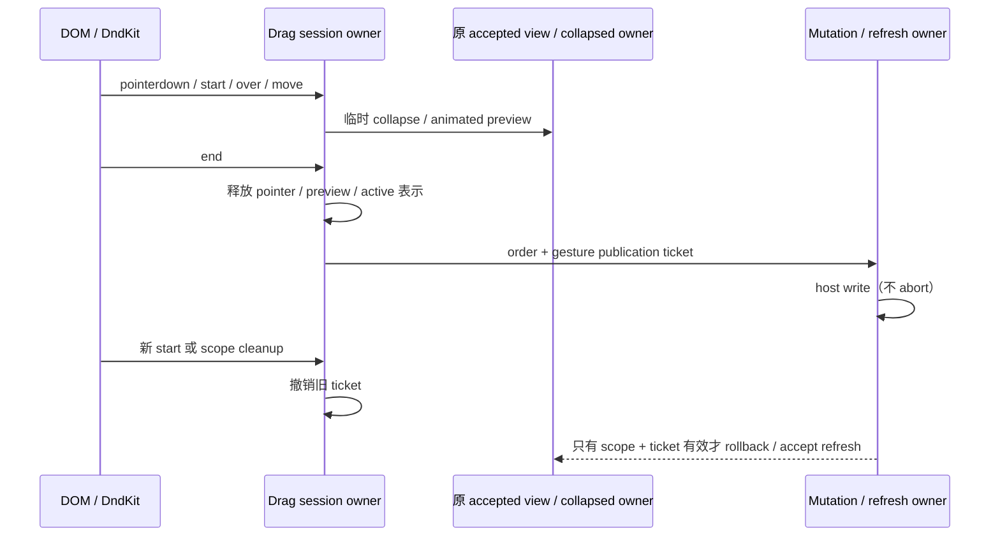

# UI 分组 hook / 拖拽：先行生命周期契约

固定 UI 路与 PR #15，起点 `3b1ff0f715a43cbc51c576fd524479a08e58e203`。
作者已读旧 useGroupedTaskView、WorkspaceGroupedTasksSection、既有 view commands
与直接 services/store 签名；是 source-exposed，权利核验待整合，不授 MIT。
本规格先于本批正文。B1–B5 既有功能、记录和既有 UI 必须保留。

## Hook remote 数据 owner

- 同 key 同世代进行中请求共享原 Promise；fetch 在 microtask 中启动，允许
  同步抛错经 Promise rejection 传递。每次 load 都算最新 demand，包括命中缓存。
- 全局只保存一份已完成 key/value；不同 key 可并发，只有最后 demand 所属请求
  可写已完成缓存。同 key 再次共享会把该请求重新标为最后 demand。
- key 命中返回 Promise.resolve 同一 value。isCurrent 判 key 和 value `===`。
  invalidate 使全部旧 demand/缓存/pending 无效；旧调用者仍可收到原 Promise
  结果，但旧 finally 不能删除新世代同 key pending，也不能回填缓存。
- 跨挂载 view 缓存继续按原 scope 签名保留最多 8 项，只在写时刷新淘汰次序；
  读取不刷新次序。只在成功 authoritative refresh 写入，既有旧数据优于空白
  的窗口保持，不新增 TTL/存储 key/数据库数据。
- 首屏、membership/structure 的 key、Controller sessions join、optimistic
  projection 和 promoted draft 持久化规则不借本批改动。原 hook 仍拥有 view。
- 首屏 refresh 仅在当前 view 无节点时 loading=true；最新请求不论成功/失败
  最终 loading=false 且初始化门禁结束。仅当前请求记录一次错误；接受还须通过
  remote cache 的 key/value 判定。build/join/accept 抛错沿用同一错误日志。
- 后续 refresh 接受权 owner 批次：scope/service 替换、卸载和 effect replay
  撤销旧 refresh 接受权并 invalidate remote cache。旧调用者仍可收到 Promise
  完成，但不得回写 view/carry cache、关闭新 loading 或重开新初始化门禁。
  此为旧 hook 没有 refresh cleanup 的显式修复；RPC 不增加 abort 接口。
- 缓存及 refresh owner 的替换不能称整个 hook 已重写。mutation、overlay 和
  promoted persistence owner 仍保留在未完成清单，不以本批撤销其写入权限。

## 拖拽目标投影

- 仅按原 data.type 和 string taskKey/groupId 解码；空 id 在投影入口仍无操作。
  保留 task key 的 workspace 身份及 NUL 分隔规则，不改 drag/drop data 格式。
- group 拖拽只允许 task 与 grouped-group-over 参与 closestCenter；task 或未知
  actor 保留所有非 grouped-group-over 容器。碰撞筛选只看 type，不因缺 id 改筛选。
- group over group/task 调用原对应结构命令。task over task 依 direction 放前/后；
  collapsed group 放 root 组前/后；header before 放 root 前，after 放组首；footer
  before 放组尾，after 放 root 后；empty zone 放组首。其它目标 no-op。
- 同 task/group、无 over、无有效 actor 和 signature 不变不发 preview。signature
  的 token/分隔保持原表达，排序与展示本身由既有 view owner 决定。
- 本批仅替换目标路由与碰撞准入 owner。原 drag start 宽度单次测量、方向反转
  重新 preview、collapsed snapshot、Workbench pointer tracker、布局动画和保存
  回滚仍在消费者中；不能通过提取文案把这些称已独立重写。
- 保留原取消边界：task cancel 恢复 origin；group cancel 恢复 collapsed snapshot
  后 reset，不额外还原 preview。group/task end signature 相同恢复 origin；变更
  持久化失败恢复 origin 并用原 toast。Workbench 接受 task drop 不保存列表顺序。
  此边界看似不对称，需最终用户/DOM 验收，不在本批静默调整。

## Optimistic 展示投影（后续批次先行契约）

- 原 accepted view、overlay store、Controller membership/activity owner 不迁移。
  本批是局部、可丢弃投影；没有第二份可写 accepted 状态。
- 多 overlay 同身份最后 metadata 胜出，但 Map 首次插入次序保留；identity
  使用原 entity key。无 tasks/promotions 时返回原 view；没有命中的节点保原引用。
- 已有 task 先走原 meta 权威合并，再保留 sessions/membership/activity 字段。
  即便合并后值相同，命中 overlay 的 node 按原规则创建候选，由展示稳定化收敛。
- 缺失 task 只补 visibleMissingTaskKeys，按 updatedAt/createdAt/taskId 降序。
  group promotion 补组首；没有该组的 promotion 暂补 root，并按 group 首次遇见
  次序追加在普通 top missing 后。重复 group id 仍在每个匹配 node 补候选。
- promotions 按原 Map 次序逐个应用。top 只重排已有 root task，不把 group 内
  task 自动迁出；group 迁移到组首但已是首位 no-op。缺少 task/组保原规则。
- 可见缺失闩锁：当前 active 且 accepted 缺失时加入；先前可见 key 仅在仍有
  overlay、仍未 accepted 时保留。不把所有 optimistic task 插回 root。
- 旧运行时 overlay 可能没有 promoted 字段，仍以空对象兼容。返回 shape、引用、
  行排序、title 与 membership 权威、临时归档/pin 边界保持。

## Mutation owner（后续批次先行契约）

- React hook 继续拥有 view/saving；mutation owner 仅拥有 scope 接受权和操作计划。
  public createGroup/renameGroup/updateGroupColor/applyOrder/ungroupGroup 形状不改。
- create 成功先插顶，sortOrder=原最小值（含 0）-1000；已有同 id 不重复插入；
  invalidation 后等 captured refresh，最后返回 host group。
- rename trim 空值回退原标题，同值/不存在组 no-op；color 同值 no-op。
  optimistic group 保留其它字段，updatedAt 仍 Date.now；所有同 id node 都投影。
  成功用 host group 替换 optimistic group，失败恢复 captured previous view，记录
  原日志并 rethrow 原错误。scope 接受权只防跨 scope/unmount 回写。
- order 先展示 next view，序列化只发送 workspace scope/ref/order，不采信 host
  返回 join view；成功 invalidate 后等 current refresh，失败 rollback 后 detached
  captured refresh 并 log/rethrow。scope key 去重仍首位置/最后 scope 值。
- ungroup 在原节点位置展开所有该 id 组成员；先 apply order，再 delete group，
  再 invalidate/captured refresh；失败原日志/rethrow，不删除任务数据。
- 保留本 scope 既有并发和 nested saving=true/false 时序，不新增队列/阻塞 UI。
  多操作同 scope 的 captured rollback 语义继续保留，最终验收须覆盖重叠操作。
- 显式修复：scope/service 替换与卸载后，已发出 host 写入仍按原 Promise 返回
  成功或失败，但不向新 UI view/saving 写回；激活新 scope 将 saving 归零。
  不宣称取消 host mutation，不新增共享协议/存储格式或消息文案。

## Promoted persistence owner（后续批次先行契约）

- 以原 accepted/displayed view 与 visible-missing 闩锁只读规划：top promotion
  仅当 accepted 第一 root task 与其身份一致时立刻清理；group promotion 仅当
  displayed 有 task、accepted/visible-missing 包含该 key 且 accepted 未为组首
  时需要持久化。first task/group 查询语义和 overlay 迭代次序保持。
- group batch signature 仍是 entity keys 排序再 `|` 拼接；同 active scope 同
  signature 只请求一次。成功 signature 继续保留；失败撤销，后续 render 可重试。
  不自行对同 key 跨 overlay 重复 task 去重，不把 root promotion 发成 order 写入。
- 写入完整 displayed order 后 invalidate，等待 current refresh，再清理捕获的
  group promoted 标记。错误保留原日志；不吞掉写入失败且误清标记。
- 显式修复：scope/service cleanup 清空 signature 许可，旧请求成功不得 invalidate
  新 scope、触发新 refresh 或清新 draft；旧失败仍诊断，但不删除新同 signature
  许可。已发出 host order 不宣称 abort，原存储 payload 与 draft shape 保留。

## 完整 drag session / pointer / rollback（后续批次先行契约）

- 单一 session owner 拥有 origin/preview、direction/delta/last-over、active ids/width、
  collapsed snapshot、Workbench payload 与 pointer tracker；React 只投影 active
  ids/width。accepted view 与持久 collapsed prefs 仍由原 hook/父级拥有。
- pointerdown 仍在 6px DndKit 激活前按 ownerDocument capture 跟踪 viewport 坐标；
  start 只测一次宽度，group 临时收起，task payload 带原 workspace/remote 身份。
  普通 move 同时更新 Workbench preview；delta 反向才重用 last-over 重新投影。
- cancel/end 保留既有边界：group cancel 只恢复 collapsed；task cancel 恢复 origin；
  Workbench 接受 drop 恢复 origin 且不保存 grouped order；签名相同恢复 origin；
  改变后保存失败恢复 origin 与原 toast。动画、CSS、overlay、drop 参数不改。
- 显式修复：新 gesture 或 unmount 撤销旧 save UI 回写许可；host 写入仍按原
  Promise 完成并诊断。mutation order 加可选本地 canPublish port，默认保留旧
  调用行为；drag 使用票据阻止旧保存 rollback/refresh 改写新 preview，已发起
  refresh 也在回包接受边界重读该票据。React adapter 暴露本地 scope signature，
  scope/service 切换清理旧 session，不因 tabs 数组同值重建中断拖拽。
- cleanup 释放 tracker、Workbench preview、临时 collapsed snapshot 和 active
  表示；不在卸载后调度布局动画。同步异常仍抛出，但 owned 清理须尽量完成。
  重入 start 释放旧 session 临时资源并保留本次 pointerdown 已捕获的 tracker。
- Pointer tracker 保留 capture true、move/up 坐标和 cancel 不改坐标；up 后移除
  所有监听，dispose 幂等。安装/移除异常清理其余 owned listener 并 rethrow 原错。
- Workbench registry 保留注册次序首个 canDrop/几何命中、同目标重复 preview、
  无目标清 preview、finish 先清再 drop。清 preview/unregister 先撤销内部许可，
  再调用外部 callback，避免同步 reentry 递归；callback 错误仍可见。注册许可
  在 canDrop/旧 preview callback 后重读；若 callback 同步发起新 update/cancel，
  旧 operation 不覆盖新 preview，不 drop 已 unregister 的目标。

## 参考稳定化与 task-created 订阅（下一批先行契约）

- 接受视图与 optimistic displayed 视图共用一种 node 参考投影；它只返回对象，
  不拥有 accepted/store/cache 状态。identity token、sortOrder、group metadata 的
  结构比较和 task 引用/顺序保持；旧重复 identity 的最后一个节点是复用候选。
- 通过 next identity 的位置桶与逆序旧节点 claim 规划复用，保持 next 顺序。
  旧 nodes 为空直接返回 next；整树节点等价且逐位复用才返回 previous，改变
  时仍返回 `{nodes}`，不丢弃任何节点或成员。NaN sortOrder 不视为相等。
- task-created 订阅按 scopes 输入顺序安装，只有既有 `workspace_task_list_changed`
  / `task_created` 边界 invalidate 再 refresh。refresh 仍通过原 ref 访问当前
  owner，事件和任务序列化 shape 不改。
- 订阅 ledger 是唯一 lease owner；scope cleanup 先禁止 callback，再释放全部
  已获得的 disposable。安装失败释放前面已获得的 leases，cleanup 某项抛错
  仍处理其余项并抛首错；卸载后的迟到事件无权发刷新。不能释放服务未交出
  disposable 的内部资源，也不宣称 host abort。
- scope signature、首屏 monotonic readiness predicate、Controller join 与 React
  bridge 保留为兼容片段，单纯搬出短表达不计独立重写或作者权利完成。

## 未验证

不执行 tests/lint/types/build/架构或全量审计。新增 owner 合同只写不跑；仅源码
阅读、差异与 Git/远端 metadata 检查。最终仍需 React、DndKit、真实保存/回滚、
scope 恢复、IME、动画、desktop/Web 和数据兼容验收。所有来源记录在本路独立
ledger/evidence，不更新全局 inventory、LICENSE/NOTICE 或第三方许可证。
