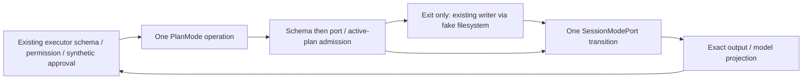

# PlanMode execution and approved-plan persistence

## Scope and source exposure

Start at immutable lane checkpoint `20dfa27920af26f9e56a142073ec6d1b18193ffe`
on `parallel/cli-tools-fast-20261001`. Own plan-mode.ts, narrowly named private
execution/persistence/projection helpers, tests and this spec/receipt/handoff.
Keep plan-mode-prompts.ts, shared declarations/policies, runtime persistence,
other handlers/lanes, root auth/session work and licensing inventories unchanged.
No real user plans, prompts, processes, credentials, model calls or OS changes.

The handler was last introduced by snapshot `7619e41` and is unchanged since
assigned integrated base `0d80f9c`. Audit facts are upstream-modified/unreviewed.
Current handler SHA-256 is
`c086c58f4ed2d4cc99973c80aab24d31a1a1d1b1dce49885d6973a32864ac382`;
prompt file SHA-256 is
`475cf53cecae8e53871528d48970e03159043f8991e61c2a980963c4bc150e03`.
Manifest upstream handler blob is `5d6ae22fb53611ae6effb184fc2538000ee551e1`,
normalized SHA-256
`2c960ad5151af3943d44752f72ddca3bff8203a3660fb93f0fee48252e931583`;
prompt blob is `dee0d037e093d594a1c02d851e2ae3ee8c16126f`, normalized SHA-256
`33177d01366b3b157034a4f835a8e32d21cb22489f3e0026bc0b33437e264434`.
These are existing manifest facts, not a fresh publisher-byte verification.
Source was inspected; this is not clean-room work or a whole-file MIT claim.
Keep attribution, inherited expressions/prose and all 27 unresolved obligations.

## Frozen behavior and ownership

Both direct handlers parse input before inspecting SessionModePort. Enter uses
the strict empty object schema; Exit preserves the raw non-whitespace plan,
20,000 UTF-16-character schema ceiling, catchall unknown fields and optional
Bash-only semantic allowedPrompts. No trim/transform, granting of permissions,
extra command execution, schema relaxation or public declaration change.
Missing port is unrecoverable ConfigurationError with exact tool/call context.

Enter delegates once to enterPlanMode with the port receiver and existing call
ID/trace fields (traceId, spanId, parentSpanId, turnId, no added sessionId).
Exit checks `isPlanEnabled?.() ?? getMode() === "plan"`; explicit false does
not fall back, null/undefined does. Preserve receiver/getter/read ordering and
raw thrown values. No port caching that would change repeated context reads.
Inactive exit gives the existing recoverable InvalidStateTransition before any
filesystem or exit transition effect. Enter has no new active-mode gate.

Exit awaits the existing writeApprovedPlanFile boundary before exitPlanMode.
Missing FileSystemPort skips persistence. Existing writer retains exact raw text,
atomic/createParents/utf8 flags, session-name sanitization/path semantics, abort
signal and trace. It is not replaced, broadened or called on actual filesystem.
Persistence cancellation (aborted signal OR actual FileSystemPortError cancelled)
becomes the exact recoverable ToolCancelled and prevents exit. Non-cancellation
persistence failures currently continue to exit; preserve this boundary, including
throwing getters inside versus outside the catch. Do not silently redesign it.
Transition throws propagate after the existing effect ordering; no rollback or
extra transitions are added. Return own undefined fields and original property
read order; raw approved plan and allowedPrompts are projected exactly.

One PlanMode operation owns parse/admission, ordered persistence and one session
transition. A typed operation intent selects the existing schema/transition and
projection; private helpers never import the compatibility entrypoint. No second
session state, queue, accepted-plan cache, approval flow or duplicated driver.
SessionModePort remains the session state owner. The existing executor owns
approval, permission, hooks, deadlines and cancellation, not the handler.

Preserve all public exports, metadata, capabilities, permission and approval
requirements, timeout 30,000ms, model/inline/preview byte budgets 100,000,
cancellation/trace policies, provider prompts and model text. The inherited
Enter prompt's approval prose and actual existing Enter permission policy are
different; freeze both without changing either. Permission policy remains
Enter direct-allow, inactive Exit deny, active interaction Exit ask or explicit
deny, including yolo. Keep read-only safeguards and denial turn-control/feedback.

## Acceptance and synthetic replay

Before production edits, capture direct source and actual emitted behavior:
schemas/metadata/export identities, embedded-search description variants,
outputs/model content, errors, getter ordering, receiver/call counts, optional
active-mode fallback, write-before-exit and persistence classification. Test
actual built-in registry, executor and PermissionService with fake session,
filesystem, broker and clocks. Cover malformed inputs, plan limits, denied/
cancelled approval, rejected/interrupted persistence, thrown getters/ports,
schema/error ordering, repeat valid transitions, output validation and deadlines.
No synthetic port may call a real adapter, process, provider or user interaction.

Test-only `KNORVIA_PLAN_MODE_TEST_EMITTED=1` loads existing rebuilt .js dist files
and asserts those files exist before import; unset or other values select source.
It has no production priority or policy effect and never falls back to source
when emitted files are absent. Capture option writes frozen JSON only via an
explicit test script argument, before production edits; final suites never rewrite
gold. Native paths may be normalized to portable separators in JSON snapshots;
separate assertions check the exact host-native path/signal/receiver identities.
Generated executor IDs are normalized only after presence/propagation checks.

Commit spec/contracts before replacing control flow. Final corrected source and
strict emitted suites, builds/root+CLI types, configured/owned lint, formatting,
changed/full architecture and full offline regression must run with unchanged
timeout/skip budgets. Record baseline failures and native gaps honestly.
