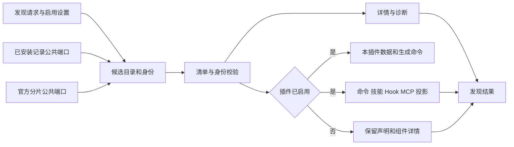

<!-- SPDX-License-Identifier: MIT; Copyright (c) 2026 Knorvia Studio contributors -->

# 插件发现与运行时投影

本边界负责把已有插件目录和已安装记录投影为插件详情、命令根、技能根、Hook 和 MCP 定义。保持 Knorvia 的界面、插件启用设置、存量数据路径与公开导出。市场注册、安装事务、ZIP/Git 来源、官方目录分片、路径工具和版本比较继续由各自公共入口负责，不计作本批替换成果。

## 状态与职责

一次发现请求拥有候选遍历、去重和诊断收集；单个插件投影拥有该插件的组件结果。调用方持有启用态与配置值。插件内容不能自行声明宿主身份或官方来源。停用插件仍有可见详情，但不创建数据目录、不生成命令、不注入可执行资源。

候选按显式本地目录、显式官方根、权威 bundled 分片或官方缓存回退、安装记录的顺序遍历。空 bundled 分片是有效的空权威集合，不能回退扫描旧缓存。身份去重和 suppressed builtins 保持来源语义。清单名称遵守名称规则；市场身份是另一字段，不将清单名称规则套到市场 ID 上，已有含 `@` 的市场身份必须保留。

清单依次识别 `.knorvia-plugin/plugin.json`、兼容的 Claude 与 Codex 清单目录。缺省版本为 `0.0.0`。本插件数据位于 `storageRoot/data/<sanitized-plugin-id>`，命令物化位于其 `generated-commands` 子目录。保留路径规则与权限错误的区分，不把读取被拒绝当作目录不存在。

## 组件与 Hook

默认根与显式命令、技能根去重合并。技能统计按实际唯一 `SKILL.md`，不跟随符号链接；扫描权限错误可降级为零。显式缺失技能目录与实际存在的空技能目录均有对应提示，并保持信息可区分。

对象命令由 `source` 或 `content` 二选一生成，保留名称规范化与长度边界；非法名称不能改写成另一个合法命令悄悄安装。声明错误与越界路径分别诊断。生成 frontmatter 支持说明、参数提示、模型与允许工具；读取组件说明时支持简单标量和折叠、字面块。单项读取失败不抹掉同组其他组件。

Hook 同时读取默认文件与清单声明，同一真实文件只加载一次。事件名枚举只负责可见名称，运行时构造再校验 matcher 和具体 Hook。无效 JSON、路径、事件或 matcher 不得逃逸为无说明成功。Hook 绑定的插件 ID、根、数据与来源路径来自宿主。

详情的 `runnable` 表示 Hook 自身可运行能力，与整个插件的启用开关分开。插件停用时可保留该标记为 true，但发现结果的运行时 Hook 集合仍必须为空。第三方插件现有可执行 Hook 能力不得收紧成只允许官方插件。

## MCP 定义与模板

默认 `.mcp.json` 与清单 MCP 定义按顺序合并，后者同名覆盖。声明名保留原始键，运行时键使用 `plugin:<plugin-name>:<server-key>`。错误只禁用相关服务器，不连带禁用合法兄弟项；stdio 参数中的非字符串项按既有行为过滤。

stdio 的宿主环境包含权威插件 ID、根、数据和项目目录，以及已有的 Claude 根、数据和项目兼容字段。清单不得伪造这些宿主值。MCP 官方来源及鉴权 provenance 也只能由宿主生成。

模板规则按使用位置区分：

- 已知插件根、插件数据、项目目录 token 由宿主上下文解析；`user_config.*` 使用本插件配置。敏感配置只能用于环境值、请求头值和 OAuth client secret 等明确允许的位置。
- 普通裸环境 token 如 `${ACCESS_VALUE}`，只有在上述敏感位置从传入环境读取；在命令、参数、URL 等位置保留字面量。
- `KNORVIA_` 前缀的环境 token 可在所有位置解析，已知宿主路径 token 优先。识别到的必需值缺失只禁用相关服务器。
- `${env.VALUE}`、`${env:VALUE}`、会话、技能及其他不识别模板不臆造上下文，保持既有字面形式。

精确官方鉴权配置仅适用于 HTTP/stdio，不能与 OAuth 共存，SSE 拒绝。官方 HTTP 头检查复用 shared 的公共规则：键经 trim 和大小写归一后匹配保留头、去重并排序；普通 MCP 的静态头不受这条额外限制。本层不访问真实令牌、不判断后端授权，也不发起模型调用。

## 验收与来源边界

独立候选和独立测试先分别冻结。测试先对冻结旧实现建立公共行为基线，保留最初失败和有依据的测试环境修正；新实现使用同一最终测试。保留依赖通过明确的自有测试替身提供，不能暗中导入旧实现来填补候选功能。

验收覆盖来源顺序、身份、启用态、数据路径、根与组件、Hook、MCP 模板和鉴权。规格补充后的环境 token 与完整保留头用例另行记录，不能伪称它们包含在最初测试冻结中。接入后还须运行真实公共依赖下的相关回归、类型、lint、架构、构建、完整离线回归和实际编译产物检查。

通过本边界不等于插件安装来源模块或全仓替换完成。源文件逐一记录依据；根许可证、现有第三方声明及 preview 状态不因这一批改变。
