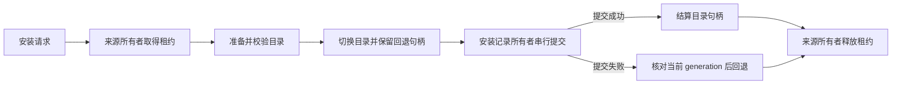

<!-- SPDX-License-Identifier: MIT; Copyright (c) 2026 Knorvia Studio contributors -->

# 插件来源、安装与持久状态

本规格覆盖内置内核的插件来源适配、市场目录、安装记录及原子目录/文件协议。目录浏览与组件发现沿用已独立替换的发现接口；本次不增加插件市场页面，也不改变现有界面和用户配置格式。

候选经独立旧版基线后通过 249 项合同验收，主仓源码与精确编译产物也各通过同一 249 项。整体回归及验证边界见[验收记录](../docs/knorvia-plugin-storage-runtime-acceptance.md)。

## 状态所有权

- 市场配置和已安装记录分别由其持久文件管理。调用者不能用临时缓存代替这两份权威状态。
- 同一规范化文件路径的异步读改写进入同一队列；需要参与修改的读取在队列内进行。同步默认市场初始化不能越过正在写入的异步操作。
- 来源下载、解包、Git 检出各有明确的临时目录所有者。资源租约结束时清理自己的临时结果，不能清理调用者的本地来源目录。
- 安装期间的目录切换与安装记录提交组成一个操作。先保留回退句柄，权威记录引用新 generation 后再结算；失败只回滚仍归该操作拥有的 generation。
- 本次不声称跨进程的任意读改写已经具备完整串行化，也不改变工作区、Agent Host 或 MCP 组件的业务状态所有者。

## 原子协议与恢复

兼容现存的 V1/V2 journal、backup 和 stage 命名，以及其中的 transaction、generation、authority 字段。文件发布和目录发布共用明确的所有权规则，但各自保留其平台替换行为。

- 取得排他 journal 后才能进行目标切换；准备失败不能覆盖其他未完成操作的 journal。
- 切换前检查取消。已经进入不可分割的 rename 阶段后，应完成一致的提交或回退，不在中途把不完整状态返回调用者。
- 恢复通过权威记录证明某一 generation 是否提交。记录之间的循环不能充当提交证明；遇到循环按未证明提交处理，并停止越过该循环清理其他目标。
- 同进程已结算操作与仍活跃操作区分；不能仅因为当前进程存在，就永久跳过已结算操作残留的恢复。无法证明已经结算的其他存活进程保持保守处理。
- 清理 journal 指向的 stage 必须先验证它是目标同目录内、满足准确前缀且后缀非空的单个文件名。路径分隔符、父级跳转和绝对路径不能取得清理权限。
- 回滚/结算句柄只能结算一次。清理允许原合同规定的有限重试，不能无限重试或吞掉尚未证明安全的错误。

## 来源与网络

保持已有来源语法、仓库引用、版本固定、本地相对路径和返回来源标识的公开语义。整个仓库根，或文件 manifest 所在目录，作为后续组件路径的来源根。

- 下载使用受配置控制的 HTTP 适配接口，保留请求取消、180000ms 下载预算、市场 JSON 10MiB 和 ZIP 200MiB 的上限。
- 重定向至多五次；跨 origin 跳转移除敏感请求头。公开 ZIP 下载错误的 URL 删除 username/password，无这两项时保留原始拼写；通用来源诊断按其既有规则归一 URL 并删除用户信息。该有限去敏规则保留 query/fragment，不声称能清理其中的任意秘密值。
- ZIP 只允许 HTTPS 或合同中准确限定的本机 HTTP 地址。拒绝明确禁用的调用者请求头；不能绕过来源校验去访问其他协议。
- Git 使用参数数组调用，不经 shell；沿用子进程网络环境投影、90 秒预算和 10MiB 输出上限。只对规定的网络失败重试，至多三次，等待间隔为 1 秒和 2 秒。
- GitHub archive 与 Git 检出之间的回退由明确分类决定。普通解析、配置或本地文件错误不能变成一次新的网络尝试。含 LFS 指针或子模块的 archive 按已批准行为要求 Git。

## ZIP 解包

插件 ZIP 安装要求固定的 SHA-256。解包前核对内容摘要；每个 entry、每个文件和整个归档都受路径及大小约束。

- 拒绝越界路径、符号链接、特殊文件和加密条目；单文件 50MiB，总解包 500MiB，条目数 20000。
- 条目流异步打开、读取中取消和过早关闭都必须有终态。关闭归档先取消尚未完成的条目工作，再移除所属临时目录。
- 返回所选插件根或市场根，保持单层目录剥离规则；调用者不能重复拼接已剥离的目录。
- 解包、校验或安装失败不发布未验证的缓存目录，也不删除原有成功安装。

## 市场目录与默认项

外部 JSON 总是经过验证。调用者提供一个看似已归一化的标志，不能绕过身份、路径和来源检查；只有实现内部创建并持有身份的结果可以复用。

保持默认市场写入、添加、刷新、健康状态、addedAt、信任和来源归属的公开约定。内置清单与 CDN 清单保持既有优先级；一个有效的空内置清单仍然有效。内容相同的官方分区不重写文件，序列化字段顺序固定为 manifest、version。

刷新以提交时读到的最新记录为基础，不能用下载开始前的快照覆盖同时发生的其他更新。失败回退只能撤销当前操作仍拥有的状态。

## 安装、描述与验证

- 依赖按既定顺序遍历，检测循环、去重，并保留跨市场依赖的允许/拒绝条件。全部所需目录准备完成后，安装记录一次提交。
- ZIP 根需要通过严格 manifest 校验；现有非 ZIP 安装保留较宽松的行为。不能把安装入口偷偷改成与主动校验一样严格，导致现有插件无法安装。
- `strict:false` 且三处受支持的 manifest 全部不存在时，生成 `.claude-plugin/plugin.json`。这只是已有插件兼容格式，不代表产品身份回退。
- 生成对象浅复制原始条目，过滤明确列出的顶层商店字段，再写入归一名称和版本；其他插件字段保留。不得覆盖或修复一个已经存在但无效的 manifest。
- 只读描述优先读取已安装的本地状态，不因为展示说明隐式解析所有远端 MCP 配置。主动校验执行对应的来源与组件检查；两者的警告和失败边界分别保留。
- 当本地来源与安装目标为同一路径时，不虚构目录激活句柄；其直接写入 manifest 的既有失败窗口需要准确记录。

## 卸载与删除边界

卸载先移除首条匹配的安装记录。默认注销不删除原目录；请求清理缓存时，只允许删除 `storageRoot/cache` 的词法严格子目录。

拒绝删除缓存根、缓存外路径或相邻同前缀目录。相对路径在 resolve 后确实位于缓存内，可以删除；不能仅因使用相对形式就拒绝。拒绝删除时，前面的注销结果保留，原目录和插件数据不动并返回错误。需要删除插件数据时，只在缓存删除成功且未要求保留数据后执行。

这项边界是先行批准的安全变化，历史缓存外目录仍可读取和注销。本次只证明词法 containment，不声称已隔离 junction 或所有文件系统别名。

## 验收

独立测试先在冻结旧实现上建立基线；已明确批准的安全修复与旧版缺陷要提前登记，其余行为应通过。候选不得通过修改断言、跳过用例、放宽导入范围或增加时限来获得准入。

候选通过后，核对主仓实际调用入口和 CLI source map 对应产物，执行同一合同测试、类型、lint、架构及完整离线回归。真实网络、模型推理、用户目录与桌面包不由模拟端口覆盖；没有实际运行的部分明确列为未验证。
