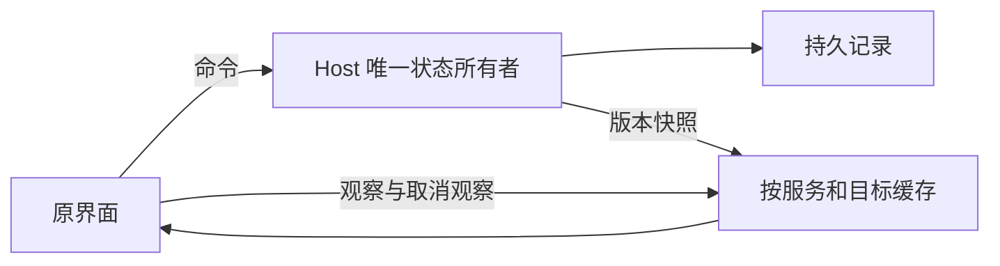

# Knorvia Studio 全量打磨：共享界面与便携行为

本轮在现有原 GUI 内修正真实缺陷，沿用 `knorvia-backend.md`，不恢复旧壳、不新增角色与记忆或成果页面。单聊、群聊/工作流、运行内核分别由同日专项规格补充。

## 共享运行界面

- Host 仍是已接受任务、会话与状态的唯一所有者；客户端仅缓存服务投影。缓存按服务实例隔离，当前观察目标不裁剪；无观察目标的历史缓存最多保留 12 份，重新进入从持久服务读取。
- 同一目标的历史页请求合并，离开后不启动永久刷新。overview 与每个 timeline 的错误分别归属，单个目标读取失败不令其他会话显示离线。客户端销毁订阅后在途响应可以更新缓存，但不能重新开启轮询。
- 消息沿用原消息组件；加载更早消息保持当前阅读位置，切换目标恢复跟随底部，新消息不能拖走正在阅读历史的用户。提供回到底部入口。待确认/排队/停止中与正在执行使用不同文字；工具终态翻译，不直接显示内部英文枚举。
- 复制操作给出成功或失败反馈。选择题选项与自由填写分开维护，多选支持保留选择再补充文字；提交时冻结控件，不显示内核未提供的许可选项。
- 历史与差异窗口的临时状态按 target/service 归属；迟到读取不能在另一个会话弹出旧差异窗口，已关闭窗口不能被迟到刷新重新打开。差异列明确区分当前项目与待应用内容，使用 diff 语义颜色。失败后重试入口明确为重试，不暗示固定轮次继续。

## 数据位置与引导

- 设置服务报告实际数据位置及固定原因。便携版显示自己的目录并说明随应用文件夹移动；不能展示用户主目录，不能先让用户选择目标再报“复制失败”。环境固定目录也不提供注定无效的迁移入口，服务层同样拒绝复制。
- 存储位置查询失败显示可重试错误，不回退成误导路径。文件选择失败保留草稿，保存期间保留选中目标，错误不抹掉输入。
- 本机偏好保存成功即完成引导；附属记录写失败不得使已完成用户下次又被引导。退出未完成引导仍只关闭本次，不擅自保存未确认偏好。移除过时的账号/上传注释。

## 验收

第二遍以生产便携包实机复查第一遍结果。未读到目标状态或该目标读取失败时禁止提交新任务，停止入口仍保持可用；修复同事务历史记录分页、未知结果队列屏障、迟到保存覆盖和未保存退出等边界。模型设置没有供应商时隐藏空导航列与无目标返回按钮，沿用原组件和字号。夜间实机调试使用深色，首次启动默认白色不变。

为时序、草稿/缓存与权限选项等行为添加实质回归；运行相关类型、lint、架构检查和生产构建。实际便携界面检查统一聊天、模型档位、待答/历史、群聊、画布、设置、窄窗口和主题切换。无需真实模型的检查使用夹具，必要联网推理固定 `gpt-5.6-luna` / `low`。交付仍覆盖桌面现有展开目录且逐文件验证 data 不变。
