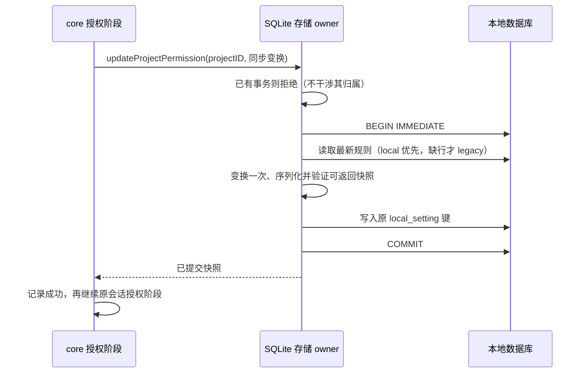

<!-- SPDX-License-Identifier: MIT; Copyright (c) 2026 Knorvia Studio contributors -->

# 项目授权的存储端原子更新

## 问题与边界

基线 `1034f17` 的 core 项目授权通过 getSession → getProjectPermission → 合并 → saveProjectPermission 完成。只读复核已在新建内存 SQLite 与真实 local-settings repository 中复现：两个普通并发调用均先读旧值，先保存 A 后保存 B，最终丢 A；无需真实用户数据或人为屏障。

本批独立替换 `adapters/storage/session-store/repositories/local-settings.ts` 的项目规则/模式记录投影和存储访问，并给内置 SQLite 增加原子更新能力。core 继续独占规则合并算法；不新增 adapter→core 依赖、进程内锁表或授权缓存。SessionStorePort 和 SQLite 大 facade 只增加委派入口，仍保留其适用许可，不借少量增量声明整个文件独立。无需变更表结构、数据迁移、项目身份、权限类别或 UI。

## 唯一所有者与接口

SessionStorePort 增加可选 `updateProjectPermission({ projectID, update })`，返回 Promise<PermissionRuleset>。update 是同步纯函数，输入当前持久化规则或 null，返回新的规则；不允许 Promise 结果、I/O、重入或异步等待。原 get/save 继续可用，保存仍表示明确的全量替换。

core 在取得 projectID 后优先调用此能力，将现有 applyPermissionUpdates 作为变换交给存储端；存储方法保留自身 receiver，合并使用原 updates 引用。存在该方法时任何异常向原 grant 错误路径传播，绝不回退旧保存。方法缺席的外部 store 保留原 get/merge/save 顺序、等待和日志语义，其并发保证仍有限，不能宣称已经原子化。

SQLite 独占事务取得、读取、一次 updater 调用、序列化、写入与提交。事务内没有 await。成功结果必须已经 COMMIT；序列化后的数据库快照作为返回值，不能直接返回仍可变的 updater 对象。

新接口在入口捕获 projectID，回调不能把这次写入转移到其他项目。序列化根必须是非 null、非数组的 JSON 对象，保留未知成员；这项新边界不收紧原显式 save 接口。

## 一致性与失败

- 跨连接/进程串行化由 SQLite 写事务提供，沿用既有锁等待配置。只有成功取得本次事务后才允许本方法回滚；BEGIN 失败不能回滚别人。
- 同连接已有事务明确拒绝，保留原事务内容与控制权。相邻 fork/import owner 存在持锁后 await 的路径，本批不重构它们，不用 savepoint 冒充独立提交。
- updater、序列化、读取、写入或 COMMIT 失败时回滚本次事务并传播原异常；回滚本身失败时同时保留两个原因。失败不自动重试 callback，不静默全量覆盖。
- local_setting 的 ruleset 行存在时，即便其 JSON 为 null，也不回退 permission 表；坏 JSON 继续报错。只有缺行时才读 legacy 表；新写入使用原键，不改变旧表。
- 保留 version、类别、条目顺序、重复处理和未知字段；合并继续复用原 core 算法。time_created 在更新时保留，time_updated 随成功写入更新。模式记录保留原读写合同。
- 此保证覆盖都使用新原子接口的写者。旧程序或外部 store 继续 get/save 覆盖、显式全量 save 或任意直接 SQL 写入，仍可能覆盖新结果；不能给混合版本写入虚假的全局保证。
- 提交后日志抛错仍可能表现为项目已经写入、会话阶段未开始；保留原部分成功语义，不回滚已提交授权。桌面连续链路及移动端回放沿用原授权事件，不增加新传输所有者。

## 验收

先写真实内存库并发丢更新反例以及 core 选路、不回退、receiver、原更新引用和提交后日志的合同。补 repository 旧读写/模式/local 优先/legacy 回退、同连接事务保护、变换/序列化/SQL/提交失败和清理、返回快照语义。临时磁盘库和两个独立子进程验证双方追加、锁等待后读最新值及锁超时不覆盖；不使用实际用户库。

执行根/CLI 类型与 lint、定向严格检查、架构、构建、完整离线、格式、来源与暂存密钥扫描。固定旧版对照保留接口；编译公开 SQLite+core 接线另行验收。前一批 Runner 已提交推送；本批最初新鲜度读取遇到 TLS 失败，随后只在子进程启用 OpenSSL 和 HTTP/1.1 并保留证书验证，重试通过（ahead 0、behind 0）。

根 Apache-2.0、0.8.0-preview.3、现有前端及历史发行保持不变。来源许可只覆盖可确认的新实现与新测试/文档；整仓 MIT、安装/便携包与官网最终发布继续待全量迁移完成。
