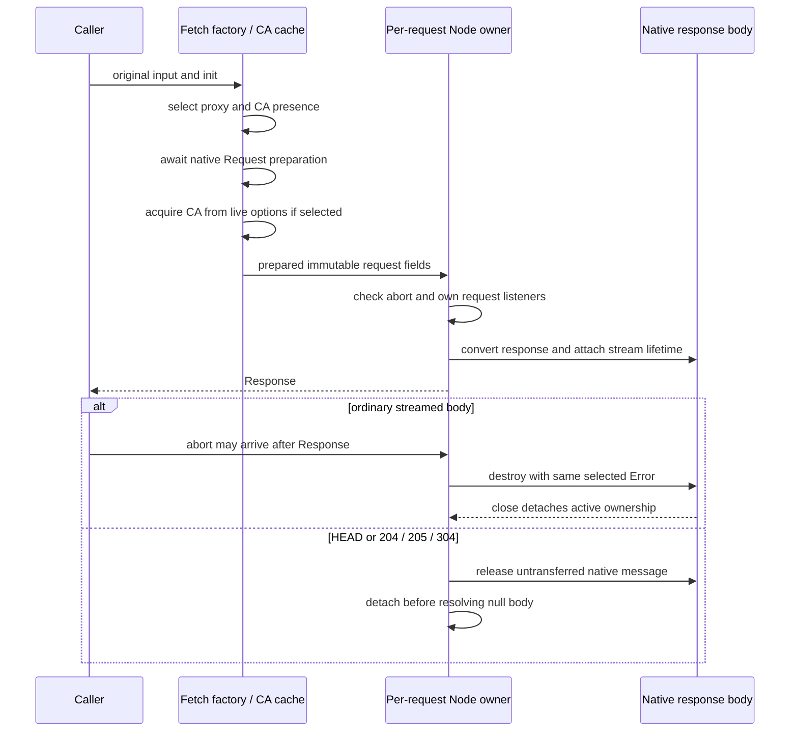

<!-- SPDX-License-Identifier: MIT; Copyright (c) 2026 Knorvia Studio contributors -->

# Fetch-compatible proxy transport contract

Final behavior-only contract authorizing isolated implementation from the approved input bundle. Root has read the old single module, its declarations, provider/MCP caller boundaries and the recently independent HTTP exchange. Author retains own prior context, which is not a whole-process clean-room claim. Do not read other product source/history/tests/probes/runtime bundles.

## Public behavior to preserve

One runtime export createNetworkProxyFetch(options), arity1, return type typeof globalThis.fetch. Private options are caCertFile/env/fetch/httpProxy/noProxy. Retained config functions resolveProxyUrlForRequest, resolveTlsCaCertFile and loadTlsCaCertificates own rule interpretation and synchronous CA reading. No captured-user proxy fallback beyond that ordinary resolver, new settings, UI, caller API, proxy/DNS policy or model request.

Factory captures options by reference and chooses provided fetch or current global fetch bound to globalThis. If all policy fields caCertFile/env/httpProxy/noProxy are falsy at construction, return that direct fetch itself, retaining provided function identity; later mutation does not retroactively add a wrapper. Even empty env object or whitespace truthy field chooses a wrapper. That wrapper has two parameters and evaluates each call's current options. It has a successful-CA-load cache, loaded only when a currently selected CA path is truthy, including success if retained loader returns absence; failed reads retry. Current selected path absence bypasses cached CA; changing to another nonblank path after success still uses the successful cache, preserving current behavior. No global cache.

First read input URL: supplied URL directly, Request via its url, otherwise String(input) then native URL. Parse/access failure or nonHTTP(S) returns directFetch(input,init), unchanged objects; do not replace native direct-fetch validation. For valid HTTP(S), resolve ordinary proxy then trimmed CA path. If neither exists, forward original input/init directly. A bypassed proxy with CA still uses the Node path. Policy getters/config errors are not a general fallback.

Only on Node path construct native Request(input,init), uppercase its normalized method, copy nonempty bytes to Buffer for methods other than GET/HEAD via await arrayBuffer; empty/GET/HEAD uses undefined body. Native Request/header/body errors reject before CA load. Use native request headers/signal/url; Request semantics own init overriding, bodyUsed and signal linkage, do not invent normalization. Load/cache CA after normalization only when selected CA path exists. Keep raw native errors from this preparation.

## Node transport and streamed ownership

Transport selected by normalized URL protocol. Native request receives hostname/protocol/optional port/path+query/method/plain lower-case headers, and sends optional Buffer once. URL userinfo is not separately turned into Authorization. Proxy uses existing ProxyAgent with ca, getProxyForUrl closure and httpsAgent only when CA exists; otherwise direct HTTPS agent(ca) or direct HTTP agent. Exact declarations will be supplied; do not read third-party implementation. Do not introduce global agent cleanup/reuse or native auto-redirect/decompression. Returned Node Response uses statusCode ??502, statusMessage and accumulated raw headers including array members, has existing constructed-response URL/redirect behavior, and streams ordinary body bytes through native Readable.toWeb.

Unlike the already independent read-to-completion HTTP port, this boundary returns a Response before body consumption. One request owner must continue managing cancellation until its owned native message closes, even after outer Promise resolves. Pending abort rejects with original signal.reason when Error; otherwise new Error('The operation was aborted.') named AbortError. Already-aborted signal must cause no transport request. After Response transfer, cancellation terminates owned request/message so the body consumer sees abort; it must not generate a global unhandled Node error. Request setup/early errors reject once and release signal/request listeners; late request errors must not change a selected result or become global exceptions. Synchronous transport setup failures must not strand an abort listener. Normal body close removes owned listeners; cleanup must not replace the first result/cause.

Root's owned loopback proxy (no target forwarding/DNS) confirms 200 returns body, but204/205/304 raise Response-constructor TypeError outside the Promise and leave request pending. Repair: valid no-body statuses or actual sent HEAD return null body and release the untransferred native message immediately. Catch all conversion failures inside response delivery, reject with the original conversion cause and release only owned resources; do not set success before Response exists. Late messages after terminal rejection must be safely disposed. Root will independently check failure identity, cleanup timing and post-Response abort using owned synthetic and native loopback cases. Do not erase these finite limits or assume all event orderings have been proven.

## Settled preparation and lifecycle details

Use two modules: factory/cache/preparation and its private Node streamed owner, each <400 normally formatted lines. Design before source. Do not modify/reuse the previously accepted HTTP bridge: its native signal and read-to-completion caller semantics do not preserve this port's original Error identity and post-transfer lifecycle. Reuse only approved public config/Node/ProxyAgent declarations; no new framework or production injection endpoint.

Preserve preparation precedence. On Node path, native Request construction and awaited body bytes finish before selected CA load, and CA load finishes before checking signal.aborted. Request/body/CA failure therefore wins over an already cancelled signal if encountered earlier. Do not race/cancel body preparation anew. Proxy URL and initial CA-path presence are selected before native Request/body awaits. The CA loader, when first needed after normalization, receives the original options reference with its then-current fields; do not replace it with an early path snapshot. Only successful load commits the instance cache. The previously selected path presence controls whether to use that cache for this call. Send the normalized Request's URL/method/headers/body, not later mutated input/init.

After that preparation, an already aborted signal rejects without constructing request/agent or adding an abort listener. For a subsequent abort, choose one Error reason: retain signal.reason identity if instanceof Error, otherwise create Error('The operation was aborted.') with name AbortError. The same selected error goes to the pending Promise (if still pending) and any owned message/request destruction; message is destroyed before request, matching the existing order. An already transferred ordinary response body consumer observes that Error through the native stream, not a new HttpClientPortError or native-signal wrapper. Root confirmed this Error identity on its own loopback response; do not combine Node automatic signal with manual abort and allow a wrapper to win.

Promise terminal selection and resource close are distinct. Active abort/request/message listeners may be removed after terminal cleanup, but late errors from an owned handle must remain harmless. Retain a passive error absorber on a discarded/destroyed owned handle where needed even after close; it must not capture the active request owner or signal. Never remove other components' listeners, replace native Readable.toWeb body observers, or call removeAllListeners. Signal association ends on failed setup, terminal failure, immediately released no-body message, or native ordinary-message close; it does not remain until arbitrary later JavaScript garbage collection. Rejecting/setup/conversion cleanup preserves first cause even if destroy/listener cleanup throws. Preserve no-body success even if best-effort cleanup fails. A late response after a selected rejection is disposed without re-delivery. No timeout, maximum-byte reader, retry, global agent cleanup or new error-classification policy.

IncomingMessage.headers is the source, not rawHeaders. For each array value append every item; skip undefined scalar, stringify other scalar. Constructed Response keeps statusCode ??502 and statusMessage, existing empty url/nonredirected semantics; no redirect following or content decoding is added. Native outgoing header object contains normalized Request Headers key/value strings. Direct HTTPS always gets new https.Agent({ca}), even if ca absent; direct HTTP gets new http.Agent. Proxy always gets ProxyAgent with ca/getProxyForUrl and httpsAgent only when ca present. The sent method is fixed before callbacks; HEAD and statuses204/205/304 use null body and immediate owned-message release. All other statuses remain native Response validation (including failure for invalid status); failures reject with original cause and never escape callback.

Synchronous request constructor/end/registration failures and response conversion failures require an explicit failure boundary with owned-signal cleanup. Root confirmed setup throw previously preserved the error but left its abort listener. Normal stream consumers retain native buffering and close behavior. Do not invent a general fallback value or new premature-close error contract outside these repairs.

## Acceptance and input limits

Only approved behavior/public API/config declarations and permitted installed ProxyAgent type declarations are product inputs. Author may use own prior review context, not old source/history/tests/probes/bundles or runtime imports. Only static Node24 syntax, strict types, formatter and 94-rule lint; no candidate execution, DNS/network/CA probes or tests. Root tests old first, then candidate/source/actual CLI artifact, callers and offline suite. No model call or production access is necessary. Root retains full-source access and separately reviews provenance; MIT candidate headers and tests alone do not prove authorship. Root Apache-2.0, retained helper/shared/third-party rights and preview identity stay until their own applicable work is complete.

## Preparation completion supplement

This is a root-authored behavior-only supplement after four additional old-first observations, not a code or test excerpt. The first candidate passed the initial46 cases. The additional four cases pass4/4 against the inherited helper; the original candidate preserves two synchronous-direct-fetch cases but fails two CA timing cases. Original candidate source and runtime evidence remain frozen externally.

For GET and HEAD, normalization is still an asynchronous completion boundary even though no body bytes are awaited. Example: options initially selects existing CA path A, call wrappedFetch(url,{method:GET or HEAD}), then immediately change the same options object's caCertFile to existing B before yielding control. The transport must use bytes from B. Proxy and initial CA-path presence are already selected; CA acquisition from the live options occurs after normalization completes asynchronously, not during the synchronous prefix of wrappedFetch. Both files are owned valid fixtures, so this is not an IO failure/retry case.

Retain one complete asynchronous native-Request normalization boundary before CA acquisition/transport for all methods, including GET/HEAD and methods that awaited body bytes. Native Request construction/normalization errors still beat selected CA and transport cancellation. Headers/method/url belong to that prepared Request, no new reread of mutable input/init. Do not turn this into an arbitrary timer delay, a network retry or a snapshot of the earlier CA path.

The two other new observations confirm synchronous direct-fetch throws on unsupported/invalid URL are delivered once with original error identity. Those already pass and need no fix. The root will rerun all50 cases and compiled/full validation after a narrowly revised candidate; author must not access tests, probes, old source or product execution.

## Ownership and delivery order

