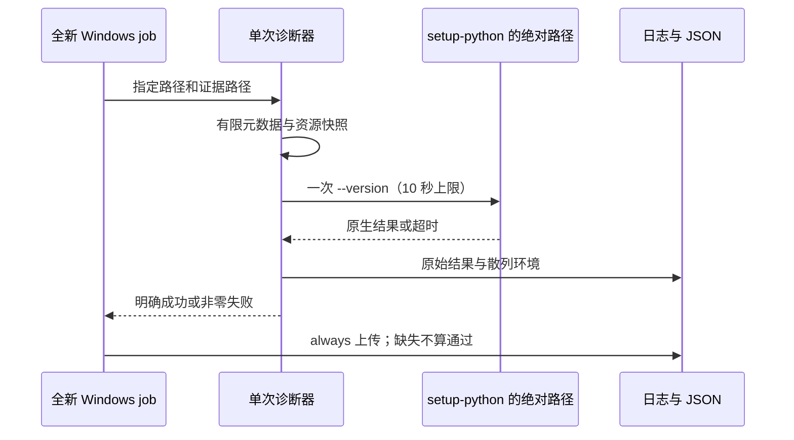

<!-- SPDX-License-Identifier: MIT; Copyright (c) 2026 Knorvia Studio contributors -->

# Windows Python 启动诊断

本规格先于诊断流程接入。提交 `c439b5d` 的 Windows 离线回归中，
已选定的 Python 3.13.15 绝对路径执行 `--version` 超过 10 秒，资源
检查脚本尚未启动。原因未确认，诊断结果不能替代发布门禁，也不修改
原测试的超时、断言、失败状态或解释器选择。

## 边界与所有者

- 独立手动工作流创建三个全新 Windows job，分别在 setup-python 后、
  依赖安装与 CLI 构建后、与 local-diagnostics 测试以并发 2 配对时观察。
- 每个 job 固定 Node 24.14.0、Python 3.13，唯一探测入口为
  setup-python 返回的 python-path；项目自身只启动一次 `--version`。
- 诊断器拥有这一次同步启动和它的证据。固定 10,000ms，不重试、预热、
  回退解释器、增加预算或将失败改为跳过。前置步骤失败同样保持失败。
- 日志仅记录可执行文件 stat/realpath、时间、父进程资源差值、有限
  runner 标识及原生启动结果；11 项启动环境变量仅记录是否存在及散列。
  不枚举完整环境，不读取用户配置、凭据或 Python 包目录。
- JSON 以排他创建写入，原始日志与 JSON 总是尝试上传。缺证据、探测
  失败、版本不符均失败。超时和成功未复现都不能被解释为原因已确认。
- 原质量工作流仍是发布检查的唯一所有者；本手动流程不构建应用安装包、
  不创建 Release、不更改产品状态。

## 验收

用自有假进程端口分别确认超时、成功、非零退出、异常版本输出与证据
写入失败；一次调用只能发生一次 spawn。真实 Node 作为目标时应留下
状态 0 的原生结果，但因不是 Python 3.13 而使诊断失败。三 job 的云端
结果必须绑定实际提交和 run；任何本地替身结果不证明云端 Python 正常。
