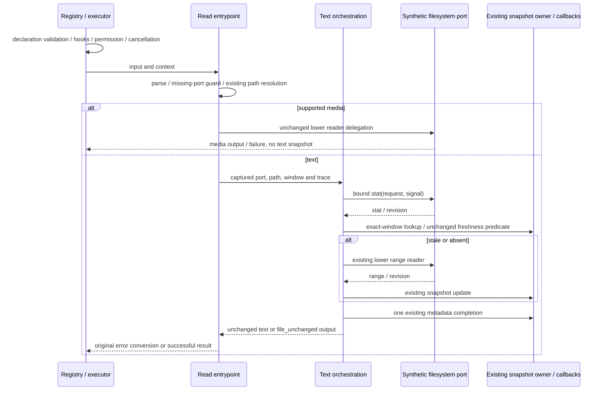

# Read text orchestration compatibility

Baseline `db8968d7a386105b92f3ad2b3e231782ff261cd3`, branch
`parallel/cli-tools-fast-20261001`. Scope: `read.ts` text stat/snapshot/read/commit/
completion orchestration, a narrowly named private helper and synthetic tests.
Public declaration, admission, path, media dispatch, error conversion, existing
state helpers and all lower readers stay intact. No product policy change.

## Lineage and existing work

Current `read.ts`: 13047 bytes, SHA256
`64513faf708de1851e29acdc5a000040cf82a887485347fe1faeca2b1375c656`.
Its local path history is snapshot `7619e41` and `d0534df` (missing-file suggestion
replacement and exact presentation relocation). The latter evidence explicitly
does not claim a whole-handler independent rewrite. Upstream manifest: ZCode
`872ad960de7ec172591f7e1952f7849229f94521`, path
`apps/zcode-cli/packages/core/src/tool/handlers/read.ts`, blob
`397c1d6fdb8bbf1119fb1debfdafd8d514b1c265`, normalized SHA256
`d3cebd63754aa4753832a1ab78d43ee3c8c00ce452972ebce2e24e1b81fa3712`.
These are existing manifest facts, not a fresh local publisher-byte check.

Existing text-budget, binary/media, PDF, filename-suggestion, snapshot codec and
lookup/hydration specs/evidence establish bounded technical replacements. Preserve
their bytes and tests. `read-model-content.ts` is explicitly a retained relocation,
also protected. Existing audit classifications/NOASSERTION are not authorship or
licence approval; technical coverage does not establish rights. Source was read;
retain attribution and older lane licensing inputs/27 obligations. Parent reports
one Keyv closure to 26 separately; do not import it. No clean-room or whole-file
MIT claim.

## Owner and coherent replacement

The executor/runtime owns the supplied ReadFileStateMap and persisted metadata.
The existing context-keyed WeakMap is the only fallback when a map is not supplied.
Existing state callbacks remain in `read.ts`; no second cache/snapshot owner.
FileSystemPort owns file/revision/range/cancellation facts, lower readers own their
accepted projection/budget/media processing and existing path/permission components
own access policy. This slice replaces duplicated text-result completion with a
single orchestration path: stat, choose existing snapshot or read, commit only a
completed fresh read, then complete metadata exactly once. A lower private helper
accepts explicit existing state callbacks; it never imports its entrypoint or
adds persistent state. All external effects use existing injected ports.
The lower range-reader argument object is encoded from an ordered field contract,
preserving own undefined fields and signal-before-window evaluation. This replaces
the inherited argument literal; accepted lower range translation/budget code is
not rewritten. No extra await separates snapshot update and metadata completion.

## Frozen contracts

- Parse input before reading FileSystemPort; preserve device/binary preflight
  tool-use error versus native Zod errors and PDF validateInput semantics.
  A valid pages value on a non-PDF remains ignored when admitted by the resolved
  model declaration; the generic declaration can reject the extra field earlier.
  Missing-port guard precedes cwd/workspace/path resolution. Existing path policy
  handles relative/absolute/empty paths and outside-workspace admission; do not
  tighten or broaden it here. Getter/path failures before try stay outside its
  filesystem-error conversion boundary.
- Keep image, video, supported PDF and text dispatch order. Media bypasses text
  snapshots/metadata. Existing model capability gates, repeated context port
  reads, reader receiver/signal/trace, PDF pages/failure and all budgets remain.
- Text captures FileSystemPort once before path resolution. Trace reads traceId,
  spanId, parentSpanId, sessionId, turnId in order, ignoring traceContext. Stat
  method getter precedes request/signal evaluation. Stat completes before state
  lookup; no kind/security policy is added by the handler.
- Supplied state is read with existing getter count; fallback is per context.
  Cache offset defaults only when undefined, preserving zero; limit remains part
  of the exact window key. Freshness keeps partial truthiness, integer-millisecond
  comparison plus size, then nonempty revision IDs, then defined size comparison.
  Preserve malformed entries/stats, native errors and getter order.
- Cache hit performs no range read or snapshot set, returns exactly
  file_unchanged and uses the existing metadata completion time. Miss calls the
  unchanged lower text reader with exact offset/limit/maxBytes/signal/trace.
  Revision capture occurs via its existing onRead callback. Commit only after
  successful projection; stat revision precedes range revision, then stat mtime
  fallback. Preserve output content, partial flag, sourceTool and readAt timestamp
  order. State mutation remains visible if later metadata completion throws.
- Metadata callback admission/getter/receiver/read order, raw tool input, current
  exact window and codec remain. Missing freshness facts produce no metadata;
  completion still uses its existing clock evaluation. No reload or retry.
- Filesystem not_found conversion may call the existing suggestion helper once;
  its best-effort failures cannot replace the original cause. too_large keeps
  exact error/context/maxBytes/recoverability. All other thrown/rejected/non-Error
  values preserve identity. Existing reader-specific conversions stay lower.
- Preserve public exports/reexport identities and exact d.ts bytes, metadata,
  model description/schema/timeout resolvers, approval/read-only/permission
  semantics, error/prose/output/model-content shapes and executor display/metadata.
  Cancellation remains owned by the existing executor and lower ports; do not add
  checks that change direct-handler late-success/state behavior.

## Synthetic freeze and acceptance

Spec and unchanged source/actual emitted freeze precede production edits. Golden
capture requires an explicit path; final tests read committed observations only.
Test-only `KNORVIA_READ_ORCHESTRATION_TEST_EMITTED=1` selects actual emitted handler,
registry/executor/permission/state/reader consumers; other/unset selects source.
Read emitted JS before import, fail if missing; no tsx source fallback. This is
test selection, not new product configuration. Known synthetic workspace prefixes
are normalized only for portable frozen observations; request paths, native path
rules, own fields/references and receiver/read order get separate assertions.

Use synthetic FileSystemPort, media/model properties, state maps, metadata/approval
callbacks, clocks and manual delayed gates only. No actual file reads/writes,
accounts, network/model calls, processes, credentials or security settings through
these tests. Cover input/path/port errors, window/budget boundaries, repeated
contexts/fallback, state and metadata timestamps, malformed/getter/thrown/rejected/
delayed ports, cancellation and real registry/executor/permission consumers.

Run final source and strict emitted regression, unchanged lower-reader/state tests,
CLI build/types, root types/configured lint, strict owned lint, full formatting,
architecture and full final suite. Bind exact current/emitted/protected hashes and
counts in named lane evidence; report native gaps and unchanged unowned failures.
No dependency, CI, licence inventory, other-lane or prior checkpoint edits.
