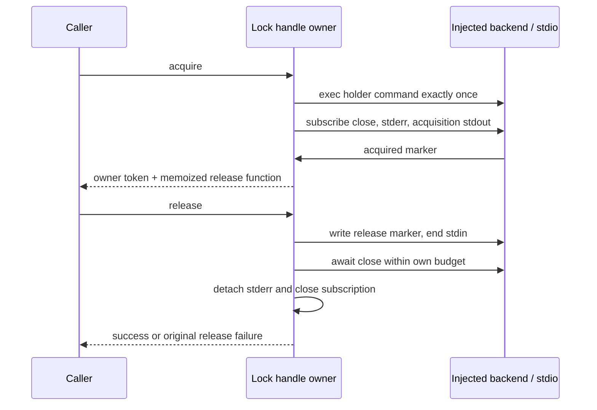

# Remote deployment-lock owner — 2026-10-02

Fifth isolated PR9 batch, baseline `de3ff5c2cf6418a35186f3a9e5895984551e0c23`.
Exclusive production path: packages/server/src/remote/remoteDeployLock.ts.
Close subscription and best-effort owned-stream cleanup remain private helpers
of this owner; no other production file needs alteration. No root cache/CDN/
network helpers, backend/deployment callers, credentials or security settings.

Fresh author reads this functional packet and repository/architecture guidance
only. Observer read baseline source and direct caller for contract extraction.
Author gets no implementation, existing tests, history, patches or dependency
source. Shared filesystem is not OS isolation. Write a whole replacement owner,
not a wrapper/extraction from prior code. No novelty or licence decision is made.

## Public dependency APIs

Imports: randomUUID from node:crypto; posix from node:path; type IRemoteBackend,
StdioStream from @knorvia/server/remote/backend.js; REMOTE_BASE from
@knorvia/server/remote/deployShared.js; quotePosixPathArg,quotePosixShellArg from
@knorvia/server/remote/posixShell.js. REMOTE_BASE currently '~/.knorvia-studio/server'
but import rather than duplicate it. Quote helpers are the established literal
POSIX quoting APIs, including home-prefixed paths. No dependency implementation
reading needed. backend.exec(command:string):Promise<StdioStream>. Stream has
stdin:NodeJS.WritableStream, stdout/stderr:NodeJS.ReadableStream and onClose listener
registration returning {dispose():void}; callback gets number exit code.

Only public exports:

```typescript
interface RemoteDeployLockHandle {
  ownerToken: string;
  release(): Promise<void>;
}
interface AcquireRemoteDeployLockOptions {
  lockDir?: string;
  ownerToken?: string;
  acquireTimeoutMs?: number;
  releaseTimeoutMs?: number;
}
async function acquireRemoteDeployLock(
  backend: IRemoteBackend,
  options?: AcquireRemoteDeployLockOptions,
): Promise<RemoteDeployLockHandle>;
```

No AbortSignal, external cancellation API, queue or extra exposed command builder.
Owner token is options.ownerToken?.trim() || randomUUID(); lock directory is
options.lockDir?.trim() || `${REMOTE_BASE}/.deploy.lock`. Both time budgets:
Math.max(1,Math.floor(option ?? default)); acquire default120000ms, release5000ms.
Do not normalize NaN/Infinity, trim/sanitize further or validate token formats.
Markers exactly 'knorvia-deploy-lock-acquired:'+ownerToken and
'knorvia-deploy-lock-release:'+ownerToken; release marker has newline on write.

## Single owner and ordering



Remote directory/owner file is the lock admission owner across processes; shell
mkdir retry is queueing without a JS FIFO or fairness guarantee. Local handle owns
one stream, one close observation, stderr tail, acquisition listener/deadline and
memoized release promise. Closing this lock never disposes shared backend or
changes/deletes another owner's lock via extra commands. Timeout cancellation
acts only on this lock-holder/waiter's three owned streams.

## Holder command semantics

Build a POSIX sh holder script plus an outer file-materialization command. Shell
variable names and whitespace may be independently chosen, but literal marker/
diagnostic strings, quoting, operations, argument order and policy stay compatible.

Inner script:

1. set -eu; assign quoted lock path and literal owner token. Owner file is
   lockDir+'/owner'. Stale directory is lockDir+'.stale-'+ownerToken. mkdir -p
   posix.dirname(lockDir), using existing path quote helper.
2. Retry mkdir lockDir with stderr redirected to /dev/null until success. On each
   failure read mtime using stat fallbacks in order: stat -c %Y owner file,
   stat -f %m owner file, stat -c %Y lock directory, stat -f %m lock directory.
   Suppress those diagnostics and use printf0 if all fail. Read date +%s.
3. If mtime>0 and age>=600 seconds, attempt command mv lockDir staleDir with
   stderr suppressed; only when mv succeeds rm -rf staleDir. Continue loop after
   stale attempt. Otherwise sleep1. No remote timeout/owner bypass is added.
4. After winning mkdir, printf %s owner token to owner file, preserving literal
   quoting. Install EXIT/HUP/INT/TERM cleanup. It kills/waits the heartbeat child
   if its pid is nonempty, suppressing errors; then reads current owner and only
   rm -rf lockDir when current owner equals this token. Signal cleanup has no new
   explicit exit behavior; preserve the POSIX trap continuation semantics.
5. Spawn background heartbeat while owner file still equals token; touch owner
   file, exit that child0 if touch fails, sleep30 seconds each iteration. Save pid.
6. Print acquired marker via printf '%s\n' and quoted literal marker operand.
   Read a single release line using IFS= read -r (EOF failure ignored). If line
   differs from exact release marker, echo '[deploy-lock] invalid release marker'
   to stderr and exit1; EXIT cleanup still enforces owner equality. Matching line
   falls through successful script completion/cleanup.

Outer command:

- Holder path = lockDir+'.holder-'+ownerToken+'.sh'. mkdir -p its posix.dirname.
- UTF-8 encode the entire inner script and express EVERY byte as backslash plus
  three octal digits. Write it with printf '%b' using quoted octal text to quoted
  holder path. This prevents intermediate shells/WSL from prematurely expanding
  inner dollar variables and leaves stdin free for release marker.
- set -eu; install EXIT/HUP/INT/TERM trap that rm -f only this quoted holder path;
  invoke sh with quoted holder path (not bash). Keep mkdir/write/trap/sh order.
- No shell command is run by author/observer validation. Only backend.exec receives
  the assembled string in production; in safety validation backend is synthetic.

## Local acquisition

Await backend.exec once before any close/stdout/stderr subscription; execution
rejection propagates original value unchanged. Make one close promise resolving
first callback code, retaining returned subscription for disposal. No new close
error conversion or backend cancellation. Attach stderr data handler; concatenate
chunk.toString() and keep last4096 JavaScript string characters. That handler stays
through acquired lifetime and release, then detaches with .off.

Acquisition wait tracks stdout tail (also last4096 characters, chunk.toString()),
a single settled latch and timeout. Install referenced timer BEFORE stdout.on,
which may synchronously deliver buffered marker. Acquired iff tail.includes the
full acquired marker (substring, not exact line); mark settled, detach stdout data
handler, clear acquisition timer, resolve. Stderr listener and close subscription
stay for release. Then observe close.promise; before marker it marks settled,
detaches stdout, clears timer and rejects NEW Error:

`[deploy-lock] lock-holder exited before acquisition (code=${code})${suffix}`

On acquisition timeout: mark settled; detach stdout; clear timer; best-effort
DESTROY stdin, stdout, stderr in that order; then construct/reject NEW Error:

`[deploy-lock] lock acquisition timed out after ${acquireTimeoutMs}ms (owner=${ownerToken})${suffix}`

suffix is ': '+stderrText.trim() only when trimmed text is nonempty. Destruction
can generate synchronous synthetic stderr/close events; acquisition timeout error
uses diagnostics after destruction. Each stream optional destroy method is called
with that stream as receiver; each throw swallowed independently so later streams
are still attempted. Never backend.dispose/disposeAndWait, extra backend.exec,
rm via a second command or arbitrary stream destruction.

Acquisition failure removes stderr handler then disposes close subscription and
rethrows SAME error. Cleanup throws retain baseline native boundaries (no new
catch/wrapping). Close promise registration exceptions reject that promise; no
new catch/timeout semantics for malformed event providers are introduced.

## Local release

First release synchronously writes releaseMarker+'\n', then ends stdin, before
awaiting close. Both operations occur in async cleanup chain so synchronous port
throws reject release. Store that resulting Promise and return the identical
Promise on repeated release calls, including after success/rejection. No new
reentrancy scheduling guarantee is added for port callbacks invoking release
synchronously before memoized assignment completes.

Construct release timeout Error AFTER write/end and before installing referenced
timer. Error snapshots stderr suffix at that time:

`[deploy-lock] lock-holder release timed out after ${releaseTimeoutMs}ms (owner=${ownerToken})${suffix}`

Race close promise vs its separate release timer. Only when caught error is
EXACTLY the constructed timeout Error, destroy owned stdin/stdout/stderr in order
using best-effort helper. Propagate that same Error. Other close/write/end failures
are not converted to timeout and do not trigger that destruction. Clear release
timer in its settlement cleanup. Even already-resolved close still follows
write/end and timer-install/clear ordering. Exit code0 -> resolve undefined;
nonzero -> NEW Error using latest stderr:

`[deploy-lock] lock-holder release failed (code=${code})${suffix}`

On EVERY release completion/failure, remove stderr handler then dispose close
subscription in outer finally. Do not alter deployment caller's aggregate-error
handling or dispose caller-owned backend. No new inactivity timer or extra output.

## Validation scope and frozen behavior

Latest user cadence defers routine matrices/full suites/builds/semantic/platform
checks. One minimal synthetic release-timeout safety check is warranted because
wrong cleanup could dispose a shared backend or a competing owner. Use only fake
exec/streams; verify literal release write, memoized Promise, destruction order,
listener cleanup, and no backend disposal/second command. Capture same check
against baseline and replacement. Never execute/parse with a real shell, deploy,
connect, call Docker/WSL/SSH or access real credentials/data.

Static review covers shell ownership guards/stale policy/quoted octal transport.
Remote shell portability, actual lock queue/stale recovery/heartbeats/signals,
native event ordering and aggregate deployment remain unrun. Frozen observations:
no AbortSignal; marker substring matching; per-chunk UTF-8/tail limits; permissive
owner strings; repeated release memoization has no reentrant-before-assignment
promise guarantee; exceptional listener cleanup is not normalized. No licence,
root/global provenance/inventory/dependency/security-setting changes.

## Authored-code review clarification

Inner owner-file and stale-directory paths derive from the already shell-expanded
lock directory variable, not independent tilde parsing of concatenated input.
For lockDir='~', stale location is expanded HOME+'.stale-'+token; '~.stale-'+token
quoted independently would target a different directory. Outer holder-path quoting
retains its separate existing construction. Heartbeat touch failures suppress
stderr before child exit0; cleanup kill suppresses stdout and stderr, while wait
suppresses stderr. Best-effort destruction reads/destroys stdin, then reads/
destroys stdout, then reads/destroys stderr; it does not capture all three
properties before the first operation. These retain path, output and callback-
observable ordering without adding security policy or new commands.
