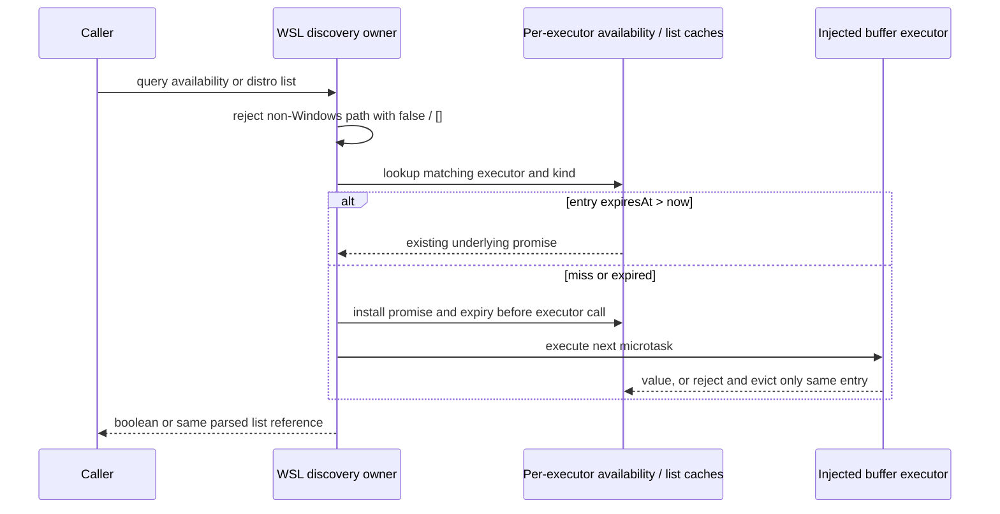

# Remote platform discovery and shell command owners — 2026-10-02

Third isolated batch in draft PR 9. Starting commit:
`784e3ad23aa8b3afbfe7daacd682551719f0f970`. Target remains the recovery integration
branch. Production scope is exactly four paths under packages/server/src/remote:
`detectEnv.ts`, `posixShell.ts`, `docker-detect.ts`, `wsl-detect.ts`.

A fresh no-inherited-context author reads this contract and repository guidance,
not the implementation, tests, history, old patches or other lanes. The observer
has source access and performs bounded review. Shared filesystem access is not
OS isolation. Complete authored owner files are candidate provenance evidence,
not a licence/MIT or novelty claim. No cache/network/CDN helpers, remoteAssetCache,
backend/deployment, credentials or auth/permission settings are in scope.

## Ownership and boundaries

Platform normalization and shell string construction are pure. Docker discovery
owns candidate order and execFile result translation; it has no new cache. WSL
owns two independent discovery caches keyed by executor function identity.
The execFile adapters are private and use existing Node ports and exact commands.
No new auth check, process flag, shell execution path or public option is added.

No real Docker/WSL/SSH/network/deployment command may be run for this task. Shell
builders return strings only. Changes do not invoke or mutate user environments.

## Public shared types

Docker file imports and re-exports type DockerContainerInfo from @knorvia/shared.
Its fields: id:string, image:string, name:string, state:string, status:string.
WSL file imports and re-exports type WSLDistro from @knorvia/shared. Its fields:
name:string, isDefault:boolean, state:string, version:1|2|null.
Type declarations do not authorize new runtime validation/coercion. Keep permissive
baseline parsers, including documented fields that are truthiness-checked only.

## detectEnv.ts — all exported functions

normalizeRemotePlatform(rawPlatform:string):string trims and lowercases first.
'darwin' or 'macos' -> 'darwin'; 'linux' or 'gnu/linux' -> 'linux'; 'windows_nt',
or anything starting with 'mingw', 'msys', 'cygwin' -> 'win32'. All others return
the normalized token verbatim, including empty string or already 'win32'.
normalizeRemoteArch(rawArch:string):string trims/lowercases; 'x86_64' or 'amd64'
-> 'x64'; 'aarch64' or 'arm64e' -> 'arm64'; all others return normalized token.
resolveRemotePlatform(reportedPlatform:string,kernelOstype:string):string applies
normalization to BOTH arguments; if reported resolves to darwin and kernel to
linux return linux, otherwise return normalized reported platform. This one
exception keeps a Linux container from selecting Darwin assets. Do not generally
prefer kernel over reported data or add unsupported architecture aliases.

## posixShell.ts — pure public builders

quotePosixShellArg(value:string):string wraps the entire value in single quotes.
Every literal apostrophe inside value becomes the five-character sequence whose
character codes are [39,34,39,34,39] (single quote, double quote, single quote,
double quote, single quote), preserving shell literal quoting. Empty value -> two
single quotes. No trimming, newline escaping, expansion, null handling or validation.
Backticks, dollar syntax, backslashes, unicode, whitespace and newlines remain
literal characters within this quoting scheme. No command is executed here.

buildPosixShellExecCommand(command:string):string returns '/bin/sh -c ' followed by
quotePosixShellArg(command), with exact spacing and no extra options.

quotePosixPathArg(path:string):string: exact '~' -> the literal string `"$HOME"`.
Prefix '~/' -> literal `"$HOME"` followed immediately by quotePosixShellArg(path.slice(1))
(the quoted portion includes its initial '/'). Other paths use quotePosixShellArg.
Do not expand '~other', canonicalize paths or quote $HOME as a literal value.

resolvePosixHomePath(remotePath:string,homeDir:string):string: exact '~' -> homeDir
unchanged; prefix '~/' -> remove ONE trailing slash from homeDir, append '/', append
remotePath.slice(2); otherwise remotePath unchanged. No path normalization or IO.
For example homeDir ending '//' loses just one slash before joining.

buildWriteLiteralFileCommand(targetPath:string,content:string):string returns
'printf %s ' + quotePosixShellArg(content) + ' > ' + quotePosixPathArg(targetPath).
Argument order is path THEN content. %s remains unquoted in the output, content is
one literal operand even if it starts with '-' or contains format directives.

## docker-detect.ts — discovery API

resolveDockerCommand(options={}):string. Internal options type:
{env?:Record<string,string|undefined>,homeDir?:string,
isExecutable?:(candidate:string)=>boolean,platform?:NodeJS.Platform}.
Defaults platform process.platform, env process.env, isExecutable private checker
calling accessSync(candidate,constants.X_OK) with success true / any throw false.
Read env.PATH only; absent -> empty. Split by ';' on win32 else ':'; each directory
trimmed; skip empty. Preserve iteration order: directory outer, executable name
inner. Windows names: docker.exe, docker.cmd, docker.bat, docker; elsewhere docker.
Use node:path win32.join on win32, posix.join elsewhere. Return first candidate
for which injected checker is truthy. Do not deduplicate candidates, read PATHEXT,
strip path quotes, search current dir for empty segments or catch injected throws.

Only after exhausting PATH evaluate options.homeDir ?? homedir(), then check
fallbacks in this exact order (using same checker):

darwin:

1. /usr/local/bin/docker
2. /opt/homebrew/bin/docker
3. /Applications/OrbStack.app/Contents/MacOS/xbin/docker
4. posix.join(homeDir,'.orbstack/bin/docker')
5. /Applications/Docker.app/Contents/Resources/bin/docker

linux: /usr/local/bin/docker, /usr/bin/docker, /snap/bin/docker.
win32: C:\Program Files\Docker\Docker\resources\bin\docker.exe, then
C:\ProgramData\DockerDesktop\version-bin\docker.exe.
Other platforms have no fallbacks. If none executable, return bare 'docker'.
No subprocess is invoked by resolveDockerCommand itself.

Private command execution uses node:child_process execFile(resolveDockerCommand(),
args,{encoding:'utf8',maxBuffer:8*1024*1024,windowsHide:true},callback).
On callback error reject NEW Error(stderr with ALL CR characters removed, trimmed,
if nonempty; else error.message). Successful stdout removes ALL CR characters
but is not trimmed. Preserve execFile errors and callback port semantics; do not
invoke a shell or add timeout/environment options. Synchronous execFile or resolver
throws inside Promise constructor become rejected promises without normalization.

parseDockerContainerList(rawOutput:string):DockerContainerInfo[]. Remove all CR,
split '\n', trim each line, skip empty. For each line JSON.parse inside catch;
malformed JSON and access errors (such as null) skip only that line. Require truthy
parsed.ID and parsed.Names; otherwise skip. Map in order to {id:ID,image:Image??'',
name:Names,state:State??'',status:Status??''}. Preserve row order and duplicates.
No new runtime type checks: e.g. truthy numeric ID remains numeric at runtime;
nullish optional values become '', but false/0 remain themselves. Declaration
assertions may express this existing permissive contract without changing output.

isDockerAvailable():Promise<boolean> executes ['version','--format','{{.Server.Version}}'];
any success -> true (even empty output); any thrown/rejected failure -> false.
listDockerContainers(options?:{all?:boolean}):Promise<DockerContainerInfo[]> executes
['ps', ...(options?.all truthy ? ['-a'] : []), '--format','{{json .}}']; then parses
stdout. Failures propagate the translated private exec error. No extra probes.

## wsl-detect.ts — decoding and parsing

Export WSL_DISCOVERY_CACHE_TTL_MS=5000 and type WSLBufferExecutor=
(args:string[])=>Promise<Buffer>. Private default executor is stable module function
identity. Decode output Buffer: empty -> ''; if buffer.includes(0) decode utf16le,
otherwise utf8. Normalize strings by remove ALL NULs, then remove exactly one BOM
at start, then remove ALL CR. Preserve this order/heuristic rather than detecting
other encodings. The parser accepts a string and normalizes it; executable paths
perform Buffer decoding first.

parseWSLDistroList(rawOutput:string):WSLDistro[]: normalize, split newline,
trimEnd each line, drop lines where trim() is empty. For each remaining line:
trim, split on runs of at least TWO whitespace characters (/\s{2,}/), trim parts,
remove empty parts; fewer than 3 parts -> skip. Last part parsed with
Number.parseInt(token,10); non-finite -> skip. Second-last part is state (unchanged).
Join all prior parts with a SINGLE space and trim to obtain name token; isDefault
iff token starts '_'. Remove initial '_' and following whitespace, trim name;
empty name -> skip. version = parsed integer if exactly1 or2, else null. Numeric
prefixes such as '2extra' are accepted as2; unknown version integers still produce
a row with version null. Header lines normally skip through non-numeric version.
Keep internal single spaces in names/states, input order and duplicate rows.

Private default executor uses execFile('wsl.exe',args,{encoding:'buffer',
maxBuffer:8*1024*1024,windowsHide:true},callback). Convert stdout AND stderr before
branching: Buffer inputs unchanged, others Buffer.from(value??''). On callback
error decode+normalize stderr then trim; reject NEW Error(nonempty stderr text
or error.message). On success resolve stdout Buffer identity. Synchronous throws
from execFile stay Promise-constructor rejection. No real execution in validation.

## WSL cache API and semantics

Maintain separate WeakMaps for availability and distro-list entries, keyed by
WSLBufferExecutor. Entry has expiresAt and underlying promise. Public queries are
async functions, so callers need not receive identical outer Promise objects;
deduplication concerns executor calls and underlying result/list identity.

isWSLAvailable(executor=privateDefault):Promise<boolean>: if process.platform !==
'win32', immediately resolve false without cache lookup, clock read or execution.
Otherwise use availability cache; load calls executor(['--status']). Fulfilled ->
true. Rejection/throw -> message = Error.message if instanceof Error else String;
return false ONLY if /not recognized|enoent/i matches; otherwise true. This lenient
baseline distinguishes missing wsl.exe from other status failures and is not to
be hardened/changed here. Boolean failure values are cached normally.

listWSLDistros(executor=privateDefault):Promise<WSLDistro[]>: non-win32 -> a fresh
empty array without cache/clock/execution. Otherwise distro cache load calls
executor(['-l','-v','--all']), decodes Buffer and parses rows. Rejections propagate
without wrapping and evict the matching cached entry.

Cache lookup: existing entry is usable only when expiresAt > Date.now(). If absent
or expired, expiry is Date.now()+5000 at admission, NOT after completion; promise
is Promise.resolve().then(load), so execute only next microtask AFTER cache entry
installed. Concurrent calls share load while unexpired, even pending load. Expired
pending loads can overlap with newly admitted load. Add rejection observer which
deletes entry only if current cache.get(executor) is still that exact entry; stale
rejection cannot evict replacement. Do not clone result arrays or extend TTL on hits.

invalidateWSLDiscoveryCache(executor?:WSLBufferExecutor):void. Truthy executor removes
its entry from BOTH caches; no arg replaces BOTH WeakMaps with fresh maps. Does not
cancel pending work or alter fulfilled values; new lookups can start new work.
Rejection cleanup is attached to the captured cache map from admission, preserving
whole-cache invalidation isolation. Do not add other invalidation triggers.

## Validation and frozen boundaries

Follow latest speed-first cadence. Ordinary runtime/platform/discovery tests and
semantic types/builds are deferred. Only a minimal pure string check is warranted
for the shell quoting safety boundary: apostrophes, command-substitution characters,
newlines and home-prefix quoting must remain exact literal construction; no shell
is invoked. Record baseline result, then execute unchanged check on replacement.
Use scoped lint/syntax and changed architecture, not broad suites or matrices.

Preserve parser permissiveness, uppercase-PATH-only lookup, current encoding
heuristic, cache TTL/admission races and lenient WSL availability errors. Record
source-observed limitations separately from executed failures. No UI/data formats,
permission settings, dependency manifest, global provenance or licence edit.

## Authored-code review clarification

Keep Buffer decoding free of normalization. Error translation normalizes decoded
stderr; list parsing normalizes decoded stdout once. Do not add a second
normalization pass by combining these owners. Indexed version/state columns use
empty-string fallback as specified, preserving string types under the repository's
noUncheckedIndexedAccess setting. These clarify the baseline contract; they add
no discovery, command or security behavior.
