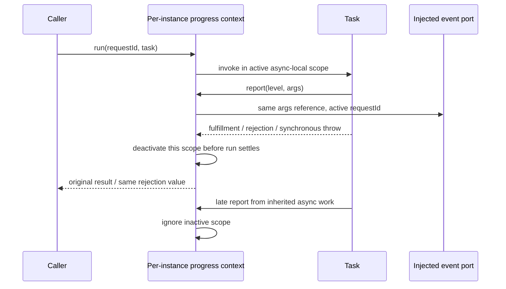

# Remote support and progress-context owners — 2026-10-02

Fourth isolated batch on draft PR 9, starting at
`6b21b98ce11d625032179c2817ef4435ce03280c`, targeting the recovery integration branch.
Exclusive production scope: packages/server/src/remote/remotePlatformSupport.ts
and remoteConnectionProgressContext.ts. No other lane, cache/CDN/network helper,
backend/deployment implementation, credential or security-setting changes.

## Author and ownership boundary

A fresh internal author with no inherited conversation receives this behavioral
packet and repository/architecture guidance only. Do not read existing owner
implementation, tests, history, patches, dependency implementations or other authors'
outputs. Observer has source access; shared filesystem is not OS isolation.
Author supplies whole replacement files, with no novelty or licence claim.
The server module is unmanaged and has no module contract. Preserve the existing
public import and caller boundaries; no new module or exported capabilities.

The support function is pure and owns the existing support decision. Each progress
context factory instance owns one AsyncLocalStorage context and the lifetime of
each run. No global active request, alternate logging path or duplicate cache.

## remotePlatformSupport.ts

Only export assertSupportedRemoteEnvironment(env:RemoteEnvironment):void.
Type-only import RemoteEnvironment from @knorvia/server/remote/backend.js; public
shape {platform:string,arch:string}. Read env.platform and reject exactly the
literal 'win32'. Every other platform is accepted without normalization, trimming,
probing or consulting arch; no extra property access. Accepted call returns
undefined synchronously. Rejected call synchronously throws a fresh standard
Error with exact message:

`当前 remote 模式仅支持 POSIX shell 环境，暂不支持 Windows 原生远程主机`

Do not broaden Windows alias rejection, consult process.platform or call any
external port. Connect and deploy remain callers of this single gate; no caller
edits in this batch. This reimplementation does not alter platform support policy.

## remoteConnectionProgressContext.ts public API

Export type RemoteConnectionProgressLevel = 'info'|'warn'|'error'.
Export interface RemoteConnectionProgressEvent {requestId:string;
level:RemoteConnectionProgressLevel;args:unknown[]}.
Export createRemoteConnectionProgressContext(options:{
emit:(event:RemoteConnectionProgressEvent)=>void}) returning an object with:

- async run<T>(requestId:string,task:()=>Promise<T>):Promise<T>
- report(level:RemoteConnectionProgressLevel,args:unknown[]):void

Use Node AsyncLocalStorage from node:async_hooks to preserve native async-resource
propagation. No other runtime dependency is needed. Type signatures must remain
compatible with callers using the returned inferred type. Do not expose new public
context methods, add timers, process listeners or console output.

## Lifetime, propagation and identity

Each run starts a distinct active scope for its requestId and invokes task
synchronously within that async-local scope. The task invocation is inside an
async boundary, so a synchronous task throw causes rejected run, not a synchronous
exception from run(). A single owner marks the scope inactive in the completion
path before run resolves/rejects, including when task throws synchronously. Await
the task result; do not deactivate immediately after obtaining its Promise.
Forward fulfillment and rejection values by identity, without wrapping or cloning.

Concurrent runs remain isolated even with equal requestId strings. Nested runs
have independent lifetimes and naturally restore their parent's async context.
Closing a nested scope does not close the outer one. Each factory instance is
independent. Async work descended from task inherits that scope; after task
settles, its late reports are suppressed, including when a newer run is active.
No cancellation/abort of such async work is introduced. Task is called without a
receiver. Calling run/report after extracting the method from the returned object
continues to work; do not depend on `this` being that object.

report obtains the current async-local scope. Outside a run or after its scope
is inactive it returns undefined and does not call emit. While active, synchronously
invoke options.emit with a fresh event object containing that scope's exact
requestId, the supplied level, and the original args array reference. Do not copy,
format, serialize, sanitize, mutate, buffer or defer args or event emission.
Empty requestId, empty args and repeated reports are accepted as supplied.

Read options.emit at reporting time (do not snapshot the callback), and invoke it
with options as receiver. Its synchronous thrown error propagates unchanged out
of report; report itself neither deactivates the scope nor catches the error.
If the task consequently rejects, run closes its scope and propagates that same
rejection. No emitting happens during run start/completion by itself.

## Validation and evidence

Latest user cadence defers ordinary runtime tests, broad tests/builds and semantic
or native/platform verification. Use scoped static API/ownership review, syntax,
lint and changed architecture only; no new test count is required. No real platform
commands, remote connections, network probes or credentials. Record baseline,
author and candidate source hashes, exact author access declaration, scoped outputs
and remaining unrun propagation/error/lifetime behavior. No root LICENSE, global
provenance/inventory or dependency edits; parent classification stays pending.
