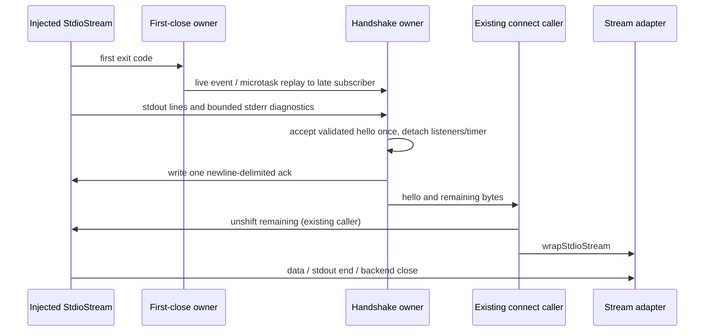

# Remote transport lifecycle owner — 2026-10-02

Continuation of draft PR 9; starting commit
`0ce9d9b13405e17f39fa8c3e73d51b8c0cee4544`, integration target
`recovery/independent-logging-20260930-0456`. Exclusive production scope:

- packages/server/src/remote/closeEvent.ts
- packages/server/src/remote/stdio-socket.ts
- packages/server/src/remote/handshake.ts

No changes to remoteAssetCache, backend implementations, SSH, credentials,
authentication/permission policy, deployment, manifests or other lanes. No real
network or remote backend execution. No provenance/license decision in this batch.

## Author boundary and design

A fresh no-inherited-context internal author receives this contract, repository
AGENTS.md and architecture-governance skill only. The observer has source access;
the author does not read existing implementation, tests, patches or history.
Author writes all three complete owner files in a separate temporary directory.
This is an instruction/context boundary on a shared filesystem, not OS isolation.
The server module remains unmanaged; architecture context has no module contract.



The close owner holds only the first exit code. Handshake owns line accumulation,
last-2048-character diagnostics, its single settlement gate and temporary listeners.
The stream adapter owns only event emitters; it neither buffers protocol frames
nor duplicates connection, cancellation, disposal or security policy. Existing
SocketProtocol remains frame owner; connect remains handoff/connection owner.
This boundary does not implement business leases, replay, desktop/mobile state,
or a second transport path.

## Dependency API supplement

Use public imports from @knorvia/rpc: Emitter<T>, Event<T>, VSBuffer, ISocket.
Emitter has .event: Event<T>, .fire(value), .dispose(). Event<T> is a subscription
function accepting a listener and returning {dispose():void}; void event .fire()
is supported. VSBuffer.wrap(Uint8Array) returns VSBuffer with .buffer Uint8Array.
ISocket has onData:Event<VSBuffer>, onClose:Event<void>, onEnd:Event<void>,
write(buffer:VSBuffer):void, end():void, drain():Promise<void>, dispose():void.
Use a type-only import StdioStream from ./backend.js. Its exact public shape:

```typescript
interface StdioStream {
  stdin: NodeJS.WritableStream;
  stdout: NodeJS.ReadableStream;
  stderr: NodeJS.ReadableStream;
  onClose: Event<number>;
}
```

Use @knorvia/shared exports HelloMessage, HelloAckMessage (types), KNORVIA_VERSION,
formatZodError, helloMessageSchema. .safeParse(unknown) yields discriminated
{success:true,data:HelloMessage} or {success:false,error}; formatZodError(error)
returns a diagnostic string. HelloAckMessage has type:'knorvia-hello-ack',
version:string, clientId:string. Do not duplicate or change schema/authentication.

## First-close event API

Export createCloseEventController(): CloseEventController. Internal interface
CloseEventController has event:Event<number> and fire(code:number):void.
First fire latches its code before notifying current listeners synchronously using
an Emitter<number>, then disposes that emitter. Later fires do nothing, including
reentrant calls. Before close, event(listener) delegates to the emitter and returns
its subscription disposal handle unchanged. After close, each subscription queues
a microtask that calls that listener with the first code, and returns a no-op
disposable. No synchronous late delivery. Disposing a late subscription does NOT
cancel its already queued replay. Reentrant subscriptions during first fire are
late subscriptions, hence microtask replay. Code 0 and negative codes are valid;
do not treat falsy code as absence. Do not add exception-catching or change the
Emitter's exception semantics. No new export beyond the factory.

## Stream socket API

Export wrapStdioStream(stream:StdioStream):ISocket. Register stdout 'data' and 'end'
listeners, then subscribe to stream.onClose. For every data chunk (Buffer), copy
bytes with a new Uint8Array(chunk) before VSBuffer.wrap and fire onData. stdout
'end' fires onEnd only. Each backend close (ignore numeric code) fires onClose
then onEnd, even if stdout end already fired. Repeated close/end events retain
repeated delivery; no terminal-state deduplication. Do not listen to stderr or add
an error handler. Do not return/remove a backend close subscription on dispose;
current behavior leaves the listeners in place. No event identity substitution.

write converts VSBuffer.buffer to a Node Buffer and calls stream.stdin.write once;
ignore its return value. end AND dispose each call stream.stdin.end(), without
destroy, other stream shutdown or local emitters cleanup. drain reads current
stdin.writableNeedDrain (optional boolean): if truthy return a Promise resolved
by a single stdin.once('drain',resolve), otherwise resolved Promise. It does not
wait for writes when writableNeedDrain is false/undefined, nor resolve on errors
or close. Preserve stream method receiver by invoking methods on their stream.
No framing/header serialization, polling, inactivity timeout or diagnostic output.

## Handshake API and success sequence

Export interface HandshakeResult { hello:HelloMessage; remaining:Buffer|null }
and performHandshake(stream:StdioStream,clientId:string,timeoutMs=10000):Promise<HandshakeResult>.
Establish one referenced timer (do not unref), stdout and stderr data listeners,
then stream.onClose subscription. Accepted event providers deliver no data/close
synchronously during subscription; the existing close owner ensures late close
replay occurs in a microtask. Baseline synchronous-close subscription can reject
through a temporal-initialization error and leak listeners; this unsupported
boundary is recorded below, not expanded into a new provider policy.

Decode every stdout Buffer chunk independently with .toString('utf-8'). Append to
pending text and to stdout diagnostic history. Iterate complete newline-delimited
lines: remove first line and '\n' from pending, trim line, skip unless startsWith('{').
For such lines JSON.parse then helloMessageSchema.safeParse. Any JSON/schema
exception is swallowed as an ignorable banner line. Schema-success accepts hello
once: mark settled BEFORE cleanup; clear timer, remove exactly the stdout/stderr
listeners registered here, dispose the close subscription, then write JSON ack
plus '\n' to stdin. Ack fields in order: type:'knorvia-hello-ack',
version:KNORVIA_VERSION, clientId (verbatim). Then resolve {hello:parsed.data,
remaining: pending text nonempty ? Buffer.from(pending,'utf-8') : null}. Do not
unshift within handshake; existing connect caller does that before installing
wrapStdioStream. The validated hello object identity is retained. Stop processing
further lines after success. No extra ACK flush/drain requirement.

Failed schema for an object whose 'type' property equals 'knorvia-hello' is terminal:
reject with diagnostics starting `Invalid knorvia-hello: ${formatZodError(error)}`.
Other schema-invalid JSON (including a different or absent type) is a banner and
skipped; malformed JSON and non-object JSON are skipped. Processing only complete
lines means a valid object without trailing newline still waits.

## Diagnostic failure and cleanup

Append each stdout/stderr decoded chunk to its separate history and retain the
last 2048 JavaScript string characters (UTF-16 code units), not the first 2048 or
2048 bytes. Pending stdout line text itself is NOT bounded. History includes the
whole chunk before parsing its lines, including lines after an invalid hello.

Timer failure starts `Handshake timeout: no knorvia-hello received within timeout`.
Backend close before acceptance starts `Stream closed before handshake completed`
and includes its code. First rejection marks settled, then cleanup, then rejects
a NEW Error with composed text. Repeated timeout/close/rejection after settlement
has no effect. Cleanup order: clear timeout; stdout.removeListener('data', exact
handler); stderr.removeListener('data', exact handler); close subscription.dispose().
Do not remove other subscribers, close the streams, emit a close, or change
permission/authentication behavior.

Error text suffix, only when at least one part exists:
` (${parts.join('; ')})`. Parts in this order: `exit code ${code}` if code !==
undefined (including 0); `stderr: ${JSON.stringify(trimmedStderr)}` if nonempty;
`stdout: ${JSON.stringify(trimmedStdout)}` if nonempty. Trim only at error formatting,
retain full histories until then. Original failure prefix is not modified. No
logging here and no stderr-to-stdout forwarding.

The JSON parse/schema/success/invalid-hello processing shares a catch that skips
exceptions as banner input. Thus an ack write or success-cleanup exception after
settled becomes true is swallowed, and the Promise may remain pending after its
timer is cleared. Preserve this frozen behavior in this compatibility batch;
do not introduce a fix or claim it is safe. Cleanup or formatting throws on other
entry paths similarly retain their existing exception boundaries.

## Frozen limitations and verification scope

Known source observations, not executed failures: per-chunk UTF-8 decoding can
corrupt split multibyte data or arbitrary binary suffix; stdout line buffer can
grow unbounded; synchronous subscription callbacks are unsupported; a thrown ACK
write can strand settlement; late close replay cannot be cancelled by disposal;
stream adapter does not deduplicate onEnd or remove listeners on dispose.
None is a new feature or security-policy change in this batch.

Latest user direction skips routine tests and defers aggregate acceptance. This
ordinary transport replacement has no authentication/permission policy change.
Use minimal scoped syntax/lint and architecture checks; do not run transport
matrices, full tests/build, native networking or platform checks merely for counts.
If a concrete new regression is suspected, use a bounded synthetic/injected check
and record exact baseline and candidate evidence. Record unrun runtime/types/
platform work plainly. Baseline/candidate source hashes and author declaration
are sufficient to submit a draft candidate for parent classification, not to
claim independent provenance or complete compatibility/production readiness.

## Observer clarification during authored-code review

The unsupported synchronous onClose callback must encounter the uninitialized
`cleanup` binding itself, before any listener removal; a hoisted cleanup function
changes the frozen error and leak boundary. Initialize that cleanup callable only
after close registration returns. The settled guard belongs at schema-success
acceptance and failure admission, not at stdout callback entry or the entire line
loop. A swallowed cleanup/ACK exception can leave buffered banner lines to be
parsed until a later schema-success notices settlement and returns. This preserves
the documented failure semantics rather than silently repairing them.
