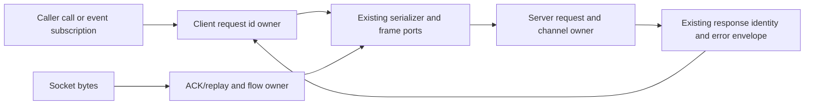

# RPC request/event/reliability owner reconstruction
Scope: packages/rpc/src/channelClient.ts, channelServer.ts and persistent-protocol.ts. Existing file records have inherited/mixed-origin classifications and no accepted-original decision was found. Retain public declaration/facade modules, foundation, serializer and transport ports. No global provenance decision is changed.
Client owns request ids, pending promise rejection and event subscription lifetimes. Server owns registered channels, active cancellation/event resources and unknown-channel queues. PersistentProtocol owns frame parsing, acknowledgement/replay queue, saturation edges and timers for one protocol session.

Keep headers/body forms, numeric message kinds, ids, undefined payloads, Error metadata and cancellation identity. Preserve existing init timing, deferred delivery, replay byte/grace bounds, listener cleanup and documented failure gaps. No new authorization model or protocol policy is introduced. No live transports/network/credentials/user data.
Fresh no-inherited-context authors receive complete body-free contracts. Hash/freeze whole outputs before source-exposed comparison, and separately freeze author-made corrections. Shared filesystem restrictions are not OS isolation. Focused lint/syntax-only diagnostics/changed architecture required; ordinary suites, semantic types and builds deferred. Minimal fake-port checks only for safety-sensitive fail-closed cancellation/replay boundaries or concrete candidate regression. No main/cross-lane integration/licence closure.
