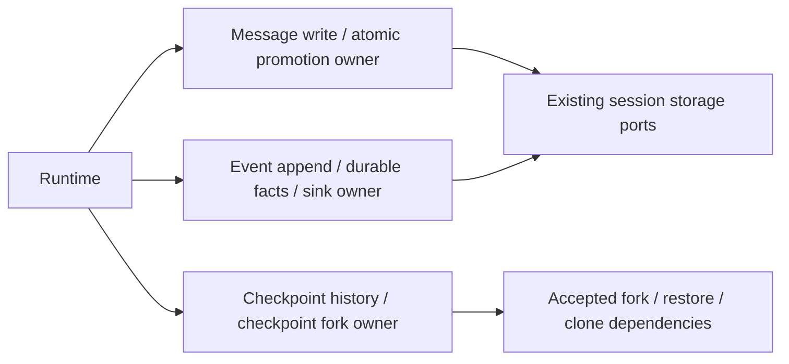

# Runtime publication owners

Scope: message-persistence.ts, events.ts and workspace-checkpoints.ts and tightly named
internal helpers only. Prior ten persistence/rewind/fork owners and E's workflow,
compact/manual/media/message-history ownership remain untouched. Each current owner
is inherited/unreviewed in the branch inventory. Root retains expression/licence review.

Functional/API-only author inputs are under corresponding runtime-*-author-20261003
evidence directories. Historical source plus actual compiler JS/declaration are frozen
before authoring. The source-exposed curator supplies schema/sequence facts; bounded
internal author access is not a clean-room or whole-file rights conclusion.

Store owns durable identities and sequence numbers; runtime retains message pointers,
configuration and persisted flag; the event module owns only its existing aggregate
WeakMap. No duplicated cache, queue, admission, lock, cancellation or permission policy.
Promotion commits before event release. Event publication is append -> durable fact ->
usage -> sinks. Native no-op await gates remain. Checkpoint forking validates before
child writes, then copies -> goal -> restore -> timeline -> notice -> event; partial
failure effects stay unchanged. APIs/model-facing strings/schema/field order remain.

Speed-first cadence: ordinary suites/builds/native skipped. Only three compact synthetic
persistence checks (promotion, durable ledger/publication, prefix copy failure) and
scoped compiler/API/lint/format. Strict current source/JS/declarations and immutable
historical oracles; errors/drafts retained. No live IO, providers or user data.
