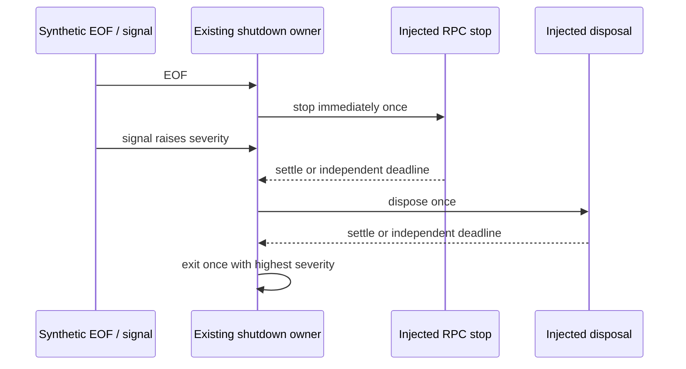

# Focused server lifecycle candidate validation

The latest delegation requests focused validation of the seven existing server
lifecycle candidates. Continue draft PR9 and its dedicated branch; do not reauthor
frozen candidates or rewind subsequent batches. Baseline is
f25b931164ee6287167e965e9da7a7586131b264; candidate checkpoint is
d9318cde0eccd553440408ebde42d28118e7ee18. Save this specification before adding tests.

The process lifecycle remains the only shutdown admission/severity owner. RPC
admission stops before scope disposal; stdio socket disposal follows scope
settlement, including rejection. HTTP deliberately initiates scope disposal before
channel disposal without awaiting it. No policy, service, protocol or source change.

Execute only scoped synthetic tests against exact baseline and unchanged candidate:
shutdown ordering/idempotency, failure/error identity, two independent deadlines
and late rejection observation; stdio byte copying, backpressure and repeated
close/end delivery; connection stop promise identity and cleanup on rejection;
HTTP upgrade modes, byte copying and existing cleanup ordering. Existing capability
safety tests remain the only direct native-Node owner test. Dependency APIs are
injected; framing implementation, Hono routing, native listeners and entry boot
remain unvalidated. Scoped syntax/lint/format checks are supplemental, not semantic
typechecking or package builds. No full suite or build is authorized in this batch.

Preserve previous evidence exactly. Add separate command results, baseline/candidate
byte bindings, fixture hashes and limits. Previously documented synchronous-throw,
handshake-decoding and resource-policy limitations remain frozen; tests do not
normalize them or convert observations into executed failures. Author boundary is
the earlier instruction-based shared-filesystem boundary, not OS isolation. No MIT,
copyright clearance, independent-expression acceptance or feature-completeness claim.
