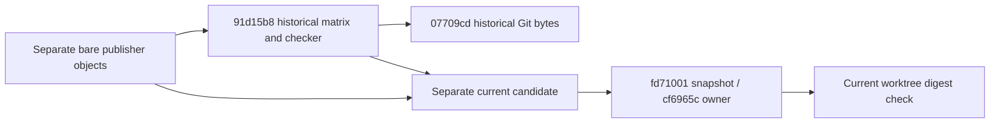

# Current services lane contribution candidate

This is an evidence-only append after fd710013b4ff69d4aca4f481b27dfb7d29fb5fe1.
Production correction is cf6965cdd2916ec84c2f6588de20b802ff50c279; monitor contracts/tests
were frozen in 90ec127428820e58e8e39fb3289a059446d3539d. Do not edit production or prior
specs, receipts, candidates/checkers while root reviews. Preserve historical checkpoint
91d15b8108509da59358d8308941c63364cad8eb and its production pin
07709cddb68c1bc504d3c72707048d979a43a7f2. Historical live replay must still reject the
corrected owner; historical schema/snapshot evidence remains valid for its old scope.

## One evidence owner and scope

A separately named current JSON candidate owns observations for exactly 55 paths: the
historical 50 plus monitor owner tests, service/RPC tests, synthetic-port helper, intended
monitor spec and monitor receipt. Two existing files changed (owner and intentional legacy
test assertion); 48 historical files remain byte-identical. Current snapshot bytes and last
content commits come from fd71001; owner last-content commit must be cf6965c. Do not count
specs/tests/hashes/line deltas as independent production implementation or originality.

The new checker stays inside legacy provenance and reuses historical digest/span/Git-file
and schema APIs without changing them. Recheck historical observations against pinned Git
bytes, not current files; separately check all current paths against fd71001 and the live
worktree. Bind the old matrix and three old checker files to exact 91d15b8 bytes. The two
scopes remain distinct, including their payload digests, pins and path lists. No aliases that
silently update the historical pin or suppress its stale-live failure.

## Provenance, retained syntax and policy

Use actual licensing model.mjs/createIndexes/classify rules. Leave every proposed decision
null with NOASSERTION; retain conservative upstream-unchanged/upstream-modified/unreviewed
whole-file statuses. Mixed source is not reviewed-retained source-code nature. Source
exposure remains true; cleanRoom, wholeFileLicenseGrant and acceptedReview remain false.

Publisher source is https://github.com/zai-org/ZCode, exact commit
872ad960de7ec172591f7e1952f7849229f94521 and tree d185a9a893c00d51fc3fe51fe7371b9eea7de143.
Verify all eight scoped publisher objects/digests from existing separate temporary bare
storage and against upstream-baseline.json. Integrated baseline is
0d80f9ca37b1daef162ecc69bd18f6e8fc30a146, imported snapshot
7619e41b950bd52073ebf36754146cf25659d9fa. The seven corrected/new paths additionally record
07709cd and 90ec127 local existence/blob/digest facts, including absence. Absence means only
an added path, not original code. Bind historical-owner/legacy-test/fixture and frozen-spec
references for precise retained/fixture syntax. No upstream implementation enters production.

Preserve valid old retained ranges for 48 unchanged paths; recollect the two changed files
and five added files against exact references. Record exact UTF-16 spans, coordinates and
slice digests for retained AST/comment syntax and string/number/regex/owned fixture payloads.
State collector limits: exact matches are representative, not a completeness/authorship test;
escaped, renamed, transformed or standard expressions still require manual review.

Explicitly bind the 17 unchanged owner method/accessor bodies and all other production/public
context paths, including entire service, launch plan, profile files, public declarations and
native helper routines. Record the narrow new subscription-role type/storage/tagging and
termination-aware cleanup expressions as structural contributions within retained owner code,
not whole-method authorship. The legacy test changes only its failed-kill disposal assertion
and Chinese explanation; its other assertions remain. Monitor receipt retains the 20-case
red proof (16 failing/four controls) and intentional legacy correction.

Installed node-pty package/version, WindowsPtyAgent JS and winpty.cc digests are optional
installed-artifact corroboration, not publisher-commit or native-platform acceptance. Verify
only fixed installed test-artifact paths when requested; no loading native modules or reading
user files/preferences. The synthetic probe's public API/error spellings, dimensions, release,
fake handle values and port grammar remain explicitly contract-derived fixture content.

## Acceptance and immutable shared boundary

Regression checks distinguish old/current schema, pins and scopes; reject unsealed edits,
re-sealed wrong/omitted/duplicate paths, stale/misbound current hashes/content commits,
tampered references/ranges/coordinates, missing protected units, altered obligations and
misleading license/source-exposure declarations. Positive current replay must check live
bytes plus exact Git lineage and publisher objects; offline replay must identify missing
publisher/installed bytes explicitly. Required publisher verification cannot silently fall
back to inventory. Recheck all 27 unchanged material obligations and fingerprinted inputs.

Do not edit shared licensing/inventory/notices, dependency/package/lock/CI, production,
security/settings or another lane. Root alone accepts/integrates provenance. Run current and
historical checker tests, actual provenance-tool/schema tests, positive/offline/negative digest
replays, root types/lint/format and changed/full architecture. This evidence-only append does
not rerun expensive unchanged source/emitted product suites, builds or full studio regression;
cite fd71001 results accurately and distinguish them from newly run evidence checks. No
clean-room, whole-file MIT, license grant or native acceptance claim. End at a clean pushed
checkpoint on parallel/file-watcher-fast-20261001 and await root's next assignment here.

## Explicit later retry-order appendix

Root's independent review proved a narrow documentation discrepancy: a failed data disposer
is removed and requeued behind the retained exit monitor. Initial acquisition order applies
before failed handles are requeued; later cleanup follows retained/requeued insertion order.
On an accepted-kill retry where both handles throw, exit cleanup precedes data, and
AggregateError errors/cause/message preserve exit as primary. Preserve that behavior and
production bytes. Append a separate small intended-order spec and source/emitted synthetic
regression, bound to their own later commit in the current matrix appendix. They were not
present in fd71001. Historical monitor specs/receipts, including red proof and the approved
legacy assertion correction, remain unchanged. Report new focused counts separately, with
no repeated full product suites or changed budgets. The review was reported by root in this
thread; its integration-only review document is not claimed locally fetched or verified.
