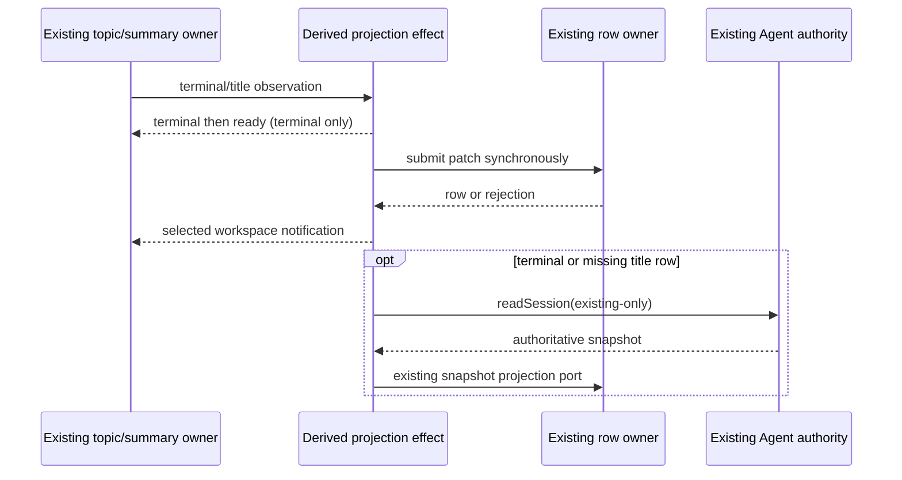

# Services residual-effect replacement contract

Baseline: `33bbc7b2593d142725a91fb90efe107418706db1` on the continuing
`lane/services-20261003`. The user assigns the minimum units recorded in
`docs/evidence/services-five-owner-provenance-20261003/residual-implementation-scope.md`
and authorizes necessary targeted comparison tests. The project stays
Apache-2.0; historical source bindings, third-party notices and HOLDs remain.
This spec precedes new production edits. It describes behavior and the chosen
new execution structure, without treating source exposure or new hashes as
proof of legal originality. The author has read the predecessor.

## Owners and implementation decisions

The Agent owns conditional persistence/close acknowledgement. The existing draft
registry alone owns remembered drafts. Replace the conditional-close routine
with separate request admission and acknowledgement/rejection continuations.
Only an acknowledged true close may release the remembered draft. A completion
failure enters the same rejection policy; logger failures must reject rather
than be swallowed. There is no unconditional fallback, retry or close queue.

The existing summary map and per-topic owner continue to own accepted projection
inputs. Replace the terminal/title execution chains with a transient mutation
description, one write-submission function and one result consumer. The mutation
description is derived work for a single call; it is not a second accepted queue
or cache. The result policy selects notification/readback consequences from the
mutation kind and persisted-row presence. Submit the repository call before
entering the async result consumer so synchronous submission exceptions retain
their original caller-visible boundary. A rejected write, a failing notification
or a failed synchronous readback setup inside the completion path enters its
existing operation-specific warning boundary.

Readback uses an immutable invocation and separate capture/publication/failure
continuations. Agent read is started immediately; snapshot publication is
admitted only after successful capture. It remains a passive existing-only read,
not resume or a new session writer. Model-only projection uses a single-field
mutation admission and separate successful/rejected completion handling.

The lock window alone retains the shared deadline. Replace the busy-wait loop
with a one-attempt verdict and a timer-driven per-acquisition request. At most one
100-ms timer is scheduled for that request. Success settles it; a nonbusy,
progress or scheduling failure rejects it with the original value. No new abort
API, timeout budget, resource owner or unref behavior is introduced.

## Required behavior and compatibility

- Conditional close shallow-copies parameters and forces expectedPersistence
  deferred. False keeps the remembered draft; true forgets it once and returns
  the Agent result. Agent rejection, synchronous invocation/parameter failures
  and draft-forget failures warn and resolve false, including falsy thrown values.
  Preserve error diagnostics and logger/parameter-getter failure propagation.
  Pending acknowledgement must not forget, promote or publish anything.
- Terminal callback precedes row submission. Capture failed/unread disposition
  and current update time before submitting. Error patches have no lastError key;
  completed patches explicitly have lastError undefined. Existing rows emit
  task_status_changed, then a detached readback with no duplicate unread signal.
  Missing rows transfer a truthy unread signal to readback. Keep grouped-top
  admission as a present boolean field and preserve task/identity isolation.
- A title update emits task_title_changed only for an existing row. A missing row
  triggers grouped-top readback with reason meta.titleUpdated. Patch rejection or
  notification failure warns once and does not start subsequent readback.
- Readback requests keep the exact workspace/session fields and existing-only
  runtime policy. Publish the returned snapshot with task_status_changed and the
  original optional-own-key/unread/grouped fields. Read or publication failure
  warns once with its actual value; it does not retry or replace the cause.
- Model-only projection trims once, skips an empty value, updates only model and
  returns the repository object unchanged. Sync/async update failure warns and
  returns null. Trimming failure and warning failure keep their rejection boundary.
- Lock attempts are immediate. Only numeric errcode low byte 5 is BUSY, with the
  existing safe getter probe. Deadline check precedes first blocked progress;
  each acquisition reports it once, then retries after exactly 100 ms. A later
  acquisition does not reset the one-hour window. Timeout keeps the existing
  message, kind and last BUSY cause. Progress failure schedules no further retry.
  Keep successful-BEGIN continuation free of an extra await before migration,
  maintaining, close, migrated marking and repository construction.

Existing create/resume/read/settings flows, fifteen service operations, initial
silent seeding, generic topic ingestion/recovery, workspace lifecycle, failure
ownership, metadata/search/grouped-write logic and terminal-node trie remain.
No public signature, UI, persisted schema, data compatibility, authority policy,
provider credential or shared protocol edit is requested. Creation reference has
no demonstrated implementation remainder and receives no new rewrite.

## Short contract expression and validation boundary

Do not make common small adapters complex merely to change syntax similarity.
The five-line path normalizer, six-field partial-safe diagnostic adapter and
small phase/goal unread predicate remain explicitly recorded retained expression.
They have no accepted-state ownership or independent implementation-credit claim.
Keep their exact path spelling, getter/guard order, diagnostic shape and outcome
rules. New projection consequence ownership is implemented around the unread
contract, rather than disguising the predicate by swapping if/switch/variable names.

Write targeted fake-port contracts for pending/true/false/falsy close outcomes,
sync/rejected write boundaries, terminal/title notification/readback order,
lastError own-key shape, unread exactly-once handoff, model update failures and
lock timing/shared budget/progress failures. Run the same frozen oracles before
and after production edits, plus the existing narrow lifecycle/workspace/snapshot/
topic/startup contracts. Use temporary storage only in the existing startup cases;
new cases use synthetic ports and fake time. No actual provider, Agent process,
Git business command, user storage/configuration or local user computer is used.

The new user instruction permits this bounded runtime comparison. Other tests,
root typecheck/lint/formatter/build/full audit and CI reruns remain deferred.
Architecture skill context/contract reading informs the design; its checker and
the earlier spec check steps remain deferred under this user phase boundary.
Label the unexecuted platform/full-product/source-rights acceptance separately.
