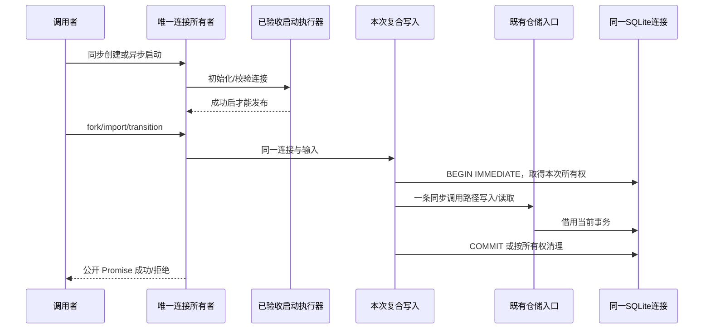

<!-- SPDX-License-Identifier: MIT; Copyright (c) 2026 Knorvia Studio contributors -->

# 会话存储连接、复合提交与观察端口

2026-09-28。基线 f033f92。先行规格：实现前确定下述兼容行为及已批准的可靠性改进；本规格本身不授予旧文件新的来源决定。原生调查和验收只使用合成数据库，不读取真实数据。

## 替换范围

独立重建 SqliteSessionStore 的连接生命周期、公开端口组合、分叉与共享上下文四个复合提交及 debug 投影。主要旧目标为 sqlite-session-store.ts 和 repositories/debug.ts；public session-store.ts、options.ts、rows.ts 保持原有导出、声明及来源，不把固定重导出改写计为独立算法。历史 SQL、业务 schema 与 UI 不变。

实现作者仅接收主代理批准的行为合同、公开类型/函数声明和逐项反馈；旧类、旧 debug、历史/编译目标、测试及比较器不作为作者输入。主代理/测试者读取旧源提取合同；先前会话上下文仍然存在，不宣称全流程 clean-room。短转发、固定类型、字段和一般 SQLite 表达可高度相似，来源决定须写明，不能仅凭拆分/改名授予 MIT。

## 单一所有者与依赖

Store 唯一拥有连接、数据路径、故障阶段及懒创建 journal 端口。SQLite 中 parent command fact 是 replay 的持久事实，不新增 accepted 缓存、队列、另一连接、重放 map 或通用调度框架。普通方法遵从各仓储已有 own/borrow 事务合同，不外套通用事务。

目录属于 CLI adapters（当前 managed false、owner unassigned），跨包只用 contracts/shared/dynamic-workflow 公开入口；同一存储域内部助手按职责组织，每个生产文件小于 400 行。先审设计，再实现完整连接/复合提交/debug 边界，不能以薄包装宣称完成。

## 公开生命周期

- 保留具名类及 instanceof、构造器与 static openStartup；两个已有工厂仍同步返回类实例，即使其中一个名称含 openStartup。
- 一共 73 个公开实例方法，66 个 Promise 方法及七个同步方法。同步为 getDatabasePath、close、getProjectPermissionMode、saveProjectPermissionMode、workflowJournalStore、debugMigrationIds、debugCounts。不将同步权限读变成 Promise。
- 以 options.dbPath 的 nullish 默认值选择路径，不缓存动态数据根；父目录、sqliteOpen 故障端口、原生 DatabaseSync 打开按顺序执行。打开时就设置启动 timeout；相关失败为 open_failed 并保留原 cause/path。
- 同步构造完成启动才返回；异步工厂持有未公开连接，等待启动成功才返回。启动/通知失败关闭自己创建的连接，忽略次要 close 错误以保留原值（包括 undefined）。外部任意 symbol 不得绕过迁移。
- close 原样关闭同一连接，没有新增重复关闭吞错、自动重连、自动弃置或外部连接借用协议。journal 第一次调用创建后每次返回同一对象，绑定本连接，close 后依赖错误仍可观察。
- 普通异步端口保持 Promise 拒绝与当前同步副作用时间；不把返回 Promise 的调用统一挪到下一 microtask。三个复合流程的事务中让步改进另列，不外推至所有方法。
- 构造器公开声明仍接受第二个可选 `symbol` 参数；只有模块私有能力值能请求延迟初始化，任意外部 symbol 均按普通构造初始化。不能收窄为调用者无法表达的 unique symbol 类型。
- `options.startupLockTimeoutMs` 决定连接打开时的 timeout 及同步初始化预算；static openStartup 的异步执行预算由单独的 migrationOptions 决定，不把前者悄然覆盖后者。打开失败文案为 `Failed to open SQLite session database at <dbPath>`。
- 初稿复核补充：异步启动的失败清理由本次 Store 的公开 close() 入口执行；该公开入口在关闭后抛出的次要值不能取代原启动/通知拒绝。同步构造尚未发布实例时可直接清理所创建的原生连接。此项明确可观察调用边界，不要求复用旧私有结构。

## 转发、故障与观察

所有公开参数/结果从批准声明保持，包括 copyFrom、默认 listSessions 空参数、setTarget 缺省 active、cloneTargetForFork 缺省原目标状态。仓储是既有唯一写路径，不复制其 SQL/codec 或另行保存状态。

恰有 22 个门面前置 sqliteRun 故障入口，在验证/重放之前执行：createSession、createForkedSessionWithMetadata、commitForkBundle、commitSharedContextImportBundle、transitionSharedContextImport、updateSession、claimLegacySessionWorkspace、repairLegacyRemoteSessionWorkspace、repairRemoteSessionPaths、saveMessage、removeMessage、savePart、removePart、saveSessionEntry、saveSessionInput、commitPermissionFullAccess、updateSessionInputs、promoteSessionInput、markSessionInputPromoted、settleSessionInput、updateTodos、cloneTargetForFork。其他方法不新增这个门面故障点；底层依赖自身故障规则不改变。

debugMigrationIds 按 SQLite id 升序返回全部账本 ID。debugCounts 有 13 个按现有顺序出现的自有数字字段：sessions、messages、parts、todos、targets、sessionEntries、permissions、localSettings、schemaMigrations、inputHistory、modelUsage、toolUsage、turnUsage。有 truthy sessionID 时 session 按 id、其余会话表按 session_id；permissions/localSettings/schemaMigrations 始终全局。空/省略 ID 读全局。维持各表分次查询和原生错误，不增加快照/事务/cache。

## 四个复合流程

### 旧分叉元数据入口

先检查 parentID 与 metadata.parentSessionId 相同；sourceCommandId 去空白后非空；boundaryMessageId 去空白后非空，orderedMessageIds 为空合法，否则其最后一项必须等于 boundary。命令事实 ID 为 v4_command_fact:child:<parent>:<command>，parent/command 原字符串参与命名，不能把两个 parent 合并。

取得事务后查 parent 的 v4/command_fact 中相同 ID。已有事实须从 data.ack.result 得到非空字符串 child ID，且 child 实际存在；重放提交并返回该 child，不另新建。新的调用按现有仓储创建 child，再写 parent 的 child-source 命令事实（accepted、revisionAtDecision 0、forkAssistant/child ID、metadata、同一次当前时间），提交后返回 child。

### 完整分叉 bundle

门面故障后先检查 parent 与 command parent、可选 initialInput 的 child 归属、ack.commandId 与 sourceCommandId 相同。锁内先查同一个 parent-scoped fact；若已有有效 child 先重放，新的 child-local 检查只作用于新提交，不提前改变重放校验优先级。

新提交中 ack.result 必须属于 forkAssistant、createSelectionSideSession 或 editUserQuery/disposition=fork，trim sessionId 等于 child ID。所有 message/part/tool attachments 归 child；assistant parent 必须出现在本包消息集合。anchor、timeline、compaction 的适用消息引用若为字符串，必须在该集合中；goal snapshot session 归 child。目标引用来自 bundle.goal.source.targetID、anchor goal snapshot、goal_verification timeline。verifier entry 归 child，适用 assistant anchor/target 引用必须属于这些集合。固定字段与错误文本以批准合同补充，不能扩展为未授权通用 payload/schema 校验。

写入顺序保持：child → message及parts（父 copy source 提示传入既有消息写路径）→ goal → verifier entries → initial input → parent command fact → commit。七个故障位置 afterChild/afterMessages/afterGoal/afterEntries/afterInput/afterCommandFact/beforeCommit 保持同样可达和顺序；任何提交前失败不能留下子会话或事实的一半。

### 共享上下文导入

context message/provenance 的 sessionID 必须与 session 相同，provenance.id 包含该 session 字符串，message 为 user/model-only/shared_context。这里维持当前 namespace 规则，不擅自升级成另一种 ID 解析方案。

锁内已有 session 只在同 type/id provenance 也存在时重放成功，否则报 incomplete。新 session、context message及parts、provenance 一起写入提交。与输入提升是两个独立业务入口，不能用提升测试代替导入验证。

### 共享上下文转换

按既有 entry 顺序找 session/type=v4/shared_context_import 且 data 为非数组对象、contextId 相同的第一条。缺失或 status 不属于 expectedStatus（单值或数组）返回 false，保持无写入。匹配后保留其余 entry/data/time 字段，更新状态和当前 updated 时间；sourceId 仅 truthy 时更新。按既有消息顺序找 metadata 为对象且 contextId 相同的第一条，若有则更新 sharedContextStatus；缺少消息不失败。提交后返回 true。

## 已取证的可靠性改进

旧版四入口在 BEGIN 之后的 catch 无条件 rollback；三入口还在同一连接事务中 await 既有同步执行的 Promise 包装。独占内存 SQLite 调查固定 16 场景、一次运行、443.7174 ms，0 夹具/观察/清理失败；这表示成功取证，不是旧行为全部正确。四个嵌套 BEGIN 保持调用者事务；四个真实自动回滚均被二次回滚错误遮蔽；四个单独注入清理失败均掩盖业务失败并留下未提交事务。三条跨 await 流程的另一会话写入返回 fulfilled，最终却随主操作回滚消失；同轮第二个复合操作因嵌套 BEGIN 拒绝。未触碰真实数据，不据此认定某次历史用户事故。

1. 复用既有 withWriteTransaction(db, own) 的单一策略：BEGIN 失败不取得所有权；已自动回滚不重复清理并返回原业务失败；清理二次失败用既有 AggregateError/cause 同时保留两因。不得新增静默吞错、重试或宣称未提交的部分状态已经持久化。
2. 复合提交调用同域同步仓储入口，整个拥有事务的临界段不跨 await；公开 Promise API 保留。只补缺失的内部同步 admission 入口并由现有 async API 转发，不能忽略返回 Promise 的拒绝或复制另一套 SQL。另一会话随后调用的成功写入不再卷入前一个事务，同轮两个复合调用可以各自串行完成；不增加队列或额外连接。
3. false transition 保留 ROLLBACK 后返回 false，不替换为空 COMMIT。允许只用于本次控制流的私有回滚信号，由同一事务所有者清理；仅清理成功且确为该信号才转换成 false，任何清理失败仍向上暴露。不能吞掉其他业务/数据库错误，也不扩大公共事务助手的职责。

依据已授权的可靠性改进范围，主代理确认以上三项作为下一批期望行为。四个嵌套 BEGIN 保持边界须仍通过；另十二个缺陷场景建立旧版预期失败的新断言，其余兼容测试必须先在旧版通过。不泛化到其他协议或新队列设计。调查的原始业务 RAISE(ROLLBACK) Error 对象没有被截获，不宣称当时记录了它的对象身份；后续回归另验证新实现应保留的原生错误。

## 新分叉校验的精确边界

下表补足独立作者需要的行为事实，非旧函数正文。child、message/part/attachment 的所有权比较用 String 值；消息集合为本包 message.info.id 的 String 值。通用“消息引用”检查只对字符串执行，不因 undefined/其他非字符串自行增加拒绝规则；assistant.parentID 是单独的强制 String 成员检查。数组按给定顺序观察，未列出的未知 metadata 不在本层新增校验。

| 优先级与适用对象                        | 字段/条件                                                                                                                                           | 校验及失败                                                                                                |
| --------------------------------------- | --------------------------------------------------------------------------------------------------------------------------------------------------- | --------------------------------------------------------------------------------------------------------- |
| 1，commandFact.ack.result               | 非数组对象；type 为 forkAssistant/createSelectionSideSession，或 editUserQuery 且 disposition=fork；sessionId 是 string，trim 后非空且等于 child ID | 否则 `Fork bundle command result is missing, invalid, or not child-local`                                 |
| 2，每条 message 按给定顺序              | info.sessionID                                                                                                                                      | 必须归 child，否则 `Fork bundle message session is not child-local`                                       |
| 2a，assistant message                   | info.parentID                                                                                                                                       | String 值必须在本包消息集合，否则 `Fork bundle assistant parent is not child-local`                       |
| 2b，anchor                              | orderedMessageIds 逐项，再 boundaryMessageId                                                                                                        | 消息引用标签分别为 `anchor orderedMessageId`、`anchor boundaryMessageId`                                  |
| 2c，anchor.goalBoundary.kind=snapshot   | target.sessionID，然后收集 target.targetID                                                                                                          | 不归 child 时 `Fork bundle anchor goal session is not child-local`                                        |
| 2d，每个 part                           | sessionID 与 messageID                                                                                                                              | 分别归 child/当前 message，否则 `Fork bundle part owner is not child-local`                               |
| 2e，timeline part                       | anchorMessageId；context_compaction 的 summaryMessageId；goal_verification 的 targetId                                                              | 前两项为消息引用，标签 `timeline anchorMessageId`、`timeline summaryMessageId`；后一项加入目标集合        |
| 2f，compaction part                     | tail_start_id、summaryMessageId、compactBoundary.lastSummarizedMessageId                                                                            | 消息引用标签 `compaction tail_start_id`、`compaction summaryMessageId`、`compact lastSummarizedMessageId` |
| 2g，同一 compaction                     | compactBoundary.summaryMessageIds、attachmentMessageIds、hookResultMessageIds 按此顺序逐项                                                          | 消息引用标签 `compact summaryMessageId`、`compact attachmentMessageId`、`compact hookResultMessageId`     |
| 2h，同一 compaction                     | compactBoundary.preservedSegment.headMessageId、anchorMessageId、tailMessageId                                                                      | 消息引用标签 `compact preserved head`、`compact preserved anchor`、`compact preserved tail`               |
| 2i，tool part 且 state.status=completed | state.attachments 逐项的 sessionID、messageID                                                                                                       | 必须归 child/当前 message，否则 `Fork bundle tool attachment owner is not child-local`                    |
| 3，所有 messages 之后                   | 可选 bundle.goal.source.sessionID                                                                                                                   | 必须归 child，否则 `Fork bundle goal session is not child-local`                                          |
| 4，每个 entry 按给定顺序                | sessionID                                                                                                                                           | 必须归 child，否则 `Fork bundle verifier entry session is not child-local`                                |
| 4a，同一 entry                          | data 和 data.payload 仅接受非数组对象用于读取；payload.anchorAssistantMessageId                                                                     | 通用消息引用标签 `verifier assistant anchor`                                                              |
| 4b，同一 payload                        | targetId 仅在为字符串时核验                                                                                                                         | 必须属于已收集的目标集合，否则 `Fork bundle verifier target is not child-local`                           |

通用消息引用失败的 Error 文案为 `Fork bundle <标签> is not child-local: <原字符串>`。目标集合在消息观察前先纳入可选 bundle.goal.source.targetID，再按上述 anchor/timeline 项扩充；不在每条消息后提前验证 verifier。上述行为次序决定多处不合法时的首个错误，不要求照旧实现组织函数或数据结构。

本规格中的“非数组对象”均排除 null；transition 的消息 metadata 匹配则只要求非 null 对象，保持对数组不另加排除的原有边界。公开类型标为可选的 anchor orderedMessageIds、compaction 引用数组、tool attachments 缺席/nullish 时跳过，不扩大为对错误类型的通用输入净化。

## 持久命令事实与重放投影

两个分叉入口均仅在 parent 的 v4/command_fact 条目内找 ID `v4_command_fact:child:<parent>:<sourceCommand>`。重放解析 data → ack → result 逐层要求非数组对象，result.sessionId 只要求非空字符串，不 trim；随后必须存在对应 child。旧元数据入口对无效事实抛 `Fork child command fact is corrupt: <entryId>`、缺 child 抛 `Fork child session is missing: <childId>`；完整 bundle 对两种情况统一抛 `Fork bundle command fact is corrupt: <entryId>`。

新事实持久化使用单次当前时刻同时写 time.created/time.updated，保留顺序字段 id、sessionID、type、time、data。data 含 source=child、ack、metadata。旧元数据入口 ack 为 commandId=metadata.sourceCommandId、status=accepted、revisionAtDecision=0、result(type=forkAssistant, sessionId=String(child.id))；metadata 为原输入。完整 bundle 的 ack 和 metadata 为 commandFact 输入，不额外净化或补字段。JSON/旧字段保留由既有仓储负责。

这里的当前时刻使用既有 `Date.now()`，单位毫秒，不新增可配置时钟或读取缓存。旧元数据入口在新 child 写入后、完整 bundle 在 initialInput 阶段之后分别只为命令事实读取一次；有效重放不读取该事实时钟。transition 仅在找到首个匹配条目且状态获准后、写入更新条目时读取一次；false 分支不读取该更新时间。下层仓储内部已有取时行为继续由其合同负责。

父归属/命令/边界失败文案分别为 `Fork child metadata parent does not match session parentID`、`Fork child metadata is invalid`、`Fork commit bundle identity is invalid`。完整 bundle 没有给 sourceCommandId 另加 trim 非空规则；不能把旧元数据入口更严格的那条规则迁入。共享导入身份和已有不完整会话文案为 `Shared context import bundle identity is invalid` 和 `Shared context import session is incomplete`。七个指定故障阶段文案保持 `injected fork commit fault: <stage>`。

## 后续验收

必须覆盖所有公开方法/导出、73 方法 Promise/同步形状、fault map、完整分叉七点原子性/同父重放/跨父命令/非法局部引用/raw copy source、共享导入与状态转换边界、debug 全局/作用域/字段顺序、真实事务及首因。源码/编译入口、有界旧新对照与已批准差异分别记录；实际 CLI 可达代码与 dist 核对。

根/CLI 类型与 lint、架构、严格测试检查、CLI 构建、全量离线、格式、来源和密钥扫描后提交。CLI 前置构建/构建与依赖 dist 的测试不并行。根 Apache-2.0 和预览版本不变，保留公共声明/历史 SQL/第三方归属，最终独立与发行目标继续。
