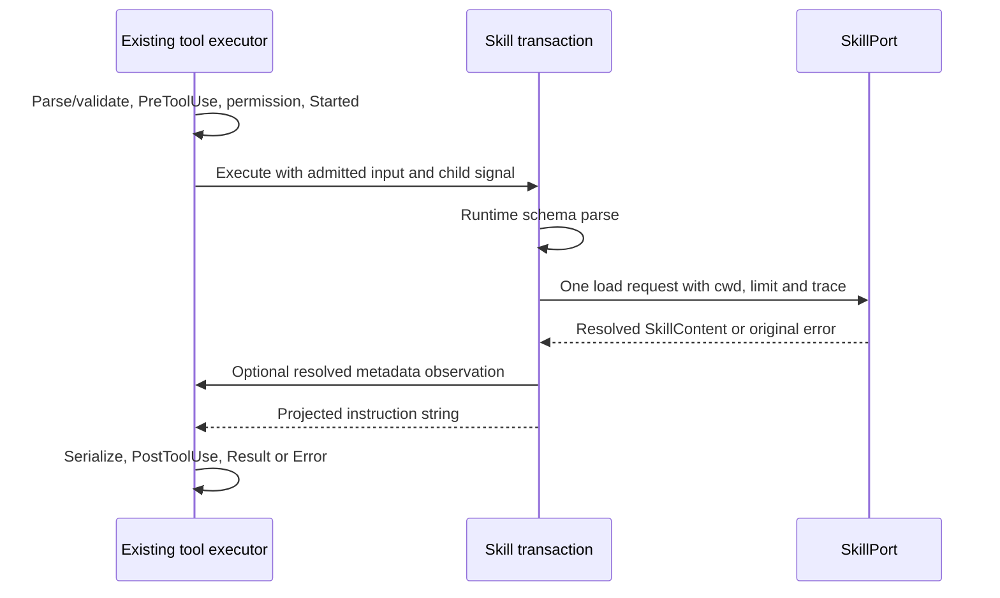

# Skill tool admission and execution

2026-10-01, Lane A. Behavioral baseline: integrated commit
`0d80f9ca37b1daef162ecc69bd18f6e8fc30a146`. This concerns the `Skill` tool handler,
not the declarative skill-pack sidecar in `knorvia-skill-contract.md`.

## Scope and source exposure

The implementer has read the inherited handler and its consumers. The current
audit identifies `skill.ts` as upstream-modified, with no accepted review;
`contracts/src/tools/skill.ts` remains upstream-unchanged. This is an exposed-source
behavioral replacement, not a clean-room or MIT determination. Exact schema,
permission declarations, prompt, errors and output wording are retained compatibility
material. Keep their applicable notices and all 27 unresolved material obligations.
No shared provenance, version, dependency, CI, security or data-boundary changes.

## Owners and execution design

The existing executor owns admission, permissions, hooks, timeouts, cancellation,
serialization and emitted lifecycle events. The Skill adapter owns discovery,
name resolution, filesystem reads, size enforcement and skill content. The new
per-call transaction owns only the ordered load intent, resolved-content observation
and final instruction projection; it has no retained state or cache.

Use a typed synchronous effect transaction to separate load/observation order from
the context interpreter. It yields a load intent, receives exactly one adapter
result, yields a lazy metadata observation, then returns instruction text. The
interpreter performs one asynchronous adapter call and no other external IO.
The load effect carries a lazy request builder so an absent SkillPort fails before
reading cwd or trace fields. The observation effect carries a lazy metadata builder
so an absent observer never reads telemetry fields. These effects are local to the
CLI module; no package export or shared contract change is needed.
Projection scans recognized variable spans and writes nonempty instruction sections;
it does not reuse the inherited regex-and-filter rendering algorithm.

## Frozen contract

- Preserve the public `skillToolEntry`, all declaration values, property order,
  schema object references, and registration through the existing built-in registry.
  No new approval path, capability or public package export.
- Model input advertises `skill` and optional `args`. Runtime also accepts legacy
  `name` (nonempty); current `skill` may be empty, is not trimmed, and takes priority
  when its union member succeeds. Extra fields are stripped by the existing schema.
  `args` stays accepted but does not enter the load request or body.
- Parse before checking `skillPort`. Invalid direct input preserves the schema
  failure; a missing adapter produces the same nonrecoverable ConfigurationError,
  message, uppercase code and `{toolCallId, toolName: "Skill"}` context.
- Issue exactly one `loadSkill`, preserving its receiver, with `name`,
  `workingDirectory`, `maxBytes: 100000`, and explicit trace fields `traceId`,
  `spanId`, `parentSpanId`, `sessionId`, `turnId`, including undefined fields.
  Pass the exact execution child signal in `{signal}`; no retries or fallback.
- After load resolution, optionally record truthy qualifiedName/pluginId and
  source, before reading content for projection. Preserve the context callback
  receiver. Absent callback must not read metadata for the observation. Adapter,
  metadata and projection failures propagate unchanged; no partial success.
- Use the adapter-resolved short name in both wrapper and heading, unescaped.
  Preserve exact output string, including internal whitespace and newlines,
  directory notes and optional truncation line. Omit zero-length sections,
  including the old empty separator entries; do not trim nonempty body text.
- Expand only `${CLAUDE_SKILL_DIR}` and `${KNORVIA_SKILL_DIR}`, case-sensitive,
  wherever present in the original content. Preserve original JavaScript string
  substitution behavior for directory dollars (`$$`, `$&`, `$\u0060`, `$'`, `$1`,
  `$01`, `$10`), using the original match span/captured name. Expansion is one pass;
  inserted markers are not recursively expanded. No new path interpretation.
- Preserve readOnly/concurrentSafe true, destructive/needsApproval false, low
  risk, session scope, skill permission, beforeAsk deny precedence, toolName
  patterns, 100000-byte truncate/head budgets, fixed 30000ms deadline with no
  override, cancellation wording and trace summary policies.

## Acceptance and migration boundary

Before changing the entrypoint, run frozen declaration/output fixtures and direct
handler failure/IO contracts against both inherited source and emitted JS. Record
baseline failures. Test the actual executor for malformed admission, policy/user
denial, hook rewrite, current/legacy success, metadata events, cancellation and
adapter rejection; retain unmodified executor tests. Probe directory substitution
with fixed cases and finite differential cases using an external baseline artifact.
Exercise the actual permission service's mode matrix: build/plan allow Skill unless
hard/project denial applies; auto is reserved and denied before those policies;
yolo has the existing pass-through behavior, including hard/project rules. These
are unchanged executor/service facts, not new Skill policy. Interleave loads to
check call-local content and metadata. Projection failures must retain their
original thrown value.

After replacement, run those same source/emitted contracts, verify the actual
built-in registry imports the new entry, build CLI packages, root/CLI types and lint,
formatting and architecture. Do not copy old implementation into tracked files,
relax existing tests or alter timeout budgets. The fixture preserves old contract
text and is disclosed as retained compatibility material. Linux offline evidence
does not establish live model behavior, native filesystem admission, desktop/Web
visual acceptance, Windows/macOS execution or distribution-license closure.

ListModels/model-reference, TaskStop/TaskOutput and shared provenance remain outside
this checkpoint. Report Skill results before requesting another assignment here.

## Baseline recorded before entrypoint replacement

The preexisting untracked drafts were inspected and retained. Initial runs against
both inherited source and emitted JS passed 11/14. Three test-fixture assumptions
were wrong: spreading the entry over the shared invocation fixture bypassed its
handler observer; Started does not carry normalized input; a plain Error retains
its Error name in executor results. Correcting the local fixture and assertions to
the actual executor contract produced 14/14 in each mode before production edits.
No existing tracked test, executor code or runtime behavior was changed to do so.
