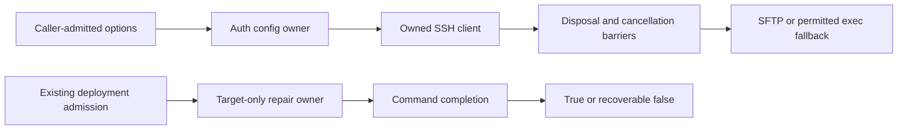

# Source-only SSH authentication, backend and permission owner reconstruction

Scope: sshAuth.ts, ssh-backend.ts and agentOfficialPluginPermissionRepair.ts. All have substantive decisions or side effects. Caller approval and credential collection remain outside these owners. This authorizes reconstruction of source, never execution of real authentication, credentials or permission commands.

The SSH auth owner maps admitted caller inputs into connection policy and keyboard responses. Backend owns one SSH client, disposal/cancellation barriers, disconnect admission, stream framing and upload fallback. Permission-repair owner invokes the established target-only command at the existing deployment phase; wait failure is recoverable, invocation failure is not swallowed. No new approvals, host verification policy, credential persistence, path expansion or permission modes are introduced.

Complete body-free behavior/API packets feed fresh no-inherited-context authors. Author outputs are hashed and frozen before source-exposed curator comparison; corrections, if needed, remain author-made and separately frozen. Shared filesystem is not OS isolation. Compatibility includes exact prompts/errors, identity, quoted target, mode, event and cleanup order, and existing limitations.

Required focused safety validation uses only injected fake clients/streams/ports and synthetic sentinel values: positive/negative auth selection and challenge handling, target-only permission command and failure boundaries, backend disposal/reconnect denial, abort admission and upload fallback/write target behavior. No real SSH/servers/network/user data/credentials/fs writes/chmod or command execution in tests. Changed-file lint, syntax-only diagnostics and changed architecture required; ordinary tests, semantic types and builds deferred. No main/cross-lane integration or global licence closure.
