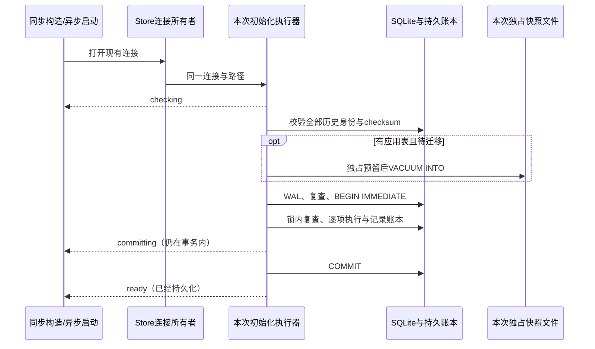

<!-- SPDX-License-Identifier: MIT; Copyright (c) 2026 Knorvia Studio contributors -->

# 会话库初始化执行与升级快照

2026-09-28。先行规格，基线 206d953。按独立实现目标替换 adapters/session-store 的 migration-runner、migration-snapshot、paths、errors 四个执行模块。保留同步构造、异步启动、数据根、迁移进度、失败状态和已有数据，不改 UI、业务 schema 或启动调用入口。

## 范围与来源

本批重新设计启动执行控制、事务与通知边界、快照文件所有权。原有四个路径继续导出兼容接口，内部可以按职责拆分，每个生产文件小于 400 行。执行层属于 CLI adapters，当前模块 owner unassigned、managed false；共享类型与路径解析只从 @knorvia/shared 和 @knorvia/shared/node 公开入口导入。

options.ts、rows.ts、历史 migrations.ts 及三个迁移构建器保留原内容和许可。本批不改变 22 条历史迁移的顺序、编号、appVersion 和 trim 后 SQL 的 SHA-256，不将它们计作独立完成。未来新建 schema 与历史升级协议另立规格，不能伪写旧 checksum、忽略不匹配或删掉旧数据库支持来完成许可目标。

主代理与复核者可读取旧实现提取行为；隔离作者仅接收批准的行为合同、公开声明、冻结迁移身份和明确的行为反馈，不读取旧目标正文、历史、编译产物、测试或比较脚本。以前上下文不能清除，这不是对整个开发过程的 clean-room 或法律保证。标准 SQL、错误字段、公开声明和固定协议相同不是原创性证据；最终逐文件记录实际设计和相似性边界，根 Apache-2.0 与预览版本暂不改变。

## 状态所有者

- Store 拥有连接及关闭；执行器只拥有本次开始时间、拿锁期限、进度事实和由自己成功开启的事务。已有调用者事务不能借用或回滚。
- schema_migration 是持久真相，进度是本次观察，不新增缓存、全局队列、连接、业务状态或迁移写入者。
- 快照只拥有自己独占创建的文件。回调由调用者拥有，可以异步拒绝；数据库错误与通知错误分别保留。
- 同步接口保持同步阻塞重试；异步接口保持通知和定时器让出语义。两者共用行为规则，不维护两份迁移流程。

## 兼容接口与事件

- getDefaultSessionDbPath 每次重新调用共享数据根解析，再用 Node path 拼接 cli/db/db.sqlite；不缓存环境。ensureParentDir 在父目录不存在时经已有 mkdir 故障端口后递归创建，已存在时不调用故障端口，原始错误不包装。
- SqliteSessionMigrationError 保留原型、name、dbPath、kind、migrationId、snapshotPath 和 cause 身份。可选字段缺省仍为自有 undefined，cause 为 Error 原生非枚举属性。
- runSqliteSessionMigrations 默认拿锁预算 5000 ms；async 的 lockWaitTimeoutMs 缺省或 null 时为一小时。无新增 abort 参数，预算不是整个启动的执行期限。
- 首次 checking 无 migration；预检、快照、WAL 与复查后第二次 checking 带 kind、executedCount、committedCount。加锁后记录 lastAppliedMigrationId（空账本为 null），后续不随新迁移改变起点。
- migrating 在每条缺失迁移执行前报告，completed 计入前面已存在项，total 为完整目录长度。先执行 SQL、增加 executedCount，再插入账本及当前时间。
- 每次通知都是新对象，migration 是浅复制；回调修改旧通知不能改变后续事实。回调每次读取 options.onProgress，this 保留 options，不预取固定回调。
- committing 在提交前；成功提交后 committedCount 才等于 executedCount；ready 在事务外。无工作也要检查账本、WAL、获取事务和提交，普通 no-op 顺序为 checking、checking、committing、ready。

## 账本、重试与失败

1. WAL 和快照前验证所有账本编号属于当前目录、已应用 checksum 等于对应 trim SQL 的 SHA-256。任意未知编号（不只最大值）拒绝为 newer_database；不将未知原文放进快照路径。已知不匹配为 checksum_mismatch，不能更新 checksum 蒙混通过。
   未知身份检查不能依赖 checksum 列可读：较新账本缺少旧列时仍须先按未知身份拒绝。目录逐项执行时读取该项当前账本与 checksum，不能把锁内一次检查的 applied 集合当成之后永久有效的事实；前项触发器或通知回调造成的后项变化仍须被观察。
2. 任一已知迁移缺失表示有待执行项。有应用表为 upgrade，只有账本/sqlite_sequence 或无表为 initialize，无待执行项为 none。获取事务后再次检查，等待期间其他程序完成迁移时不能重复执行。
3. 外键开启后，预检/快照、WAL、复查、BEGIN 各自允许原生 BUSY 重试。仅数字 errcode 低字节 5 属于 BUSY；LOCKED 不按 BUSY 重试。WAL 模式接受 wal，只有 dbPath 恰为 :memory: 才允许 memory。
4. 所有拿锁阶段共用初始 deadline，包含等待回调耗时。仅遇 BUSY 后检查余额，成功操作不会因时钟超过 deadline 被反向拒绝。每个阶段至多一次 waiting_for_lock，延迟从 10 ms 倍增至 200 ms 上限并受剩余预算限制；同步等待向上取整且至少 1 ms。
5. 异步入口先设置 native busy_timeout=25，再进入保护范围；结束通常恢复 5000。第一次设置失败保留原错误。通知拒绝关闭执行并清理自己事务；已有首因（包括 undefined 等 falsy）不能被回滚、关闭执行或恢复 timeout 的错误覆盖。顺序清理失败可能使后续 timeout 恢复未执行，维持现有边界。
6. 提交前通知拒绝使自己事务回滚；ready 通知拒绝发生于提交之后，返回同一回调错误且不能撤销已提交数据。failed 通知拒绝不能覆盖已经归一化的数据库错误；其他通知拒绝不伪装成数据库错误或强行追加 failed。
7. SQL/账本写入失败保留迁移编号，先尽力回滚再报告 failed。已是 SqliteSessionMigrationError 保留对象身份；其余通过共享结构化错误分类并保留 cause，禁止用文案识别错误。错误文案、错误码和可选字段的存在性按旧版先行验证。

数据库失败时对自己仍活动的事务只尽力回滚一次，随后放弃本次事务所有权，即使回滚本身抛错也不在关闭执行时再次回滚。通知直接拒绝关闭尚运行的执行时，同样只清理自己的事务；连接最终关闭由调用者负责。

先行澄清：无账本表时按全部目录项待执行处理，快照起点为 unversioned；锁内完整复查后才创建账本并读起点。未知 ID 检查优先于已知 checksum 错误。单条迁移 SQL/账本插入中的 BUSY 不重试，直接以该 migrationId 归一为 lock_timeout。错误的枚举键顺序为 dbPath、kind、migrationId、snapshotPath、name，原生 stack/message/cause 在前且非枚举。

## 快照文件边界

- db.location() 为 falsy 时立即返回，不读账本、时间或文件系统。文件库读取账本最大编号，缺省 unversioned；直接帮助函数依赖调用者先校验编号，不新增通用文件名净化协议。
- 文件名为 dbPath.pre-起点.ISO时间戳.bak，时间戳移除 - : .；碰撞后缀为完整文件名加 -1 至 -100，一共 101 个候选。不能覆盖旧快照，目录等非文件占位立即失败。
- 用独占创建请求 0600，关闭预留句柄后执行原生 VACUUM INTO，包含已提交 WAL 数据，禁止只复制主数据库。Windows 的 mode 不宣称为 ACL 隔离保证。
- stat 只拒绝非文件；看到普通文件后仍尝试 wx，由原子创建的 EEXIST 决定换后缀。若文件在观察之后已被移除，本候选仍可成功预留，不能只凭旧 stat 结果提前消耗候选。
- 只在本次成功预留后清理失败的部分文件，清理失败保留原始 cause。BUSY 原样交给执行器重试；其他预留/复制错误为 backup_failed，携带 dbPath 和实际 snapshotPath。位置、账本、日期等在预留保护范围前的失败保留原调用边界。
- 不清理成功快照，不自动恢复或重建原库。快照与随后拿写锁之间存在其他进程提交窗口；本批不建立额外锁协议，也不宣称快照包含生成后的数据。

已有快照路径沿用 stat 跟随链接的观察：指向普通文件视为碰撞，指向非文件立即失败；悬空链接导致 wx/EEXIST 时换后缀。不增设链接删除/恢复策略，不宣称已验证所有链接与文件系统组合。

## 验收与明确限制

先在旧版运行合同验收并冻结结果，再接入独立实现；失败不得通过放宽期望值消除。保留两份既有 session 升级/快照测试，覆盖原生 WAL、一致快照、幂等、崩溃恢复、并发启动、回滚和首因。

新增有限场景验证 22 项迁移身份和顺序、no-op/sparse ledger/非最大 checksum 错误、未知历史、进度字段与回调时序、各阶段通知失败、调用者事务、BUSY/LOCKED、快照碰撞与拥有权、路径每次读取环境、错误原型与 own undefined。真实新建 SQLite 与测试自己的临时文件为主；确需注入的方法另标明范围，不能把注入结果称为真实磁盘故障。

生产入口切换后执行源码、编译公开入口、必要的有界旧新对照、类型/lint/架构、CLI 构建、完整离线回归、格式及来源清单校验。严格隔离 CLI 构建和依赖 dist 的测试。记录真实初次失败及更正、仍适用的历史许可、未验证平台/故障边界；不读取真实用户数据库，不调用模型或生产服务。
