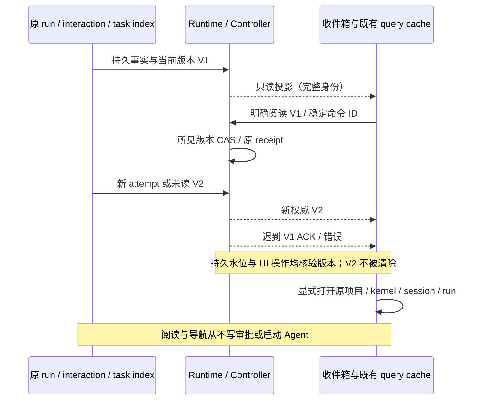

<!-- SPDX-License-Identifier: Apache-2.0 -->

# Studio 跨内核待处理收件箱

2026-10-07。本 lane 按父任务调度承接原 attention lane，基于整合 PR #46 的 `55ea333991910bf7431195df8e9514b35ba8ada6`（main `a8f83c98`，v0.9.0）。原独立 PR #48 已在整合祖先中，整合 owner 继续独立验收；批注 PR #47 由原 lane 实现。不增加手机、全文索引、额度、终端历史、官网或发布能力。

## 行为与唯一所有者

- 既有窄工具栏新增紧凑的待处理入口，沿用黑白视觉、共享按钮和 `text-ui-*`。页面聚合已保存的待审批／待输入、失败／中断及完成未读，可筛选状态、展开更多行、刷新、打开原目标、逐项已读。没有批准、重试、发送或自动恢复按钮；明确的人类审批仍在原对话里进行。
- Studio Runtime 从全历史 run、当前 pending interaction 与冻结的原定义／turn 推导投影，不依赖 Renderer 已加载的 timeline、最近 100 个 run 或 12 个非活跃缓存。投影不保存另一份运行或审批状态，不启动 adapter、探测内核、读取账号凭据或会话全文。
- 原生 Knorvia 单聊保持 V4 owner。收件箱复用 Window Controller／`useGlobalTaskList` 的 timeline、pinned、archived 分区与既有 task `unreadAt`、activity；没有新搜索／分组索引。未打开的任务同样可见，远端离线、加载失败及不完整结果有明确提示，不把读取失败当作权威空集。离线源保留可信旧行，已读和导航禁止同路径本地回退。
- Studio 只新增 `attention-read` 阅读收据，按对象 ID 保存所见事件版本。终态版本包含 run 的 attempt、state 和更新时间；审批版本绑定 interaction、原 turn 和 attempt。相同事实重复投影不新增通知；旧 attempt／旧事件的读命令不能消除新版本。阅读 pending interaction 也不回答、过期或隐藏其待处理事实。
- 收件箱默认显示未读终态及所有 pending 交互；可查看已读记录。失败／中断、取消和成功按真实 owner 区分，不把已接收或取消请求当作完成。未知结果显示需原界面人工处理。已移除的内核和已删除目标仍保留历史信息，显示不可用原因，不能自动创建替代 Agent。
- 阅读水位持久化在当前 Host 的既有 Studio SQLite entity 表，无 schema 升级或旧行迁移。旧数据库没有水位即未读；原始 run／interaction／配置／正文／草稿不清空、不改写。记录按 Host 数据库隔离，UI key 进一步包含连接代次、workspace identity（缺省 path）、对象类型及 ID。

## 导航、分页与异步顺序

- Studio 投影携带原 target kind/ID、run/interaction、kernel、源项目及会话信息；归属来自持久记录，不从当前选中 kernel 或 Renderer 自选 cwd 取得。点击先校验目标和 workspace，然后一次提交完整导航位置，历史 run 显式聚焦。不存在或已删除目标显示原因，不改成新会话。
- 原生跳转复用既有精确 workspaceIdentity／remoteSessionId 导航入口；标记已读复用原 Controller/task service 的 `expectedUnreadAt` compare-and-clear，读动作不调用 `answer`、`send`、`resume` 或创建 task。
- Runtime 读取完整待办事实；UI 按小窗口展开，不让分页、预取或后台订阅被当作已读。显示全部已知数量及加载状态；若原有源只返回部分数据，说明范围而不声称完整。
- 所有异步 UI 动作捕获连接、目标与操作版本。A 的读取／确认／错误晚于 B 导航或服务替换时不能导航回 A，也不能把错误／busy 放进 B。重复点击同一读命令复用 StudioClient 原稳定 command ID/receipt；读命令失败可重试，不触发外部执行。

## 共用原生缓存修正

已复现的 `100 → 乐观已读 → 新权威 101 → 旧 reconcile → 空` 必须修复。由本 lane 唯一修改 `taskQueryCacheStore` 和 `useWorkspaceTaskNavigation`，整合 owner 独立核验。

现有 query cache 持有瞬态阅读操作身份及其所见 `unreadAt`，既有 overlay setter 返回可选关联 token；reconcile／rollback 核验 token 和最新权威 marker。新 marker 到达、第二次阅读、同文／空值 ABA、缓存清空、连接／组件替换都会撤销旧 UI 回包资格。旧错误不能恢复旧 marker 或覆盖新操作。只保护已有缓存／乐观状态，不新增持久未读事实或另一份接收队列；旧调用者保持兼容。

## 公共接口与文件边界

- `StudioOverview.attention` 为可选只读投影，新增类型位于 `attentionTypes.ts`；无字段的旧 Host 显示能力不可用。
- 既有 `StudioCommand` 增加 `attention-read`，Host 同事务验证版本并写水位／原 command receipt，公开 RPC 仍为 12 个方法。
- SSH 单聊保留原远端内核／会话／项目坐标，不按远端路径补开本地 workspace；群聊／工作流仍定位其原编排项目。Inbox 不探测实时内核可用性，静态退休／缺失配置会显示原因，其余由原页面的既有执行门核验。
- 历史定位通过既有 `timeline` 的可选聚焦 run 参数和 UI 导航位置增量完成，Host 核验 run 属于原 target，不查询另一目标。
- app 层负责投影／阅读 admission，domain 只定义纯版本／状态规则；SQLite adapter 和原进程／审批 port 的执行所有权不变。
- 本 lane 拥有新 attention UI/hook、缓存 ACK 防护、现有入口／导航接线和中英文文案。与 PR #47 重叠的 contract/types/runtimeProjections、可选历史聚焦字段通过 PR 评论登记；不改批注 workspace-review 实现。来源清单最终由整合树再生。

## 必过验收

1. 两个以上 kernel、group/workflow、旧历史窗口外与未加载 target 的 pending／失败／完成聚合；重复事实去重、已读重开保留、新 attempt 再未读。
2. 阅读 pending 或完成只写阅读事实；approval 仍 pending，adapter/native start／credential reader／answer／resume／send 均为 deny-spy。
3. 旧读命令晚到 Host 的 CAS、Host 先完成但 ACK 晚到 UI、新 marker、第二次阅读 ABA、迟到失败 rollback、清空与连接替换分别验证；同 taskId 在异 workspace／Host 不串写。
4. 完整原项目/kernel/session/run 导航；旧 A 响应晚于 B 不能回跳；历史原定义改变、删除 target/kernel、断开远端有真实拒绝信息，不能启动替代会话。
5. 实际 React 组件浏览器点击筛选／展开／导航／阅读，连接真实公开 Runtime/SQLite 或受控本地协议；不能只凭源码字符串或数据库 CAS 声称 UI 通过。原生缓存／导航额外使用受控迟到响应。
6. 旧数据库、正文、原生未读／分组／搜索及批注兼容回归；相关离线测试、根 typecheck/lint/fmt、changed/full architecture、provenance regeneration/check。需要完整离线测试时先 build CLI；不重复不变的完整基线。

中文提交、推送草稿 PR，报告 exact head／命令结果与实际 GUI/provider 证据范围；合并、版本和发布仍由 integrator 决定。

## 可复现交互证据

执行 `pnpm exec tsx --tsconfig packages/ui/tsconfig.json packages/services/test/fixtures/studio-attention-browser.ts [chromiumPath]`。该验收在 loopback 受控传输上连接真实 `StudioRuntimeService` 与临时 SQLite，挂载原 `StudioAttentionInbox`／hook／阅读动作／query cache／`StudioRunHistory`，点击 25→50 窗口、审批阅读、旧 attempt ACK、A/B 导航、未读 100→101 ACK 与重启恢复。记录写入被 Git 忽略的 `test-results/studio-attention-browser/results.json` 与 `inbox.png`。Native Controller 的网络延迟由夹具控制，持久 CAS 另由原 `TaskIndexRepo` 回归验证；此证据不声称运行了 Electron 安装包或真实 CLI/provider。
