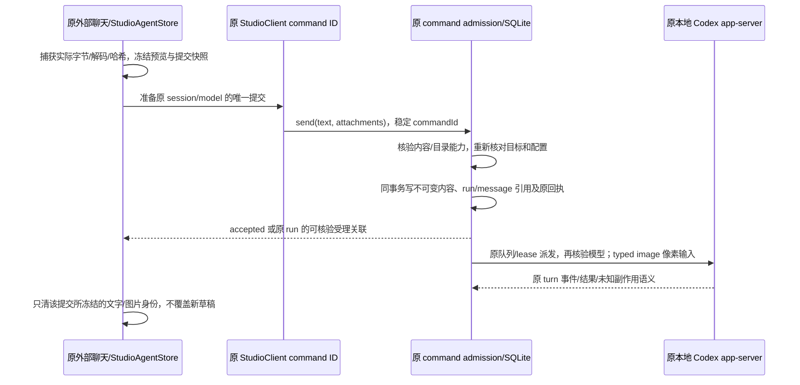
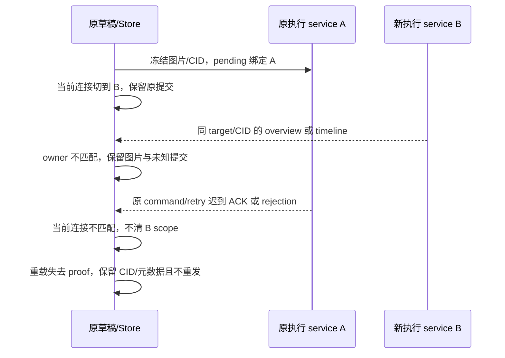

# Studio 外部单聊本地 Codex 贴图

基线：2026-10-08 main `34078257b5d9d1e78c40308b34dab8ff45565156`（v0.10.0）。本路仅补本地 Codex 的 PNG/JPEG 输入，不合并、升版或发布。正常文字聊天、既有 fast 路由和原生通过明确本地路径读取图片的能力保持各自的现有所有权。矩形批注、图片编辑器、远程 Host、视频、SVG、外链上传和全内核扩展不在范围。

## 当前事实和设计边界

- 外部聊天由 `StudioExternalChat` → `submitStudioChat` → `StudioClient` → Runtime command admission → queued run/turn → Codex app-server 驱动；此前发送只有文字。
- `ChatPromptEditor` 已有 paste/drop、空输入发送和 topContent 插槽；`chatAttachments` 已有 File/Blob 预览、释放和序列化。沿用这些呈现与采集能力，不复制原生聊天的媒体系统。
- V4 `attachmentPut`/transfer 的 ref 归属原生 session，本地 transfer 本身还只是零拷贝路径；均不能作为外部 Studio 内容已冻结的证明。此处不创建隐藏原生会话，不把可变磁盘路径直接当作待发送图片。
- Codex rust-v0.161.0 的模型目录 `inputModalities` 与 typed `image.url` 输入提供协议依据；ACP 广告缺省 false 不等于选中模型能力 unknown，codex-acp 的图片转文字分支不能作为像素交付成功。

## 所有者、状态与输入契约

- UI 草稿唯一所有者仍为 `StudioAgentStore`。捕获直接读取 File 字节，复制为 immutable Blob/File；既有 object URL 与序列化只使用该副本。相同内容的重复 paste/drop 去重；移除后再加入生成新捕获身份，旧 ACK 不能清掉新图。
- 未提交图片在原草稿内持有不落盘的 `imageOwnerService`，采集、追加和封存均核验该执行 service 与捕获 ID；同 sessionId 换 Host 不能自动发送原图片，须返回原 Host 或明确移除并重新采集。store 的 ACK/rejection 校验原 pending service/CID/target 和当前图片归属，hook 的所有返回路径再检查当前连接；切 Host 后直接 command/retry 的迟到结果也不清当前草稿。没有第二份草稿或 accepted 队列，仍用原捕获 ID 区分版本。
- 首版限制：静态 PNG/JPEG，每张 ≤2 MiB、一次 ≤4 张、合计 ≤4 MiB，任一边 ≤8192、像素 ≤16 Mi。限制独立于现有 readMediaPreview（最高 8 MiB）和 readBinaryPreview（25 MiB），不改全局额度，不照搬上游 32 MiB。检查声明 MIME、签名、实际完整解码、尺寸、规范 base64、字节数和 SHA-256。PNG 在预览和受理前按实际字节检查完整 chunk 边界、CRC 和结束标记；出现 acTL/fcTL/fdAT 动画声明立即明确拒绝，包括伪装成普通 image/png 文件的 APNG，避免动态预览与模型首帧不一致。不扩展动画或转码平台。
- 最小 typed 图片包含捕获 id、文件名、MIME、尺寸、字节数、SHA-256、冻结 base64。`send.attachments` 仅 chat 可用；image-only 合法，文字＋多图合法。group/workflow、非本地 Codex、未知/非 image 模型明确拒绝；不静默转文字。
- Host accepted 内容只写原 SQLite 所有者下的不可变图片实体，run/message 保存有界 owned 引用；不新增 accepted 队列。内容与 refs、冻结模型和原 command receipt 同事务提交。相同内容可复用，不允许同哈希不同内容覆盖。
- `StudioKernelOptions.models[].inputModalities` 可选：缺失代表 unknown，明确无 image 代表不支持。UI 要核验所选或可核验的原生默认模型；Host 在受理与 Codex 提交前分别查询实际目录，不信任 UI 能力声明。排队时冻结实际模型，派发时必须仍支持 image，原生 thread 响应必须匹配。
- 原 RPC 方法数不增加：`timeline` 追加可选图片 id 参数，与既有聚焦 run 组成 scoped owned 读取；只返回这一张的冻结内容。历史 refs 没有媒体或无法校验时显示缺失，绝不把占位或纯路径称为图片已发送。旧命令和旧记录没有附件字段时完全沿用文字逻辑。
- 草稿字节留在有界 UI 内存；本地持久草稿只保存图片元数据/身份，不把个人截图 base64 放进 localStorage。重载后未受理草稿显式显示缺失、要求移除或重新添加，不能只发剩余文字。接受后的媒体可从原 Host owned 内容重新读取。

## 异步、ACK 与恢复

捕获、模型目录读取和会话创建均绑定 service/kernel/session/project/selection 代际。卸载、移除或更换目标使旧回包失效；不会往另一个会话贴图。捕获的成功、错误和结束状态使用同一个 scope token；同会话更换模型或连接也立即结束旧读取，旧失败不能写进新范围或结束新读取。受理前重验原目标和配置，删除/过期目标不创建替代。

原 `StudioClient` 继续拥有稳定 commandId 和重试身份。图片提交冻结全部载荷；重复点击共用同一 pending 操作。不确定 ACK 保留原请求，重试只重放原 payload/commandId，不能自动改用当前会话或模型；连接变化时先观察原历史，不盲目跨 Host 重发。overview、timeline、直接发送及重试结果的清稿操作统一由 `StudioAgentStore` 校验原 pending service 对象、commandId 与目标；同名 target/CID 的另一个执行 service 不能确认原提交。timeline 观察只在仍持有该 service 的 pending proof 时发出，换连接或卸载使原观察失效。原已发 command 的直接结果仍以捕获时的 service 校验，不把新 service 当作响应来源。新增 run 的受理 commandId 关联仅用于观察原受理事实，不替代执行状态或 lease。迟到 ACK/失败只影响原操作，不能清新图片、还原已移除图或重置新操作。排队和运行中发送仍由既有 Runtime 队列承接；取消仍由原 cancel owner 决定。

现有 Studio RPC 没有可持久验证的 Host 身份，`StudioClient.connectionKey` 只是窗口内计数，service 引用也不能持久化。重载后原 pending proof 丢失，恢复的图片提交必须明确保留未知状态，不对当前 service 自动查 CID/认领 ACK，也不重发。即使当前 Host 返回相同 target/CID 也不能清掉它。提示具体原 CID 尚未知、原图片字节已不可恢复，指向已有原 Host 运行记录和新建独立会话入口，不承诺重新连接就能重试。普通未提交的失效图片可明确移除后重新采集；若已有未知提交，移除/重加也不能清 CID 或把原请求重新执行。保持窗口和原 service 对象时，组件重新挂载仍可只读观察原受理；真正重载后的自动确认需要后续单独设计可信 Host 身份契约，本路不新增猜测身份、平行执行器或数据库 owner。

图片回执复用原 command 记录并标记内部表示版本 1：canonical 载荷保留全部原文字、目标、模型、权限和图片元数据/内容地址，base64 仅保存在同事务的不可变 image-content 实体中一次。每次图片请求（包括 CID 重试）均先完整验证真实字节、哈希与解码；重放还逐字核对原内容实体，缺失或变化明确拒绝。不得仅信调用方 sha256，也不得把原有纯文字或旧完整图片 canonical 回执重写成新表示。旧回执仍按原完整载荷比较。此方案保持单记录 4,000,000 字符限制与对外合计 4 MiB 图片预算，不扩大全局数据库门禁。两张独立约 1.9 MB 静态 PNG 必须受理、原 CID 重试/重启无重复，且字节、元数据、模型、权限或目标变化必须拒绝。

图片只通过真实 typed Codex `image` 输入发给原 native turn；`accepted` 表示 Host 受理，不能描述为模型已看图。图片附在 `/status`、`/compact` 等原生控制命令上需明确拒绝，不能消费控制命令后遗漏图片。失败草稿保留可重试；原生结果未知沿用 interrupted/明确重试规则，不擅自重复执行。

## 文件协作

本路拥有新图片类型/纯边界校验、Host 图片 admission/内容适配器、UI 草稿/图片 hook/缩略图与专项验收。共享变更限于 `contract.ts`、`kernelTypes.ts`、`modelOptions.ts` 的目录字段、commandAdmission/runExecutor/turnExecutor 的输入透传，以及 `codexProtocol.ts` 的 typed 输入与提交前能力校验。另一条适配器信息保真路拥有事件输出/引用/事件规范化；通过集成 PR 协调，不改其事件行为。fast 相关字段使用既有路由，不重新定义速度或模型策略。

Node 解码使用仓库已锁定的常规第三方 PNG/JPEG 编解码依赖并明确声明，不复制上游实现；不读取凭据、不调用真实付费模型，所有图片验收均用合成小图。

## 必过验收

1. image-only、文字＋多张小图、中文文件名；预览的实际 pixels/hash 与 fake app-server typed 输入一致，不能用 placeholder base64。
2. 重复 paste/drop 去重、移除/取消、错误 MIME/损坏/截断文件、APNG 声明/损坏 chunk、SVG/视频/外链拒绝，数量/字节/尺寸/像素边界。合法 ancillary 数据里只有 acTL 字样不误拒绝。
3. 模型能力 known-image、known-no-image、unknown 分开；非本地 Codex 拒绝、模型/目标换代、目录更新、原生实际模型不符；无像素请求不得伪称支持。
4. 创建/发送异步中换会话或模型、排队/运行中输入、重复点击、失 ACK、迟到 ACK/失败、重试与重启；只清冻结身份，不跨会话，不重复执行。
5. 真实 Runtime/SQLite owner＋fake protocol endpoint 的模型目录和输入断言；实际 React 浏览器 paste/drop、缩略图/删除、按钮/状态/错误/重试与历史缺失媒体场景。
6. 旧文字及持久记录回归；fmt/lint/typecheck、changed/full architecture、来源指纹再生/check 和 targeted tests。完整离线测试如执行，先 build CLI；不得把未运行的 paid provider、安装包或远端场景列作通过。

## 协议依据

- [Codex rust-v0.161.0 Model](https://raw.githubusercontent.com/openai/codex/rust-v0.161.0/codex-rs/app-server-protocol/schema/typescript/v2/Model.ts)：原生模型输入能力字段。
- [Codex UserInput](https://raw.githubusercontent.com/openai/codex/rust-v0.161.0/codex-rs/app-server-protocol/schema/typescript/v2/UserInput.ts)：typed image URL 与 localImage 路径是不同输入形式。
- [Codex TurnStartParams](https://raw.githubusercontent.com/openai/codex/rust-v0.161.0/codex-rs/app-server-protocol/schema/typescript/v2/TurnStartParams.ts)：原 turn/start 结构化输入。
- [W3C PNG animation chunks](https://www.w3.org/TR/png-3/#11AnimationChunks)：acTL、fcTL、fdAT 的实际 chunk 声明；首版明确拒绝动画输入。

## 实现补充：受理回执与窗口恢复

`StudioCommandResult.imageRejection` 表示 Host 明确在入队前拒绝，原草稿继续可编辑；传输错误仍为未知 ACK，原 CID 和冻结载荷绑定原服务重试。`timeline` 第五可选 `admissionCommandId` 只读查找原 command 回执并核验 run/target/CID，返回 `admission` 与该运行的完整引用；不创建新任务，不增加 RPC 方法（仍为 12）。原 service proof 尚在时，该查找解决组件重挂或历史分页淘汰后受理事实不可见的问题。真正 reload 已失去原 service proof 时，显示原 Host 归属无法确认的未知提交，不自动认领回执或重新执行。

未发送图片与待确认载荷共用窗口级 16 MiB 总内存预算，localStorage 仅保存元数据与待确认 CID/捕获 ID，不写截图 base64。明确放弃不明提交的策略不由图片工具擅自决定。

贴图 UI 在原 prepared command 内冻结 `imageModel`（目录确认的实际模型）和现有 `kernelConfig` 权限/可执行文件快照；Host 拒绝与显式 selection 不一致的图片模型，再查询真实目录并核对原生响应。`imageModel` 只 pin 本次运行，不改变会话的 CLI 默认偏好。重试仍使用原快照，不能随新草稿模型或全局权限变化转用另一条执行路径。
