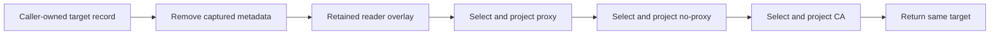

<!-- SPDX-License-Identifier: MIT; Copyright (c) 2026 Knorvia Studio contributors -->

# Subprocess network environment projection contract

Root has read the old environment helper, its public declaration, and execution/MCP/Git caller boundaries. Implement only from this finalized behavior contract and the approved declaration files; do not read old product source, tests, history, probes, runtime bundles, or the main repository. Your earlier own context remains and is not a whole-process clean-room guarantee. Use a separate task cache directory for design and candidate code. Write design before implementation; only static checks are permitted until root runtime acceptance.

## Boundary

One synchronous export `applyNetworkEgressEnv(env, options)`, arity 2. Public type `NetworkEgressEnvPolicy` has optional caCertFile/httpProxy/noProxy strings. Options has optional network policy, NodeJS.Platform, sourceEnv record of string or undefined, and toolEnvPassthrough boolean. It mutates and returns the identical target env object. Target values are strings. Source defaults to a new empty object, platform to process.platform, policy to empty. It must not default to process.env, spawn anything, read certificates, parse URLs, sanitize arbitrary keys, or change caller behavior/UI/settings. Config owners and runtime sanitization stay in callers and the existing shared public reader.

## Ordered behavior

First remove the product captured-environment metadata key from the destination. Unless toolEnvPassthrough is exactly false, invoke the retained public `readKnorviaToolEnvPassthroughEnv(sourceEnv)` and overlay each returned own entry. Reader performs its existing captured-JSON validation; do not copy or reimplement it. Then apply explicit proxy, then no-proxy, then CA configuration. Do not clear absent policy outputs or copy arbitrary source keys. Existing destination/captured values remain when no explicit/product value is selected. Explicit policy overrides captured network values; there is no generic HTTP_PROXY/source certificate fallback here.

Proxy selects trimmed nonblank `network.httpProxy`, else the first product proxy source key value using platform lookup, trimming that value too. A case-insensitive `scheme://` syntax consisting of an initial ASCII letter and ASCII letters/digits/+./- thereafter is passed through without URL validation or canonicalization. Other nonblank proxy strings get `http://` prefix. Selected proxy is assigned in order to HTTP_PROXY, HTTPS_PROXY, ALL_PROXY, http_proxy, https_proxy, all_proxy.

No-proxy selects trimmed nonblank `network.noProxy`; otherwise use the product no-proxy source value only if its trim is nonblank, while preserving the source's original leading/trailing spaces. Assign NO_PROXY then no_proxy. CA does the same explicit-trim/source-raw selection with the product CA source key, then assigns NODE_EXTRA_CA_CERTS, SSL_CERT_FILE, REQUESTS_CA_BUNDLE, CURL_CA_BUNDLE, GIT_SSL_CAINFO in that order. No file checks or certificate IO occur; values are only projected.

On non-win32, lookup/deletion is exact case. On win32, source lookup selects the first own enumerable key whose lowercase equals the requested lowercase, preserving Object.keys insertion ordering; if that first value is blank/undefined, do not fall through to a later differently cased alias. Destination assignment deletes all existing case-insensitive variants, then sets the specified canonical spelling. Therefore the sequential upper/lower proxy and no-proxy writes leave only their final lowercase spellings on win32, while POSIX retains both. CA final spellings remain uppercase. Remove only keys selected by this rule, never unrelated entries or inherited properties. Ordinary ECMAScript record mutation and property-operation exceptions propagate; no catch/rollback is introduced. Source and target may alias; preserve the documented operation ordering instead of snapshotting all source fields upfront. No global state/cache.

## Settled public and platform details

The exact product source keys are KNORVIA_HTTP_PROXY, KNORVIA_NO_PROXY and KNORVIA_AGENT_CA_CERT, one key per policy, with no additional product alias list. Captured metadata is KNORVIA_TOOL_ENV_PASSTHROUGH_JSON. Import the approved four constants and reader from the existing narrow public @knorvia/shared/runtime-env entry; shared.d.ts states their declarations. Public-api.d.ts supplies the exact single function and type declarations. Do not make the options parameter optional or add null coercion beyond the existing optional fields.

Root's twelve owned pure observations settled design-review ambiguities. Each captured overlay entry uses the same platform delete-then-set operation as explicit writes. Captured entries differing only in case leave only the last spelling on win32, while distinct spellings coexist on POSIX. Non-win32 source lookup uses ordinary exact property access, including an inherited exact property. Win32 lookup uses only own enumerable keys. Never introduce a new own-property restriction for POSIX. Destination deletion remains ordinary exact delete on POSIX and own enumerable case-insensitive matching deletion on win32, so it does not delete the prototype's properties. Target/source alias loses its own captured metadata before invoking reader and cannot restore that removed capture. Separate source remains unchanged. The reader's own exact metadata lookup and JSON validation are retained, including malformed JSON returning an empty record; do not invent a decoding exception or case-insensitive reader mode. Normal property access errors still propagate.

Selection timing is part of this synchronous mutator. Default option field reads occur before initial target deletion; policy values themselves are selected in proxy, no-proxy, CA order after the overlay. A captured source alias can consequently observe previous target writes. Do not snapshot all source values or replace the target object. Options getters/record operations use ordinary ECMAScript behavior; do not newly promise arbitrary getter counts, Proxy trap sequences or rollback beyond the specified finite observations.

## Implementation, verification and provenance limits

Use one normally formatted module under400 lines with one target owner, direct ordered projection and small platform-sensitive helpers. No generic mapping framework, new sanitizer or parallel caller helper. Existing shared reader/constants keep their rights and own parsing responsibilities. Author may read only this contract, public-api.d.ts, shared.d.ts, input-hashes.json and own newly authored files/prior review context. No old code, tests, probes, history, product runtime bundles or other workspace. No DNS/network, env/CA probes, model calls, package installation or product/candidate execution. Fixed Node24 syntax, strict types with approved declarations, formatter and94-rule lint are allowed; audit actual compiler-program inputs.

Root retains full-source knowledge, writes old-first pure tests and validates integrated source, CLI-reachable compiled code and full offline regression. Compatibility names, standard property operations, MIT headers or passing tests alone do not establish authorship. This is not a whole-process clean-room or legal guarantee. No known defect is approved for behavior change in this batch; preserve the established contract. Keep root Apache-2.0, preview identity, retained dependency rights and UI/data unchanged.

## State owner and ordering

Each step reads the live borrowed source after prior target writes. A synchronous exception stops at that step and leaves earlier mutations visible. No alternate state, rollback, cache or background task exists.
