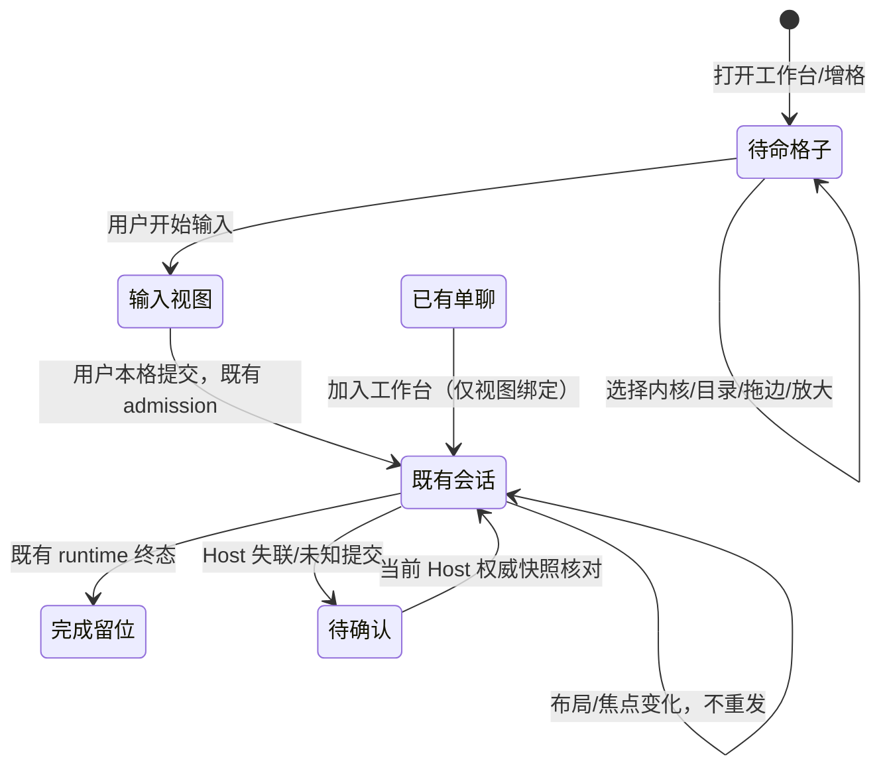
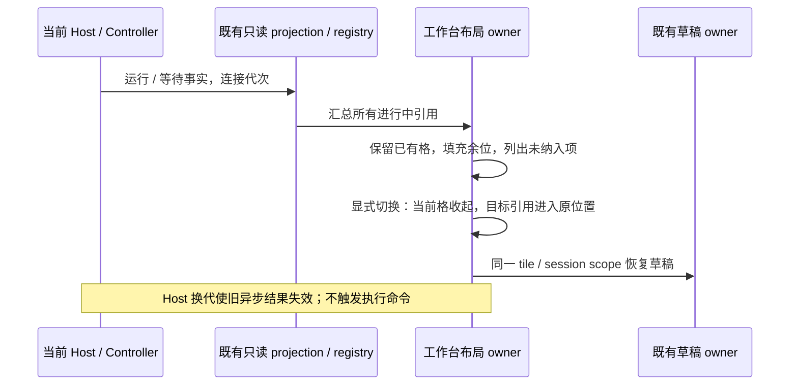

# 独立 GUI 工作台

2026-10-08。工作台统一复用现有 GUI，提供独立导航、零任务预布局、每任务一格（同内核多个任务不同格）、各格独立输入/审批/停止、拖边调宽高、布局持久化、单格放大返回、结束原位保留。原单会话保留“加入工作台”，只建立同一会话的视图绑定。

基线 main `34078257b5d9d1e78c40308b34dab8ff45565156`，分支 `codex/task-workbench-20261008`。不改执行协议/PTY/CLI/历史导入，不发布版本；只读运行历史投影去除未结束记录的截断。保留黑白 UI、Apache-2.0、第三方来源、现有用户数据；不扩大手机、官网、签名范围。

## 能力与所有者

| 状态/能力                      | 唯一所有者                                         | 工作台边界                                                      |
| ------------------------------ | -------------------------------------------------- | --------------------------------------------------------------- |
| 布局、焦点、放大、待命配置     | Renderer 工作台 store                              | 最多四格，严格校验持久化，只保存布局/会话引用                   |
| Knorvia 会话、输入、审批、停止 | 既有 V4 runtime / SessionPane                      | 复用 pane provider、scope、session 与命令，不另建 executor      |
| 外部内核会话、输入、审批、停止 | StudioRuntimeService / SQLite / StudioExternalChat | 复用现有 admission、commandId、run/attempt/owner、未知 ACK 保护 |
| 草稿、滚动、消息状态           | 既有会话组件及缓存                                 | 不把布局 store 当成队列；稳定 tile key 防止调整布局导致重挂     |
| 远程连接                       | 既有 workspace resolver / remote bridge            | 明确 endpoint+workspace，断连不可回退本地 Host                  |

首批 GUI 覆盖现有 Knorvia 及外部内核；能力仍由既有内核目录和发送 gate 决定。不会因选择内核而安装、探测启动任务或发送消息。没有持久暂停能力的动作继续显示“停止/中断”，不伪造暂停。

## UI 与持久化

新增“工作台”导航；复用 split tree / WorkbenchSplitDivider。首批最多四格（2026-10-08 起改为两行、每行最多四格，共八格，并新增新建任务、紧凑顶栏与画布缩放，见 `knorvia-workbench-usability-20261008.md`），最小输入面积 360×300；尺寸不足时内容区域滚动。固定 tile 身份，稳定叶子平铺；分割/缩放/放大不卸载存活会话。单格放大只隐藏其他格子，恢复时保留草稿、滚动与比例。关闭格子不停止后台会话，结束不自动删格。

空格先选择内核和目录，再打开输入；此过程不发送任务。打开现有会话不发送 create/send/resume。重复加入同一 kernel+scope+session 聚焦已有格；不同任务即使内核相同也分别占格。UI 用现有黑白语义颜色和 text-ui-\*，所有标签中英文。

持久化版本化、有大小/深度/叶子数上限，拒绝非法/重复 key。只持久化引用及配置，不保存 Host 句柄、执行状态、批准结果或复制正文。存储失败仍保留本次内存布局并显示提示。刷新恢复后核对当前 Host 的会话；缺失/断连保留格子并显示原因，不能把不存在的历史会话当新任务自动启动。Host 服务代次更换时旧回调不得绑定新会话；未知提交沿原组件路径，不由工作台自动重试。

集成真实 reload 发现仅匹配当前索引会误认另一 Host 的同 ID/内核/项目。恢复的已打开/带会话引用（包括收起格）必须先将原连接证明设为 unknown；当前索引、汇总和收起恢复不能证明原 Host。已有会话由用户在当前 Chats 核对后显式重新加入；未发送原生输入或当前 Host 没有同 ID 会话的外部草稿，显示保存坐标并由用户显式打开原输入。保留 tile/layout/draft ID，不保存新的 Host 标识、不自动启动任务。未打开的零任务布局仍按原流程准备。

## 一键汇总与收起恢复（首版遗漏补齐）

“汇总进行中任务”一次纳入可用位置，并展开完整任务列表。进行中包括排队、运行、等待审批、等待输入；原生任务以 Controller activity/pendingInteractions 为准，外部任务以 StudioOverview 的 run + 当前 attempt 的 pending attention 为准。结束、已取消、旧 attempt 的批准不混入。去重键包含内核、工作区身份、远程连接、会话；同内核不同任务不能合并。

读取范围是当前窗口 Host 的全部 Studio 运行记录与 Controller 已知工作区（包括远程和未打开的工作区），补充当前工作区、现有格子与工作区标签。扩展既有 Controller registry 的工作区只读投影，不另开执行/轮询通道；任务列表使用不分页查询，保留断连和查询失败提示，不将不完整结果称为全部。Studio 从既有 active 索引补入全部进行中记录，未知结果历史取消 10000 条截断，普通完成历史仍只取最近 100 条。

四格仅是同屏布局容量，不是任务数量上限。已有布局/已配置待命格/草稿/完成格不被汇总覆盖；只消费未经配置的待命格或添加空余格。列表显示全部进行中数量、已显示数量、未纳入数量，各项都有状态与项目。超容量项可“切换到当前格”，被换出的格子进入“已收起”，布局比例不变；群聊/工作流保留原页面入口，不假装已经装入单聊格。汇总与切换只改视图引用，不发送 create/send/resume/approval/cancel/read-receipt。

“收起格子”不停止任务；说明常驻显示，停止仍由格内既有按钮执行。已收起列表保存最多 64 个有界引用（不复制正文/运行状态），到上限阻止继续收起并提示，不静默删历史。恢复/切换保留 tile 身份、原会话 ID 与连接归属；同一窗口 Host 换代后不能借收起/恢复把旧格重绑新 Host。v1 布局缺省迁移为空收起列表；存储失败不丢本次内存引用。

未发送原生草稿使用既有 V4 草稿 owner，以稳定 tile ID 派生专用 draft scope；普通单聊仍用原 root scope。首发 accepted 后只转移并清理本格作用域；收起与重载沿相同作用域恢复。外部草稿仍由原 per-session store 保存，本轮不修改 PR #52 的附件/ACK 路径。附件的持久性沿用既有组件保证，不额外宣称支持未提供的附件重载恢复。

新增验收：超过四个任务含两类等待/远程身份/旧 attempt；配置和比例不被覆盖；所有未纳入项可达；收起/换入/刷新后未发送草稿恢复且无命令；两个原生待发送草稿各自保存/转移；Host 换代后的枚举与恢复隔离。工作台仍是 UI owner，Controller/Studio runtime 仍是状态 owner。新增原生 props 仅显式工作台调用使用，不修改常规聊天默认值。

## 源码边界与集成

已核对 feature-boundary-planner 的 conversation-runtime / conversation-projection 及其 command-inbox、topic-publisher、connection-scope 一跳关系。工作台处于展示/布局边界，仅复用既有执行链。新增 UI/store 位于 `packages/ui/src/studio/workbench/`；导航改 `StudioActivityRail`、`WorkspaceShellLayout`、路由类型和 messages。

不改 PR #52 的 chatSubmission、附件、草稿或跨 Host ACK；嵌入现有 StudioExternalChat。不改内核协议适配器。不改普通终端。所有文件符合架构预算，不提高基线；最终 fmt 后更新来源指纹，冻结材料不动。

## 验收案例

| 案例         | 设置与动作                                                            | 必须证据                                 |
| ------------ | --------------------------------------------------------------------- | ---------------------------------------- |
| 零任务布局   | 新工作台，增格、改内核/目录、拖边、放大恢复                           | 模型/发送/创建任务调用为零；持久化可恢复 |
| 同内核多格   | 两个外部任务分别输入/提交/审批/停止                                   | draft、target、run、interaction 相互隔离 |
| 加入已有任务 | 单聊加入两次、调整布局                                                | 同一格聚焦；不复制会话、不发任务         |
| 状态保留     | 输入草稿后增格/放大恢复，任务结束                                     | DOM 身份/滚动/草稿不因布局丢失；结束留位 |
| Host 更换    | A 与 B 同 ID，A ACK/批准迟到                                          | 旧回调不修改 B；未知提交不自动重发       |
| 恢复异常     | 非法/过深/重复布局、会话已删除、存储失败                              | 安全回退或保留原因；无自动执行           |
| 最终质量     | fmt、lint、typecheck、architecture、provenance、针对性离线协议/浏览器 | 记录实际运行结果；不复用旧 A 的测试计数  |

验证只用离线合成协议和测试服务，不连接付费模型。用户取消的原生终端/真实 PTY 测试不再属于本轮要求。

## 本环境首版验收记录

- `node scripts/check-workspace-freshness.mjs`：相对 origin/main ahead 0 / behind 0（提交前）。
- `pnpm fmt:check`、`pnpm typecheck`（含 5573 个中英文键核对）、`pnpm verify:pre-push`：通过。Lint 0 error，1 条已有 `packaged-runtime-evidence.mjs` control-regex warning；架构 0 violation。
- 8 个针对性测试文件共 58 pass / 0 fail：工作台状态、原 Studio client 的未知提交/幂等重试、导航、草稿、真实 SQLite/runtime、SSH 归属、Codex/Claude/Grok 离线真实 stdio。
- `node --import tsx scripts/task-workbench-smoke.mjs`：Chromium 实际 GUI + 真实 SQLite/命令接纳 + 合成内核，通过 5 组验收；有横纵拖动、稳定 DOM、放大返回、刷新布局、重挂载保留草稿、两个 Codex 格子独立输入/审批/停止、完成留位、重复加入不发送、Host A→B 同 ID 加迟到 ACK 不重放。
- 浏览器没有 mock 聊天/工作台组件；平台目录选择与模型 adapter 为夹具。未运行付费模型、真实登录内核、完整 Desktop/Electron、Knorvia V4 的端到端发送或跨机器 SSH UI。普通终端没有改动，也不再属于本轮验收。
- 当前改动不包含 PR #52；集成须保留它的外部聊天附件与跨 Host ACK 修复。其模块未被本工作台覆盖。

## 一键汇总补齐验收记录

- 最终 11 个针对性测试文件：64 pass / 0 fail。新增覆盖多于四项的两类等待、原生/Studio 同会话去重、远程身份、离线提示、收起上限、恢复、旧 Controller 代次，以及真实 SQLite 中 10003 个进行中记录不被最近完成记录挤出。
- Chromium 实际 GUI + 真实 SQLite/runtime：7 组场景通过。新增 6 个进行中任务（审批与输入等待均有）；保留未发送草稿后显示 3 个已在格内、3 个未纳入，列表六项全部可达。显式换格、收起、重载恢复未发送文本，未产生新执行命令。
- 原生 V4 草稿 owner 的浏览器探针：两格独立保存、卸载再挂载恢复、只转移 accepted 的作用域；未宣称跑过完整 V4 模型发送。
- 全仓 `typecheck` 和 `verify:pre-push` 通过；中英文键 5573 对；架构 0 violation，lint 仍只有上述既有 warning。最终格式与来源指纹检查在提交前再次执行。
- 提交前核对 main 仍为 `34078257`，本分支 ahead 1 / behind 0。与 PR #52 `f45d1900` 仅重叠生成文件 `licensing/current-files.json`；与 PR #50 `535146a1` 还重叠 `studio-runtime/CONTRACT.md`。集成应合并契约段落并重新生成来源指纹，不覆盖其他分支的功能。
- 仍未运行付费模型、真实登录内核、完整 Electron、完整 Knorvia V4 发送、跨机器 SSH UI。

## 全量回归的历史投影断言

PR #53 的 `4085817e` 在 CI run `37720024724`（实际检出合并 SHA `ae38ba37e9e8fdaede0508e04c920d9268012a99`）出现一个失败：`studio-runtime-sequencing.test.ts` 的崩溃恢复历史用例原本只预期最近 100 条记录加 1 条旧未知结果。本轮 active 索引补入了旧排队任务，真实结果是 102 条，本环境同版本可复现。

验收应明确验证最近 100 条记录的完整 ID 顺序、旧排队任务和未知结果各出现一次，以及排队仍被未知结果阻挡、读取投影没有启动内核。不得仅放宽数量范围，也不得为迁就旧断言删除应展示的进行中任务。修正后须运行该用例、全量 `test:studio`，并按新 head 核对 CI；此前本地 64 项结果不能替代全量回归。
