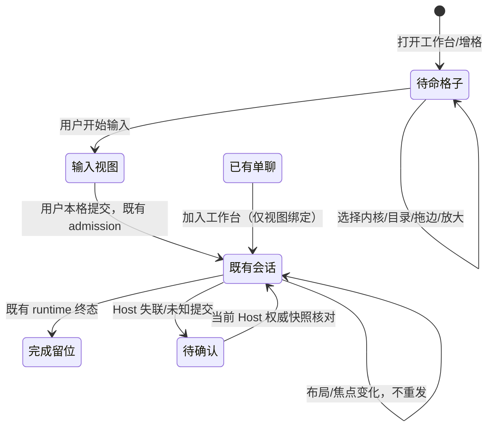

# 独立 GUI 工作台

2026-10-08。工作台统一复用现有 GUI，提供独立导航、零任务预布局、每任务一格（同内核多个任务不同格）、各格独立输入/审批/停止、拖边调宽高、布局持久化、单格放大返回、结束原位保留。原单会话保留“加入工作台”，只建立同一会话的视图绑定。

基线 main `34078257b5d9d1e78c40308b34dab8ff45565156`，分支 `codex/task-workbench-20261008`。本轮没有服务端协议/PTY/CLI/历史导入改动，不发布版本。保留黑白 UI、Apache-2.0、第三方来源、现有用户数据；不扩大手机、官网、签名范围。

## 能力与所有者

| 状态/能力                      | 唯一所有者                                         | 工作台边界                                                      |
| ------------------------------ | -------------------------------------------------- | --------------------------------------------------------------- |
| 布局、焦点、放大、待命配置     | Renderer 工作台 store                              | 最多四格，严格校验持久化，只保存布局/会话引用                   |
| Knorvia 会话、输入、审批、停止 | 既有 V4 runtime / SessionPane                      | 复用 pane provider、scope、session 与命令，不另建 executor      |
| 外部内核会话、输入、审批、停止 | StudioRuntimeService / SQLite / StudioExternalChat | 复用现有 admission、commandId、run/attempt/owner、未知 ACK 保护 |
| 草稿、滚动、消息状态           | 既有会话组件及缓存                                 | 不把布局 store 当成队列；稳定 tile key 防止调整布局导致重挂     |
| 远程连接                       | 既有 workspace resolver / remote bridge            | 明确 endpoint+workspace，断连不可回退本地 Host                  |

首批 GUI 覆盖现有 Knorvia 及外部内核；能力仍由既有内核目录和发送 gate 决定。不会因选择内核而安装、探测启动任务或发送消息。没有持久暂停能力的动作继续显示“停止/中断”，不伪造暂停。

## UI 与持久化

新增“工作台”导航；复用 split tree / WorkbenchSplitDivider。首批最多四格，最小输入面积 360×300；尺寸不足时内容区域滚动。固定 tile 身份，稳定叶子平铺；分割/缩放/放大不卸载存活会话。单格放大只隐藏其他格子，恢复时保留草稿、滚动与比例。关闭格子不停止后台会话，结束不自动删格。

空格先选择内核和目录，再打开输入；此过程不发送任务。打开现有会话不发送 create/send/resume。重复加入同一 kernel+scope+session 聚焦已有格；不同任务即使内核相同也分别占格。UI 用现有黑白语义颜色和 text-ui-\*，所有标签中英文。

持久化版本化、有大小/深度/叶子数上限，拒绝非法/重复 key。只持久化引用及配置，不保存 Host 句柄、执行状态、批准结果或复制正文。存储失败仍保留本次内存布局并显示提示。刷新恢复后核对当前 Host 的会话；缺失/断连保留格子并显示原因，不能把不存在的历史会话当新任务自动启动。Host 服务代次更换时旧回调不得绑定新会话；未知提交沿原组件路径，不由工作台自动重试。

## 源码边界与集成

已核对 feature-boundary-planner 的 conversation-runtime / conversation-projection 及其 command-inbox、topic-publisher、connection-scope 一跳关系。工作台处于展示/布局边界，仅复用既有执行链。新增 UI/store 位于 `packages/ui/src/studio/workbench/`；导航改 `StudioActivityRail`、`WorkspaceShellLayout`、路由类型和 messages。

不改 PR #52 的 chatSubmission、附件、草稿或跨 Host ACK；嵌入现有 StudioExternalChat。不改内核协议适配器。不改普通终端。所有文件符合架构预算，不提高基线；最终 fmt 后更新来源指纹，冻结材料不动。

## 验收案例

| 案例         | 设置与动作                                                            | 必须证据                                 |
| ------------ | --------------------------------------------------------------------- | ---------------------------------------- |
| 零任务布局   | 新工作台，增格、改内核/目录、拖边、放大恢复                           | 模型/发送/创建任务调用为零；持久化可恢复 |
| 同内核多格   | 两个外部任务分别输入/提交/审批/停止                                   | draft、target、run、interaction 相互隔离 |
| 加入已有任务 | 单聊加入两次、调整布局                                                | 同一格聚焦；不复制会话、不发任务         |
| 状态保留     | 输入草稿后增格/放大恢复，任务结束                                     | DOM 身份/滚动/草稿不因布局丢失；结束留位 |
| Host 更换    | A 与 B 同 ID，A ACK/批准迟到                                          | 旧回调不修改 B；未知提交不自动重发       |
| 恢复异常     | 非法/过深/重复布局、会话已删除、存储失败                              | 安全回退或保留原因；无自动执行           |
| 最终质量     | fmt、lint、typecheck、architecture、provenance、针对性离线协议/浏览器 | 记录实际运行结果；不复用旧 A 的测试计数  |

验证只用离线合成协议和测试服务，不连接付费模型。用户取消的原生终端/真实 PTY 测试不再属于本轮要求。

## 本环境验收记录

- `node scripts/check-workspace-freshness.mjs`：相对 origin/main ahead 0 / behind 0（提交前）。
- `pnpm fmt:check`、`pnpm typecheck`（含 5573 个中英文键核对）、`pnpm verify:pre-push`：通过。Lint 0 error，1 条已有 `packaged-runtime-evidence.mjs` control-regex warning；架构 0 violation。
- 8 个针对性测试文件共 58 pass / 0 fail：工作台状态、原 Studio client 的未知提交/幂等重试、导航、草稿、真实 SQLite/runtime、SSH 归属、Codex/Claude/Grok 离线真实 stdio。
- `node --import tsx scripts/task-workbench-smoke.mjs`：Chromium 实际 GUI + 真实 SQLite/命令接纳 + 合成内核，通过 5 组验收；有横纵拖动、稳定 DOM、放大返回、刷新布局、重挂载保留草稿、两个 Codex 格子独立输入/审批/停止、完成留位、重复加入不发送、Host A→B 同 ID 加迟到 ACK 不重放。
- 浏览器没有 mock 聊天/工作台组件；平台目录选择与模型 adapter 为夹具。未运行付费模型、真实登录内核、完整 Desktop/Electron、Knorvia V4 的端到端发送或跨机器 SSH UI。普通终端没有改动，也不再属于本轮验收。
- 当前改动不包含 PR #52；集成须保留它的外部聊天附件与跨 Host ACK 修复。其模块未被本工作台覆盖。
