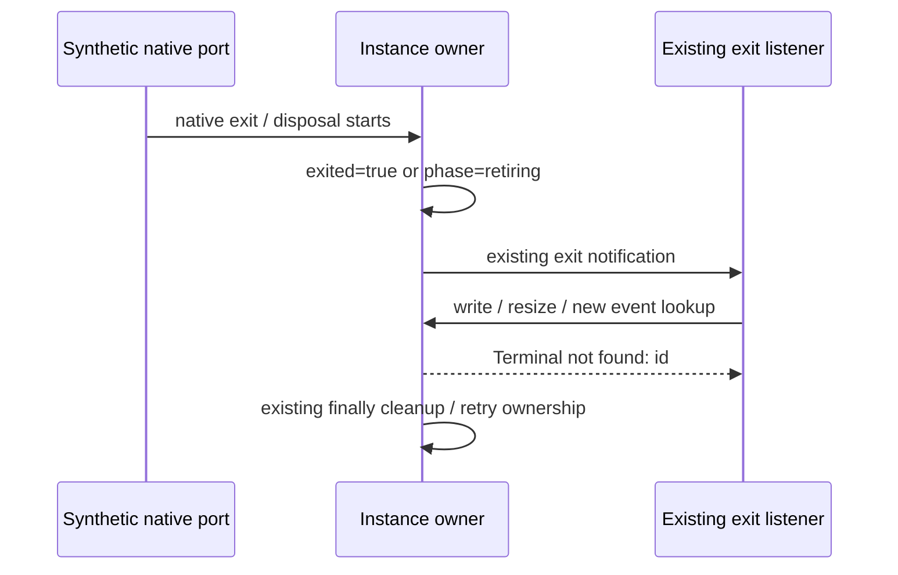

# Terminal retirement admission correction

Append-only correction after immutable 71647d576ab1b617f163f602ca8f7b20681d0c52.
Root reproduced a write from an exit listener after the owner had already observed native
exit and diagnostic terminal.open had become zero. Publication remained true until the
notification finally block. The same window exists inside synchronous kill callbacks.
The earlier corrective spec intended retiring IDs to reject IO and new subscriptions;
this checkpoint implements that existing policy rather than introducing a new public API.

## Ownership and admission

TerminalServiceInstanceOwner remains the only reservation, PTY, emitter, subscription and
diagnostic owner. Its existing lookup is the single admission point for write, resize,
dataEvent and exitEvent. Admission requires an owned, published, open, non-exited entry.
The phase/exited checks happen at the existing lookup point, before write data or resize
dimensions are evaluated. No changes to public terminal declarations, launch planning,
profile resolution, native loading, helper permissions or service create sequencing.

## Preserved and corrected contracts

- Ordinary live write/resize delegate unchanged raw values, return void, and evaluate id,
  lookup, then data or cols/rows in the existing order. No arbitrary input validation.
- A retired ID throws the existing `Terminal not found: <id>` error before evaluating IO
  payload/dimension getters. New event lookup is rejected for both native-exit notification
  and kill/disposeAll reentry. Unknown IDs retain the same behavior.
- Already subscribed exit listeners still receive the original event and snapshot order.
  Notification errors and resource cleanup retain the approved corrective semantics.
- Reentrant/repeated disposal still does not kill twice. Failed kill remains owned for
  explicit retry, counts as a live PTY, and rejects IO/new event lookup while retrying.
- An Event function obtained while open retains the existing RPC Emitter semantics;
  this patch does not wrap previously obtained functions or change emitter snapshot rules.
- No deferred work, timer, second accepted-state cache or new terminal ownership path.

## Failure-first acceptance

Before changing production, freeze source and strict emitted regressions using the real RPC
Emitter and owned fake PTYs. Cover write, resize, data-event lookup/subscription and exit-event
lookup/subscription from native exit, kill callbacks and bulk kill callbacks. Include live
getter-order/notification controls, failed-kill retry and actual direct ProxyChannel service
consumers. Record the unchanged starting owner bytes and red counts in a separate receipt.
Do not amend earlier commits, edit historical specs/handoffs, remove or weaken normal cases.

After the smallest lookup correction, run source and strict emitted lifecycle/RPC, immutable
planning/portable/macOS profile regressions, root types/lint/format, changed/full architecture,
CLI and desktop builds, and the normal full offline studio runner. All target native/process/
filesystem/chmod/access/settings ports are fake; no actual terminal, application, user profile,
user data, network share or OS/security setting access. Linux synthetic acceptance does not
establish native Linux/macOS/Windows PTY or packaged GUI acceptance. Resume the lane-specific
provenance checkpoint only after this corrected production boundary is verified.
