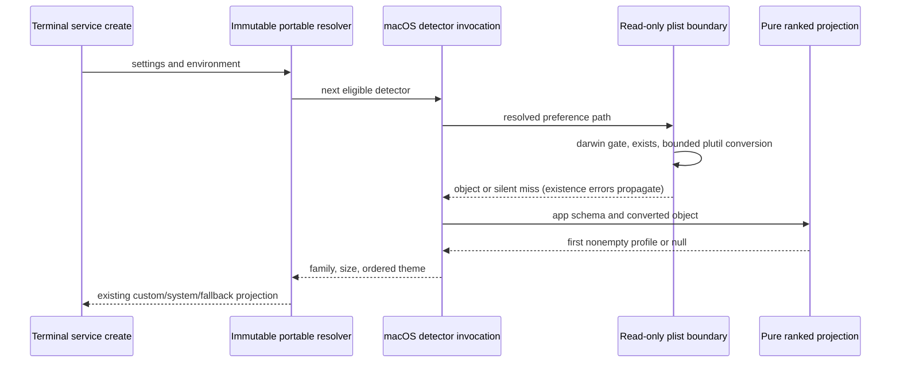

# macOS terminal profile boundary — fixed services lane

Start at immutable portable checkpoint `be96657486da1dd56841ab4b162f3b9146d03286`
on `parallel/file-watcher-fast-20261001`. Fetched recovery is
`08255eca46ea14de63dcead1a2ca76194187b772`. The macOS entrypoint blob is
`153a19560f824d032421f60a7a5fe0150471bf6e` at both heads, matching the fixed upstream
baseline: upstream-unchanged, NOASSERTION, review null, imported-snapshot history only.
No completed replacement was found. Its SHA-256 is
`e25ea5af453dcf05352f19f0e77452e3c02ddde44822a3059badaced50bf5c77`.
Public types blob `c4218bf29ff3415c5e32d8863f1e6bf629fba607` stays unchanged.

The author read inherited macOS source to extract behavior. This is source-exposed
reconstruction, not clean-room or a whole-file MIT conclusion. Root owns rights review,
shared provenance and integration. Keep LICENSE/NOTICE, preview identity and all 27
unresolved material obligations. Watcher, archive and portable checkpoints are immutable.

## Ownership and implementation decision

The existing synchronous factory remains the only portable resolver integration path.
It returns iTerm2 then macOS Terminal, both darwin-only. The portable caller places them
after VS Code and before Kitty/Alacritty; terminalService.create consumes the same result.
Retain public terminalProfileTypes declarations and do not edit either caller.

One invocation owns an ordered candidate search. A single read-only plist boundary owns
platform/existence admission, one bounded conversion and object-root validation. Pure
candidate planning and a declarative app schema own profile priority, font projection and
color aliases. Replace duplicated app loops and imperative theme writers with lazy ranked
candidates and an ordered schema projection; no parallel discovery, cache, second owner,
old implementation fallback or additional configuration probe.

Synchronous IO is retained because the approved portable API and real service caller
resolve synchronously; async conversion would require a separately scoped API change.

## Frozen legacy contracts

- Home is trimmed HOME, trimmed USERPROFILE, then OS homedir, resolved for each detector
  invocation even off-platform. Join literal Library/Preferences plus the two existing
  plist filenames using native path rules. Preserve relative paths and normalization;
  do not expand tilde, variables, remote shares, includes or terminal environment hints.
- Off darwin, never ask existence or run conversion. A missing file is a miss. Existence
  exceptions propagate; command/JSON failures and array/scalar/null roots are silent
  misses. One `plutil -convert json -o - <path>` call per present plist, with UTF-8,
  windowsHide true, timeout 2,000 ms, maxBuffer 2 MiB. No defaults, shell, retries, writes,
  child app launches or preference mutation. No log/output reveals preference contents.
- iTerm2 uses only the New Bookmarks array. The first object whose Default Bookmark is
  strictly true is tried first, then the remaining profiles in original order. Skip
  scalar/null/array profiles. Empty candidates continue; the first truthy family, size
  or nonempty theme wins. Do not replace strict true with truthiness.
- Terminal tries trimmed Startup Window Settings then Default Window Settings, including
  duplicate names, and looks up each directly on the plist root. Do not invent a nested
  Window Settings lookup. Skip malformed settings and continue past empty candidates.
- Descriptor coercion preserves optional `toString()` behavior, including exceptions.
  Trim names, remove one trailing unsigned integer/decimal size, replace every hyphen
  with a space, and trim again. Size extraction uses the original untrimmed descriptor;
  trailing whitespace suppresses extracted size. Font sizes accept numbers or parseFloat
  string prefixes only within inclusive 6..72 and reject nonfinite/other types.
- Terminal font family priority is trimmed FontName verbatim, normalized string Font,
  then archived Font/Font.NS base64 decoded as latin1 with the inherited font-name matching
  grammar. String base64 Font normally wins as a literal descriptor before archive
  decoding. Preserve that quirk. FontSize priority is valid explicit size then descriptor
  size. Object descriptor coercion remains observable, including `[object Object]`.
- iTerm2 exposes five base colors then ANSI indices 0..15; Terminal exposes four base
  colors then its named ANSI keys. Preserve key insertion order and all existing names.
  First successfully decoded theme alias wins (iTerm Ansi before ANSI). Component aliases
  instead choose the first defined value, even null/invalid; no later component fallback.
- Trim accepted string colors and preserve their spelling. Retain the observed hex
  grammar (3, 5, 6 or 8 digits) and permissive case-insensitive rgb/rgba prefix acceptance.
  Object RGB components use numbers or parseFloat strings; finite 0..1 stays fractional,
  > 1..255 divides by 255, >255..65535 divides by 65535, other values fail. Round RGB\*255.
  > Invalid/missing alpha defaults to 1; alpha below 1 emits rgba with three-decimal rounding,
  > otherwise lowercase six-digit hex. Skip invalid colors; an empty theme is undefined.
- Returned detected profiles have own fontFamily, fontSize and theme keys, including
  undefined values. No extra plist fields or metadata. Every call observes current data;
  no persistence, caching or mutation of env, preferences, settings, public types or PTY.
- Parser/projection exceptions outside conversion remain visible to the portable caller;
  custom fonts still detect inherited size/theme, and inheritance false stops all probes.
  Failed iTerm conversion falls through to Terminal, then existing portable fallbacks.

## Acceptance and safety

Before replacement, commit this spec and unchanged old-entrypoint contracts. Tests cover
failure-first IO, order, paths, font/archive/coercion, color aliases/thresholds, privacy,
repeated calls and the real portable/service consumer. All plist fixtures are synthetic
and owned in-memory maps; filesystem, plutil, home, PTY and permission ports are fake.
Consumer environment retains only synthetic values and Node's IPC marker. No real user
logs/profiles, credentials/account data, actual defaults, app launches, shares or OS changes.

Run the same frozen cases against source and strictly resolved emitted modules; also run
all immutable portable regressions, root typecheck/lint/format, changed/full architecture,
CLI/desktop builds and the full existing offline regression without timeout/test changes.
Inspect production consumers and bundle inputs/outputs for the new boundary. Linux fake
platform/IO acceptance is synthetic acceptance, not native macOS acceptance. Native plist
conversion, real terminal/PTY launch, fonts/color rendering and macOS preference errors
remain native acceptance gaps. Disclose retained expressions and digest evidence to root;
never regenerate shared provenance or change dependencies, CI or another lane.
