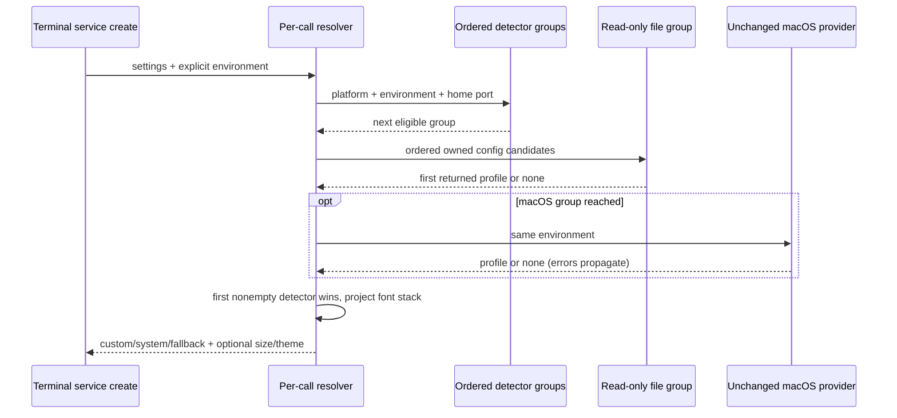

# Portable terminal profile resolver — fixed services lane

Start from immutable watcher/archive checkpoint `79e5eab90e5b94937abdc42d7f13ec0c5869b54c`
on `parallel/file-watcher-fast-20261001`. Fetched recovery remains
`0d80f9ca37b1daef162ecc69bd18f6e8fc30a146`. Portable resolver blob
`9fbcc28f7759cd7a924eb5592491fedde004a5bc` matches both heads; inventory says
upstream-modified, NOASSERTION, review null. Mac detector blob
`153a19560f824d032421f60a7a5fe0150471bf6e` and public types remain upstream-unchanged.
Only imported-snapshot history and no accepted independent replacement were found.

The author has read portable source and bounded macOS factory/IO context to extract
contracts. This is source-exposed work, not clean-room or whole-file MIT evidence.
Compatibility declarations, fallback values, paths and parser rules are retained facts.
Root owns contribution review and shared provenance. LICENSE/NOTICE, preview identity
and 27 unresolved material obligations remain unchanged.

## First boundary and ownership

Complete only `terminalProfile.ts` and narrowly named portable helpers/tests now.
Do not edit `terminalProfileMacOs.ts`, `terminalProfileTypes.ts`, terminalService or UI.
Report the portable checkpoint before extending macOS. Keep the synchronous public
`resolveTerminalFontProfile` signature and type re-exports: the actual service consumes
its result synchronously during `create`. Synchronous reads are necessary compatibility
at this boundary; changing to async would require a separately scoped caller change.

One per-call coordinator owns the ordered detector search and selected profile. A lazy
plan defines eligible detector groups and ordered candidate paths; a file-group read
boundary owns existence/read/parse attempts. A pure format interpreter replaces the old
two-pass JSONC character reconstruction with lexical spans and pending separators.
Projection owns only the returned font stack/source and passes size/theme references
through. No cache, second state owner, parallel probes or old implementation fallback.
The unchanged macOS detector factory is an explicit external group between VS Code and
Kitty. Its thrown errors remain visible, and its implementation is not counted migrated.

## Frozen behavioral contract

- Detector order: Windows Terminal (win32), VS Code (all platforms), factory-supplied
  macOS detectors in their existing order/platform constraints, Kitty then Alacritty
  (darwin/linux/freebsd/openbsd). Do not key eligibility to TERM_PROGRAM, WT_SESSION or
  terminal-specific environment hints; current behavior probes eligible config paths.
- `env` defaults to process.env. Each portable home resolution uses trimmed HOME,
  then trimmed USERPROFILE, then OS homedir. APPDATA/LOCALAPPDATA/XDG_CONFIG_HOME are
  trimmed. Preserve relative roots, native join normalization, repeated candidates,
  and no expansion of `~`, includes, environment expressions or shell commands.
- Windows Terminal: LOCALAPPDATA then APPDATA; stable packaged settings, preview
  packaged settings, unpackaged Microsoft/Windows Terminal settings. Within each
  object, matching defaultProfile GUID fonts win, then profiles.defaults.font.face,
  then first nonempty list font. Default ID is trimmed; list GUID matching is exact.
- VS Code: APPDATA stable/Insiders, XDG stable/Insiders, HOME/.config stable/Insiders,
  HOME/Library/Application Support stable/Insiders. Read the literal dotted
  `terminal.integrated.fontFamily` key, not a nested substitute.
- Kitty: XDG or HOME/.config first, then HOME/Library/Application Support. Preserve
  multiline-regex grammar including first-match and whitespace spanning line breaks.
  Trim the captured family, strip one leading/trailing double quote without retrimming.
  A quoted empty family returns an empty profile and ends that detector's candidates;
  the coordinator then continues to the next detector.
- Alacritty: XDG/alacritty/alacritty.toml, HOME/.alacritty.toml, then XDG .yml/.yaml.
  Use existing smol-toml/yaml libraries and font.normal.family; reject array/scalar roots.
- JSONC first attempts the original JSON. Otherwise remove only non-string line/block
  comments and trailing commas before `}`/`]`; preserve quoted comment markers,
  escapes and whitespace behavior. Invalid objects or non-object/array roots yield no
  candidate. Unterminated comments and malformed JSON retain observed acceptance or
  rejection; no evaluation of configuration code.
- Missing files are skipped. File read and parse errors are silent candidate misses.
  Existence-port errors and unexpected external-detector errors propagate unchanged.
  No log/error response includes configuration content. Do not add retries/timeouts.
- Only `terminalInheritSystemProfile === false` disables all detection; custom font
  does not bypass detection when inheritance is enabled. Whitespace-only custom is
  absent. Custom font owns family while detected size/theme pass through unchanged.
- A detected profile is nonempty if fontFamily, fontSize or theme is truthy, including
  theme-only/size-only profiles. Preserve theme identity and values; do not clamp or
  normalize provider data in the portable coordinator. A fontless profile uses the
  first fallback family and source system.
- Split primary font stacks on commas, trim/drop empty pieces, preserve primary
  duplicates, and append missing exact case-sensitive fallback names in the original
  order. Custom/system results include fontSize and theme keys even when undefined;
  fallback has only fontFamily and source. Preserve all fallback font literals.
- Every invocation observes current files/settings/env; no persistent detection cache.
  Do not mutate settings, env, profiles or files.

## Acceptance and privacy

Freeze the old resolver's precedence, paths, parser corpus, error identity and projection
before replacing its entrypoint. Use synthetic filesystem/home/platform ports and fake
macOS providers; native reads may touch only owned temporary config fixtures. No actual
user profiles, credentials, account data, terminal/app launch or OS/settings/security
change. Actual terminalService consumer tests use fake PTY, filesystem and command
adapters, never spawn a process or repair executable permissions.

Run the same frozen source/emitted cases and actual service consumer; root types/lint,
formatting, changed/full architecture, CLI/desktop builds and full offline regression.
Verify emitted consumer resolution and production bundle input/output for the new
portable code. Disclose Windows/macOS native gaps and inherited macOS code. Keep
watcher/archive commits and paths immutable; no shared provenance/package/lock/CI edits.
