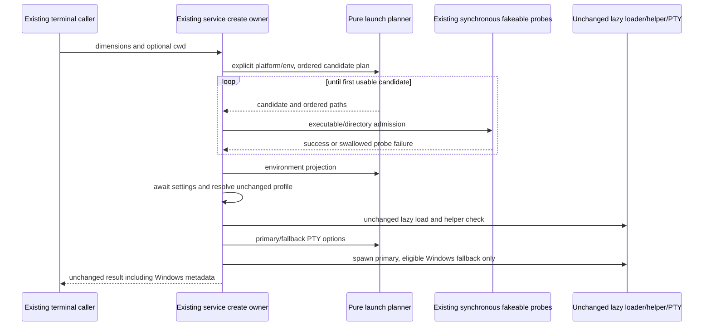

# Terminal service startup planning — first fixed-lane boundary

Start at immutable `8c463b2ee1361c1ccc68dec005a4b9eccbd1fce4` on
`parallel/file-watcher-fast-20261001`. No other conversation or agent. Terminal service
blob `02d002c74150a94321cd303e92dfac470f6c1945` matches the local cached recovery
`08255eca46ea14de63dcead1a2ca76194187b772`. Only imported-snapshot history exists;
inventory is upstream-modified, NOASSERTION, review null, upstream blob
`882d78ac39d4033b29c8a6b48a05368ba93bec95`. Starting SHA-256:
`0031c0f468e58c9fd4a67c723bfca146867f7ca8ea69c31d3ebae7d2c930bbdc`.
No independently completed service replacement was found in available history. Respect
this assignment's network restriction: freshness uses --no-fetch and cached refs; no new
remote-head freshness assertion. The authorized final branch push is the only network
operation. Public terminal.ts and every profile implementation/checkpoint stay unchanged.

The author has read inherited service source to extract contracts. This is source-exposed
work. No whole-file independence, clean-room or MIT assertion. LICENSE/NOTICE, preview
identity and all 27 material obligations remain; root owns provenance/rights/integration.

## First boundary and decision

Own only shell/cwd candidate planning, terminal environment projection, Windows metadata
and PTY-option planning, with a narrow terminalServiceLaunchPlan helper and scoped tests.
The pure planner knows explicit platform/env and native path-string rules, no process,
filesystem, PTY, settings or OS state. It emits ordered candidate groups and immutable
choices; the existing service alone interprets admission via synchronous read-only probes
and executes the existing primary/ConPTY fallback. One invocation owns selection; no new
cache, second accepted state, timeout/retry policy or parallel launch path.

Retain actual service create call ordering: consume ID; shell probes; eager home lookup
then cwd probes; copy/project environment; await settings (same failure fallback); profile
from current process.env; lazy module load; native helper check; allocate emitters; spawn;
attach events/store instance; Windows metadata from then-current platform/release.
The public service is registered in node.ts, exposed through accessor.ts and consumed by
useTerminalService.ts and TerminalSession.tsx. Windows metadata continues into xterm's
windowsPty option. These callers and public terminal.ts are not edited.

Lazy module-load promise/retry behavior, native-helper discovery/permission behavior,
terminal Map/counters/emitters/events/write/resize/dispose/disposeAll/memory diagnostics
remain inherited and unmodified. This first checkpoint does not replace instance lifecycle.
Synchronous access/stat probes remain to preserve current public create ordering; an async
or host/security change is outside scope. Test adapters never touch actual permissions.

## Frozen source and emitted contracts

- Windows shell order: pwsh.exe, powershell.exe, raw ComSpec, cmd.exe. Other platforms:
  raw SHELL, /bin/zsh, /bin/bash, /bin/sh. Do not trim shell/cwd candidates or deduplicate
  repeated candidates. A slash or backslash means direct X_OK access; bare commands probe
  raw PATH segments using native delimiter/join, ignoring only empty segments. No PATHEXT,
  extension expansion, profiles, commands or augmented Darwin PATH during shell admission.
  Access errors are candidate misses. Return original command, never the resolved PATH hit.
- Cwd order: raw requested cwd, raw HOME, OS homedir, literal /. Homedir is evaluated
  eagerly even if requested cwd is usable. Directory-stat/isDirectory errors are misses;
  homedir errors propagate. Ignore only falsy candidates; keep relative/whitespace paths.
- Failure messages stay exactly No usable Windows shell found for terminal startup,
  No usable shell found for terminal startup, and No usable working directory found for
  terminal startup. Admission failures precede settings/load/spawn.
- Copy only the supplied process environment at the existing call site; do not introduce
  any new merge or privilege/security policy. Planner never reads process.env itself.
  Terminal-only transformations do not mutate input/global env. Darwin PATH trims nonempty
  segments, deduplicates exact strings and appends eight existing Homebrew/system values
  in order. Other platforms retain PATH verbatim, including absence.
- TERM becomes xterm-256color; COLORTERM is trimmed or truecolor. Remove CI only when it
  equals exactly 1 and original TERM is exactly dumb. Preserve all other original fields.
- UTF-8 fallback selection: first original LC_ALL, LC_CTYPE, LANG matching /utf-?8/i,
  preserved verbatim; otherwise en_US.UTF-8 on darwin, C.UTF-8 elsewhere. Only missing,
  whitespace, case-insensitive C/POSIX locale fields are filled. LANG/LC_CTYPE always
  receive fallback when absent; absent LC_ALL stays absent. Other locale values stay raw.
- Unix PTY options: name xterm-256color, dimensions/cwd/env, encoding utf8, no Windows
  flags, empty argument array. Windows adds useConpty true and first useConptyDll true.
  Only existing DLL/module-load error grammar enables the second useConptyDll false
  attempt; no generic retries. Preserve second-error selection and complete wrapper text:
  Failed to start terminal with shell '<shell>' in '<cwd>': <message>.
- Windows build parsing uses the third dot component and decimal parseInt prefix, accepting
  signed/zero values and trailing text exactly as observed; absent/nonfinite yields own
  buildNumber undefined. Always backend conpty on win32, undefined elsewhere. Preserve
  release observation after spawn and its default evaluation even outside Windows.
- Existing lazy load stays import-on-create, shared in-flight promise, reset on rejection
  and exact node-pty is unavailable in this runtime error. No eager native load. Native
  helper remains darwin-only, one-time flag set before lookup, same archive path rewrites,
  X_OK, fakeable 0755 repair/recheck and exact error wrapping. Do not modify either routine.
- Profiles/settings behavior and public results remain unchanged; emitters, instance
  ownership and cleanup are unmodified. Consumer tests use the actual create service,
  fake settings and PTY; existing immutable Mac/portable tests cover actual profile flow.

## Acceptance and privacy

Freeze baseline source and emitted real service contracts before decision replacement.
Use only synthetic curated environment values and owned virtual fixture/probe maps. Every
PTY, module adapter, process command, filesystem access/stat/chmod and setting read is
fake; no user profile, credential/account/log data, app/terminal launch, OS/permission/
security change or network request. Keep only the test-runner IPC marker from parent env.
No arbitrary environment inheritance in tests. Native-helper tests only record fake ports.

Run unchanged frozen cases plus immutable Mac/portable source/emitted regression, strict
emitted resolution without source fallback, root types/lint/format/changed/full architecture,
CLI/desktop builds and full final offline regression with existing timeouts/configuration.
Inspect generated actual service consumers and verify retained routine bytes. Record
production hashes, retained expressions and native Windows/macOS/PTY/GUI gaps. Linux fake
platform acceptance is synthetic acceptance, not native acceptance. Never edit other lanes,
shared provenance, package/lock/CI or production/user data. Stop after this planning boundary;
report original commits and await lifecycle scope here.
