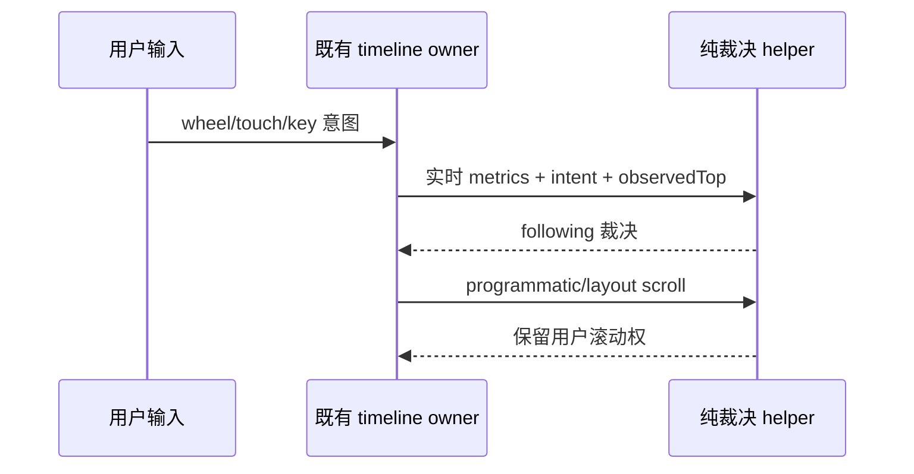

# UI 四个继承 helper 的有界独立实现

父任务明确交回以下四文件，按 PR19 head
`1128e11a98a47d16ad19e9b3e60e65fc8b470cd7` 的
`third-party/source-verification-20261003/bounded-inherited-source-facts.json`
与 `inherited-implementation-next.md` 规划单元推进。记录将 main
`59517d9699519b0a7a44980da27df29d45f0e91e` 的这些完整字节绑定到固定上游
`872ad960de7ec172591f7e1952f7849229f94521`。作者已读现有实现及直接消费者，
本路是 source-exposed，不声明 clean-room 或 MIT 权利结论。保留 Git 历史、
LICENSE/NOTICE/第三方记录及普通依赖，不为接口、常量、短数学式追求差异。

本次只替换实质执行主体，不修改 JSX、CSS、资源、公共类型、存储格式、共享协议
或其他路范围。四 helper 均为纯投影；调用者保持现有状态权威，没有第二份缓存。

## Directive 文法与流式呈现

`packages/ui/src/lib/assistantDirectiveParser.ts` 保留当前导出和 index 坐标：

- directive 名精确匹配；通常两个冒号，单/三冒号与智能引号只在现有 opt-in 下
  放开，从连续冒号中间不得匹配。闭合扫描忽略引号内的大括号及转义引号。
- 参数名为 `[A-Za-z_][A-Za-z\d_-]*`，空白/逗号分隔，键与等号之间允许空白。
  单/双及 opt-in 成对智能引号可含空格；已知引号/反斜杠转义解开，未知转义原样
  保留（尤其 Windows 路径）。重复键最后值；坏参数返回 null 而闭合 raw 仍保留。
- 闭合 directive 消费整个 span，内部匹配不重复输出；未闭合者不消费后续候选。
- fenced code 仅接受行首 0–3 空格、至少三同类 marker；同类且不短于 opener 可
  关闭，未闭合 fence 到文末。HTML code/pre 与 inline backtick spans 合并相交范围。
  保留当前 inline 首个闭合 marker 落入 fence 就放弃 opener 的兼容行为。
- 流式隐藏只作用在未受保护的候选：未闭合且仍是有效参数前缀、开放引号或未完成
  键/等号；带标点的普通正文分叉保留。兼容旧尾部规则：最后一个 bare word 可被当作
  未完成键，即使其前已有无法解析的正文。名称前缀只看连续文末尾部，单冒号最小
  长度按原选项。

实现选择：一个 quoted span reader 处理 quote/escape 边界并供参数、闭合与尾部判断
复用；参数以 sticky 文法 token admission 解析。候选 cursor 在 accepted 闭合 span
后前进；代码范围分别收集 fence/HTML/inline，再一次合并。没有额外 parser 状态持久化。

## 工具 diff 输入与 patch

`packages/ui/src/lib/toolDiffPreview.ts` 保留字段别名、direct diff 优先于 content 数组
首个合法 diff 的适配；newText 必须是 string，oldText nullish 成空字符串，其余照常
String 化，空白 path 不带值。`extractBeforeAfter` 的非空 string 判定不变。

patch 保留 `diff --git` 边界、创建/删除侧 `/dev/null`、空串零行与尾换行拆分语义、
context floor/非负有限判定以及 `@pierre/diffs` 的 `trimPatchContext`。未改变的内容
也保持原返回行为。小区间最多 60,000 LCS cells，相同 score 先加入 after 行；大
区间按双方唯一行的递增锚点切段，没有锚点才全删后全加。公共 diff 格式不改。

实现选择：用显式区间 work stack 调度 gaps 与 equal lines，避免递归 slice 链；
小区间的 suffix scores 用扁平 typed matrix 保存，行输出统一由 admission cursor
执行。双方唯一位置索引加严格递增锚点重建维持相同顺序；标准 LCS/LIS 本身不是
来源差异证明。先确定前后 context window，再经原依赖规整 hunk。

## Timeline 滚动权与 prepend

`packages/ui/src/v4/timelineScrollAnchor.ts` 的 following 仍由既有 timeline owner
持有；纯 helper 只作裁决。只有 user scroll 事件可按当前 bottom 几何改 following；
programmatic/layout 原样保留。content commit 捕获 away 意图立即放弃，none 保留，
unknown/toward 先检查 bottom，再检查未观察的向上位移，最后保持原值。

保留 48px bottom、2px 位移、64px 到顶与两 viewport prefetch、原按键/触摸/滚轮
映射和禁编辑控件规则。稳定 key prepend 按保存 offset 与实时 scrollTop 算绝对
目标，换 key 或必要值非有限时 null；row prepend 仅首 id 减小且 total 增大时平移。

实现选择：scroll event 与 content commit 归一为“是否授予几何裁决权”的同一纯
policy，再由各入口提交事件事实。prepend 的身份/数值有效性与位移策略分开，
不新增用户意图 owner、监听器、超时、回写或测量缓存。

## Cron builder 与消息描述

`packages/ui/src/settings/automationFormat.ts` 保留所有导出、默认 builder 与 rawExpr，
标准频率和自定义单位的原五段表达式。分钟/小时/日期间隔超过 59/24/31 时使用合法
兼容候选，真实周期仍由既有 scheduleRule 持有。周排序、空集合默认、每月日期/首
weekday、年度 month clamp 与 day fallback 均保持；不增加严格校验破坏旧 cron。

反解析按既有模式优先级处理：minute step、hour step、day step、hourly、daily、
weekdays、weekly、yearly、monthly。weekly 保留 Number 转换后 0–6 整数筛选，
step 的零值兼容和未知/坏表达式默认 custom 原样保存。卡片对固定 month/day 和
month step 保守描述为 custom；未知 custom 的 roundtrip 不相等也描述为 custom，
已识别标准频率保留原宽容呈现。visual editor 按原精确 normalized roundtrip 判定。

实现选择：用五段字段投影装配 cron、有序 grammar decoders 反解析、单一消息
descriptor projection 决定 id/values。Intl id、中文 separator、Date/pad2、GMT、
relative/30 天阈值和 duration 等普通短辅助保留，不变 UI 与日期语义。

## 定向接受与范围

先补合同样例，覆盖 quote/Windows escape/坏输入/流式范围、实际 diff parser 与
大区间、多种滚动意图/阈值/prepend、全部 cron modes/原始回退/消息参数。
执行仅本批 suite、文件 lint/格式与 changed 架构；不重跑 8k 全套或全量来源审计。
若 UI reference typecheck 仍缺 dist 产物，记录阻塞，不添加忽略或伪造声明。

新字节记录在本路 `docs/lane-ui-20261003.md` 和独立 evidence 下；全局清单/许可证
结论由整合者更新。GUI/安装包的既有阻塞已经交接，独立 helper 检查不替代它们。
