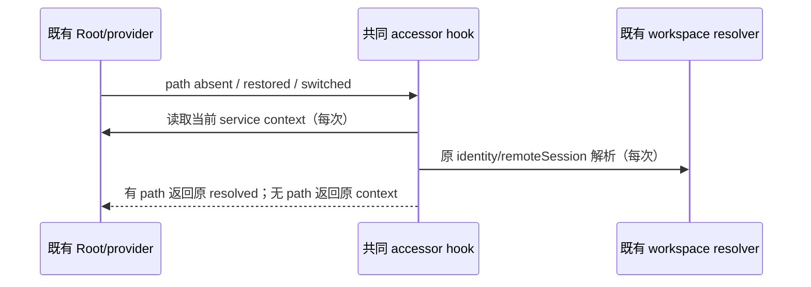

# Workspace service hooks 的固定 React 顺序

实际 Web 冷启动观察到 onboarding error boundary 捕获 hook 顺序变化与
`areHookInputsEqual` TypeError。`Root` 先传空 workspace，恢复 tab 后再传路径；
`OnboardingDialog → useSettingsSync → useSessionService` 与
`useClaudeSessionMigration → useTaskService` 按路径真假调用两套不同 hooks。
`useAgentService` 有同样结构。错误来自条件调用，不是工作区草稿持久化错误。

本次只修复这些 UI service accessor hooks，保持全部返回与数据路由语义：有路径时
使用原 workspace/identity/remoteSession resolver；无路径（包括空字符串）时返回
当前 `ServiceProvider` 的 accessor，不能默默改成 registered base host。
task proxy 仍由原 WeakMap/缓存 owner 管理，不修改 snapshot key、存储、RPC 或时序。

在既有 `useWorkspaceServices.tsx` 增加一个共同 hook 入口，始终按固定顺序读取
context 与原 workspace resolver，读完后才选择 accessor。三 hook 调用该入口，
不复制 resolver、持久状态或代理，不注册 provider 或开启额外网络请求。官方 Root
原有 ServiceProvider/TabStoreProvider 边界保持不变。没有新的公共服务协议。

接受场景用同一隔离真实 HTTP Host、源码 Web 和 Chromium，带既有合成 workspace
记录冷启动、alpha/beta 切换、renderer reload，监测 console 与 caught boundary；
onboarding hook 错误须消失。既有 Controller/Agent/cleanup 阻塞分别记录，不以它们
屏蔽本次断言。执行改动文件 lint/格式与 changed 架构；不重复缺 dist 的全 UI
reference typecheck、全量 suite/构建或 Windows 等未具备能力的验收。
