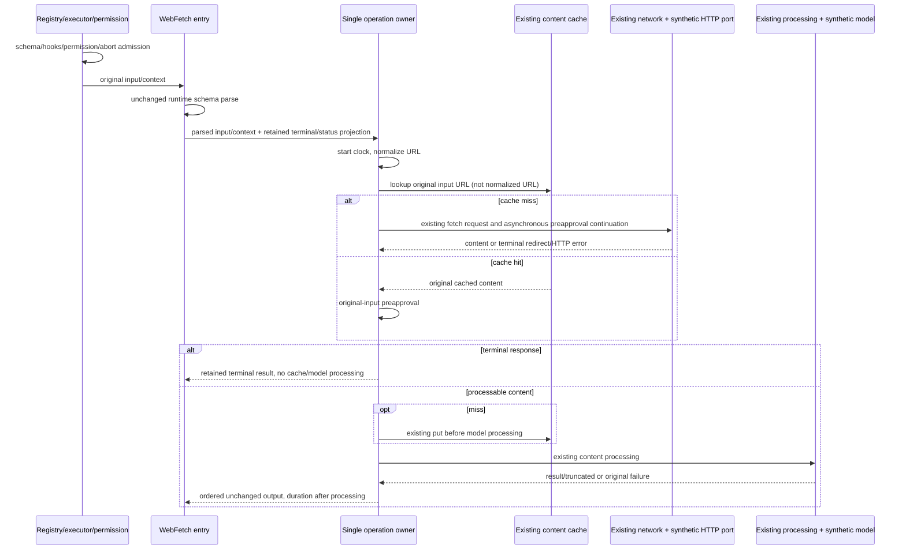

# WebFetch cache/content/result orchestration compatibility

Baseline `613c250629764cad1eca8e61a4d8df5f91d0e627`, fixed branch
`parallel/cli-tools-fast-20261001`. Scope: `webfetch.ts` orchestration, one narrowly
named private helper and synthetic freeze/consumer tests. All earlier commits,
lower network/egress/URL/cache/content/processing/trace owners, public contracts,
permission and preapproval policy stay unchanged. No security repair or policy
redesign is authorized by this slice.

## Lineage and protected coverage

Baseline handler: 8311 bytes, Git blob
`e0cfc98c4d18d9eb8ed5d1d3638979cd9aaebd0f`, SHA256
`b92f6bdc5aadcd332976eb301de728a32149aeab13c89a0b77bec7481d936866`.
Local history is snapshot `7619e41b950bd52073ebf36754146cf25659d9fa` only. Existing
publisher manifest facts: ZCode `872ad960de7ec172591f7e1952f7849229f94521`, path
`apps/zcode-cli/packages/core/src/tool/handlers/webfetch.ts`, blob
`e0a52aa30d836164f34f6f117d581cdf196cdb2e`, normalized SHA256
`fe1ec1299440e2b7b65f862ec5707e523b5c7817483c4632d0c2f87bfaa7bdf6`.
These are manifest facts, not a fresh local exact publisher-byte verification.
Source exposure and existing attribution remain; no clean-room or whole-file MIT
claim. Older lane licensing inputs remain at 27; root's reported material count
26 is separate and not imported.

The local review register has accepted permission-rule WebFetch consumer tests and
bounded permission matching work. That does not classify the handler or all lower
helpers as independently replaced. Protect every lower helper and its existing
tests; do not reimplement accepted security/network/media or model processing.
Root owns the Windows long-argv test-launcher repair; this lane preserves runner,
concurrency two, 120000ms per-test timeout and every existing test file.

## Owner and implementation decision

`webfetch-cache.ts` remains the sole URL-content cache and TTL/LRU/byte owner.
`webfetch-network.ts` remains the only HTTP/redirect/egress/status/artifact owner.
`webfetch-processing.ts` owns markdown bypass, model request/prompt/truncation and
processing errors. The executor and permission subsystem own approval and abort.

One private operation owner composes existing cache selection, fresh retrieval and
result completion. Fresh retrieval retains its asynchronous continuation before
preapproval; cached processing retains its synchronous admission (no new cache-hit
await). Ordered fresh-request encoding and lazy normal-result field projection
replace inherited literals while keeping exact own fields/getter/time ordering.
Terminal redirect/HTTP prose and formatting remain in the entrypoint as callbacks;
there is no second cache, derived mutable state, retry or network path.
The entrypoint binds the operation factory directly as its handler, so schema
parsing stays inside the one asynchronous owner and rejects as before. Do not add
an asynchronous forwarding wrapper or its extra promise-adoption ticks. The old
fresh await continuation can be expressed by one lower promise continuation, with
frozen hit/fresh interleaving as acceptance proof.

## Frozen invariants

- Schema parse precedes all clock/cache/context reads. Start time precedes URL
  normalization, which precedes cache lookup. Cache key is exact parsed original
  URL, including HTTP spelling, case, fragment and path; normalize even on a hit.
  Existing 15-minute expiry, 50MiB cache bound and hit recency belong only to cache.
- Fresh fetch retains request own-key order `context`, `originalUrl`, `url` and
  original URL versus normalized URL distinction. Existing bound HTTP method reads,
  events, clocks, trace, signals, redirects and artifact writes remain lower-owned.
  Preapproval uses original input after successful fresh completion or on a hit.
  Preserve additional fresh continuation/microtask behavior and no hit await.
- Terminal test remains property presence (`type in fetched`), including malformed
  cached objects. Terminal results bypass cache put/model and retain exact prose,
  bytes/status fallback/duration/URL/redirect/output fields. No repair of malformed
  terminal results. Preserve their existing branch behavior.
- Nonterminal fresh content is cached before model processing, including failures,
  and later cache hits still perform prompt processing. Missing models, throwing
  getters, native errors and non-Error rejection retain existing capture boundary.
  Preapproved short markdown bypasses model exactly as lower processing defines.
- Normal output preserves own keys/order, undefined artifact fields, status/statusText
  repeated reads, redirects/reference identity, duration clamp, model result and
  truncation. Duration is read after processing; terminal duration after terminal
  classification. Public declarations/metadata/prompts/prose/formatters unchanged.
- URL upgrade, credentials/protocol/local/private/redirect restrictions, literal
  egress and proxy/network failures remain unchanged. No DNS/HTTP in fixtures.
  Approval precedes network effects via real executor. Preapproval stays below
  deny/ask/plan rules; permission metadata is preserved. Cache never bypasses executor
  permission, though direct cached handler keeps its existing no-port behavior.
  Preserve existing mode precedence too: yolo allows before project rules, while
  auto denies through its unimplemented-mode rule. A pre-freeze generic deny
  assertion failed on unchanged source and was corrected to assert these facts;
  this is not a product/security repair.
- Request/response/body/model/artifact byte limits, redirect count, 60000ms deadline,
  result budget and cancellation prose remain. No added direct abort gate/rollback;
  malformed ports ignoring cancellation keep old late-cache/processing behavior.
  Executor cancellation prevents late success; port/runtime owns cleanup.

## Synthetic freeze and final validation

Write spec and freeze unchanged source/strict actual emitted contracts before
production replacement. Test-only `KNORVIA_WEBFETCH_ORCHESTRATION_TEST_EMITTED=1`
selects actual dist handlers/registry/executor/permission/lower helpers. Read each
selected emitted JS before import; missing file fails, no tsx source fallback.
Capture requires an explicit destination; final tests use committed observations.

Use owned synthetic HTTP, model, artifact, event/approval and cache-clock fixtures.
URLs and content are synthetic protocol values; even allowlisted host spellings
never reach any live network. Test setup installs fail-closed global fetch/DNS
fixtures; all authorized effects use synthetic ports. Deterministic fake clocks
and UUIDs replace incidental IDs; generated executor spans are normalized after
presence/propagation checks, and incidental source/dist error stacks are omitted.
Explicit receiver/signal/getter/own-field identity
assertions complement JSON observations. No OS/process/security setting changes.

Cover fresh/cache/expiry/key spelling, redirect/HTTP failures, malformed/thrown/
rejected/getter/delayed ports, cancellation, cache-before-model-failure, result
projection, real registration/executor and permission consumers. Preserve ordinary
and error contracts; fix only separately proved in-scope defects, otherwise no
product repair. Run final source/strict emitted, existing WebFetch regressions,
CLI builds/types, root types/configured/owned lint, full format/architecture and
full suite. Bind exact source/emitted/protected hashes and factual native gaps in
lane evidence, with conservative retained-expression/advisory review status only.
