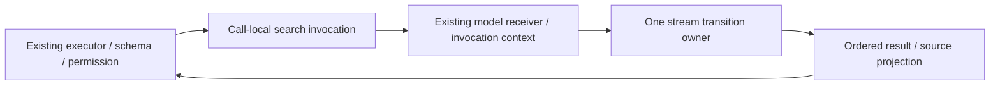

# WebSearch request, stream and projection boundary

## Scope and source exposure

Start at immutable lane checkpoint `8813066819ba9b8862d589da9b7b86f0ca4497f0`.
Own only websearch.ts, websearch-results.ts, websearch-support.ts, narrowly named
private helpers/tests, this spec and a new WebSearch handoff. Prior production and
evidence commits stay immutable. Root owns integration and shared provenance.

All three existing files were inspected, follow inherited snapshot `7619e41`
and formatting `88001f0`, and are byte-identical to the assigned integrated base
`0d80f9c`. Existing audit classification is upstream-modified, unreviewed. Their
raw/LF-normalized SHA-256 values are respectively
`1be7272a721e2fb00d83f3ff26810da8ac0e1e3a22d0ab292063e285c93b93d7`,
`89014d5271492733f69f432283826e038914c643952f9b599afd9df581112750`,
`8d7b428e3048f2f85ab7b623991bc8610880c4c7aa6b4270f04eef2e64a2b7d4`.
Pinned upstream blobs are `a76996ec5103b6d0941c07fecdb15164831676d4`,
`90a6073c90a43aa90525d29a1b1886bbb9aa874e`, and
`0711244eb459c6b33779e32a096085396d87a09d`. These are manifest facts, not a new
publisher-byte check. This lane has source exposure, no separated clean-room
roles and makes no whole-file originality or final MIT claim. Preserve inherited
prompts, public declarations, attribution, LICENSE/NOTICE and all 27 obligations.

## Frozen admission, request and stream behavior

Direct handler reads Date.now before context.model. Missing/falsy model fails
configuration_error, unrecoverable; unsupported native search fails the same type,
recoverable. Both carry call ID/tool name. Direct handler does not parse input or
preemptively abort; the executor owns schema/permission/hooks/cancellation/timeouts.
Capability and schema failures must never enter the synthetic model.

Admitted request uses the existing system/query prompts and precisely one internal
provider-native web_search contract. Its fallback stays disabled, maxUses default
and ceiling stay eight, and allowed/blocked domains retain existing contract
parameter names and optional own keys. Keep automatic tool choice by omitting a
forced choice. Auxiliary reasoning uses the first configured level and max tokens
are min(4096, configured maximum); preserve observable option/property reads.
Forward the exact abort signal and invoke streamText once with the model receiver.

Invocation metadata, trace fields/attributes, session type other and operation
web_search remain exact. The existing invocation context scopes both initial call
and iterator methods. Executor/runtime wrappers retain admission/retry/status-sink
ownership; the handler must not add or replace these. Metadata description is a
getter: each access reflects local calendar month/year, including rollover.

Stream transitions concatenate text deltas in arrival order, append tool calls,
replace finish reason/usage/provider metadata on every finish (last finish wins),
and ignore other event kinds. Continued text after finish remains accepted. No
finish gives empty usage/unknown reason. A non-Error error event becomes the exact
recoverable ModelError; Error objects preserve identity. Iterator/start throws
propagate, and early failure invokes iterator cleanup through the existing wrapper.
Malformed events retain existing property-read/type-error ordering. Partial text
without finish is returned; partial text followed by error is rejected. The stream
does not promote tool results/sources into output: only summary Markdown carries
links in this path. Do not silently repair this inherited behavior.

Raw non-iterable model returns retain native TypeError messages, including the
`input.events is not async iterable` expression. Synchronous iterables are accepted
by the inherited for-await protocol; returned promises are not implicitly awaited.
Unknown event tags are read once, never coerced, and cannot dispatch inherited
Object properties. Additional protocol fixtures freeze both unchanged source and
emitted baseline observations before correcting the replacement's native message.

## Frozen projection and presentation

The public buildWebSearchOutput accepts ModelTextResult directly. Results traverse
tool outputs, nested arrays, content before sources; accepted leaf types are
missing/empty, web_search_result and url. A valid result leaf suppresses descendants.
Source traversal accepts any nonempty URL regardless of type and also suppresses
descendants. Preserve sparse/inherited slots, traversal/read order and malformed
response failures. URL dedupe is case-insensitive, first occurrence wins, while
output spelling/title/pageAge and ordering stay unchanged.

Source precedence is model sources, deduped results, tool-output sources, then
summary Markdown. Accept only model sourceType url/string URL; summary links keep
the existing HTTP(S) pattern, title trimming and image exclusion. Never fetch URLs.
Summary is trimmed or undefined. Usage presence keeps all eight existing token/
server-tool checks, exact reference and short-circuit order. Duration is a final
Date.now minus admission time. Preserve all seven own output keys, undefined values,
webSearchRequests and direct versus executor output-validation differences.

Formatter validates with the unchanged schema; invalid data falls back through
JSON.stringify/modelMessageContentToText with its existing failures. Valid output
preserves exact headings/reminder, first-win links, sources before result-derived
links, twenty-link cap, title fallback, summary truthiness and trailing trim.

## One owner and explicit effects

One call-local search invocation owns admission/request effect and stream state.
Replace the monolithic request/switch path with a request intent and explicit event
transition dispatch, keeping one stream iteration and one final projection.
Replace duplicated result/source traversal with a shared ordered traversal policy
and first-win projection; retained functional subexpressions and prose remain
explicitly disclosed. Helpers never import the compatibility entrypoint. No second
stream collector, result cache, retry, provider selection, network adapter or quota.

## Acceptance and synthetic boundary

Before production edits, freeze entry/registry descriptions and schemas, requests,
trace/receiver/iterator observations, malformed/reordered/error/partial streams,
raw projection and rendered outputs from both source and actual dist consumers.
Commit spec/tests/captured observations before replacing entrypoints. All fixture
models, provider responses, clocks, permissions and status events are in memory;
no real model/search/network/billing/account/user-data interaction.

The test-only `KNORVIA_WEBSEARCH_TEST_EMITTED` selector uses rebuilt dist only
when its value is exactly `1`; unset or any other value selects source. It has no
production configuration priority or effect on provider/permission policy.
Missing dist fails through the normal module loader instead of falling back.
The seeded differential script requires an explicit external immutable reference
directory argument; a missing argument fails before comparisons. Reference
bodies remain outside tracked production, and only import routing/module format
is adapted to share the existing contracts/invocation storage.

Test actual handler registry, executor, permission capability/service, model
invocation wrappers and provider-native contract transformation with synthetic
requests. Include admission failure ordering, schema versus handler boundaries,
month rollover, output validation, cancellation/deadline, iterator cleanup,
interleaving, getters/holes/duplicates and metadata identity. Freeze baseline
failures instead of relaxing expectations. Final source/emitted contracts and
seeded differential probes must pass on corrected source, followed by CLI builds,
root/CLI/core types, configured and owned lint/format, architecture and full offline
regression with existing timeout/skip conditions. Report native/live gaps.
