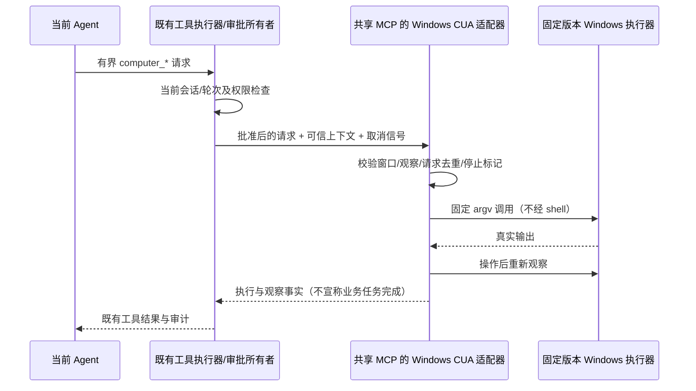

# Windows Computer Use（2026-09-27）

> 最新方向（2026-09-27）：用户选择参考开源 Hermes 的实际 Computer Use 能力，取消独立桌面及不抢鼠标的硬限制。采用 Hermes 使用的 Cua 驱动架构，复用 Knorvia 现有聊天模型；不安装虚拟机，不引入另一套 Agent。前台动作可能移动系统鼠标、改变焦点。此前 C# 原型不作为产品执行器。

本规格承接 T12 受限契约，将 Windows 本地桌面的占位能力接成可用工具。macOS、Linux、远程工作区与外部 CLI 的电脑控制不在本轮交付范围。保留 Claude 已修改的图标、动画、样式及导航。

## 实施边界

- 复用既有 Computer Use 插件启停、内置 `node_repl` MCP 宿主与工具审批。Windows 提供独立、严格参数的 `computer_*` 工具；不把对任意 JavaScript 的许可解释成桌面操作许可。
- 以截图视觉操作闭环为主要能力，沿用 Hermes 的 Cua stdio MCP 后端架构。固定 Cua `cua-driver-rs-v0.30.1`（Hermes 所核查提交锁定的是 0.21.0，不能宣称逐字复用同一版本）。构建时校验官方 ZIP SHA-256，随包保留 MIT 与第三方声明；不携带可选 perception 模型。运行时不下载、不安装、不自动升级、不额外调用模型服务。
- 构建允许 `KNORVIA_CUA_DRIVER_ARCHIVE` 指定已下载的官方归档，但不跳过摘要校验。Turbo 显式透传该变量；原生插件构建不使用跨平台缓存，宿主缓存输入包含仓库级 CUA 源码，避免适配器改动后复用旧宿主。
- 插件随包分发、默认关闭；用户在现有插件/电脑控制设置中启用。启用只注册能力，首次调用才启动自有 `cua-driver.exe mcp --direct` stdio 子进程，关闭遥测与更新检查。不使用全局 daemon、用户已有服务或安装脚本。
- 能力包含窗口枚举、选择目标窗口并请求当轮控制、截图观察、窗口内视觉坐标点击/双击/右击、拖动、文本输入、按键、滚动与停止。每次动作返回新的截图供现有多模态 Agent 验证并继续。UIA 仅作辅助，不作为视觉操作的必需前提。模型需要支持图像输入；不假称任何文本模型都可视觉操作。
- 不暴露任意命令、脚本、文件路径或无观察绑定的屏幕坐标入口；不修改系统权限、不控制 UAC、安全桌面或其他用户会话。

## 所有者与顺序

任务、会话、轮次、批准决定仍归现有 Host/Core 所有。MCP 适配器只持有按 workspace/session/turn 隔离、有界且不持久化的观察和请求结果；轮次标识构成该轮 CUA 执行域，不创建新的业务 run。重启后旧观察与授权不可恢复。Driver 只执行单条被批准的动作，不保存业务状态。

## 权限、观察与失败规则

- 上下文只从 MCP 的 Host request-context 读取；模型参数不能传 permission、approved、session、turn、可执行程序或工作目录。拒绝子代理、远程上下文和缺失身份。
- `computer_request_access` 通过既有审批流程明确批准当轮、指定窗口的观察与操作（`alwaysAsk`，不保存永久规则）。后续动作只消费这一窗口/会话/轮次的临时许可；模型无法传入 approved=true 自授权限。拒绝时不操作窗口；列窗不抢焦点。新窗口、取消/停止、重启或下一轮都需要新许可。
- 观察含不可猜测 ID、单调版本、窗口 HWND/PID、驱动实例代号、真实图片尺寸及期限。沿用 15 秒上限，过期需重新观察。审批通过后才捕获首帧，不把审批之前的画面当成当前状态。Cua 此版本不返回进程启动时间、用户输入 tick 或窗口 DPI；不得虚构这些字段。句柄/PID 极速复用仍依赖上游目标校验，不能宣称本层检测全部复用情况。
- 动作绑定驱动最近一次有效捕获的 capture ID、窗口身份及原始图像坐标。目标消失、错误窗口、过期捕获或越界均拒绝，不做模糊搜索或就近匹配。后台与前台输入按驱动实际支持执行，前台模式可能改变焦点；不能对所有 Windows 软件承诺后台无干扰。
- 截图只捕获被授权窗口，附最终图片宽高、物理窗口矩形、观察ID/版本。模型坐标明确相对于这张图片；执行端使用保存的缩放映射转成物理坐标，并校验图像范围与目标窗口。工具结果禁止内部二次缩图/截断破坏该映射。多显示器和非 100% DPI 要有转换单测与实机可执行的验收。
- Cua 0.30.1 Windows 实际不输出 schema 声明的 `screenshot_scale`。点击、拖动沿用驱动保存的捕获映射；像素滚动必须明确选择前台模式，先用同窗口原生尺寸的隐藏校验帧计算真实缩放，校验身份、矩形、PNG、期限与取消后才派发。后台像素滚动拒绝；控件 token 滚动保留原观察，不刷新 token。没有可信屏幕原点的独立 `move` 不暴露。
- 输入由固定版本驱动执行，使用其窗口/UIA/键鼠路径。不得暴露任意原始 MCP 调用、剪贴板读写、系统设置或自动升级工具；不暴露单独的持续按下状态。输入交付成功不等于业务任务完成，必须观察验证。
- 停止先封闭本轮后续动作，再取消在途进程；队列中尚未执行的动作也检查同一屏障。用户停止会话触发的 AbortSignal 具有相同效果。停止不声称撤销已经发生的动作。
- 停止屏障同步清理许可、观察和取消信号，仅等待该 scope 或 session 拥有的驱动退出；其他 scope 的排队调用不能延迟停止响应。整个 MCP 宿主关闭时才等待全部队列及自有驱动退出。
- 同一请求不可重复执行；下发后超时/取消/回执丢失按 `unknown` 记录并拒绝自动重放。真实拒绝、驱动不存在、窗口不可见/不可操作、UAC/管理员权限不足分别返回诊断，不提权、不静默改用其他工具。
- 同一宿主串行派发，每个 scope 独占惰性启动的直接 MCP 进程（最多 4 个），使用私有临时扩展目录，不继承本机 perception 扩展。不承诺多个宿主同时操作系统输入时互不干扰。缓存有数量/生命期上限，进程退出清空。输出有界，日志不打印窗口内容、输入文本、截图和密钥。停止不能依赖驱动忽略的 cancelled 通知：先封闭 scope，再关闭自己拥有的进程并等待退出。

插件的授权边界只约束这条电脑控制通道，不把具备完整 Shell/JavaScript 权限的运行环境宣称为操作系统沙箱。此次直接工具接入 Knorvia 内核的现有 MCP Host；其他 CLI 内核没有相同可信上下文时拒绝调用，不据此宣称全内核可用。

## 验收与交付

1. 离线单元覆盖 schema、身份/远端拒绝、过期/错窗口、重复请求、停止/取消/unknown、进程异常与输出上限。
2. 真实本机隔离测试窗口：枚举 → 观察 → 输入 → 点击 → 重新读取结果 → 窗口截图；同时核验不触碰用户已有应用与 data。只控制测试自己创建的窗口。
3. 验证工具审批拒绝时零动作、批准后才派发，插件启用/禁用和生产包资源齐全；模拟模型只验证接线，不记为真实模型实测。
4. Node 24 下运行根类型、lint、架构与相关测试；生产身份构建。验证 Claude 前端文件未被回退。
5. 桌面便携覆盖前确认目标程序未运行，排除 data，覆盖前后逐文件散列一致；不新增全量备份，不提交推送。

本规格是验收目标，不是成功声明。每项实际结果及平台限制写入交付文档。
