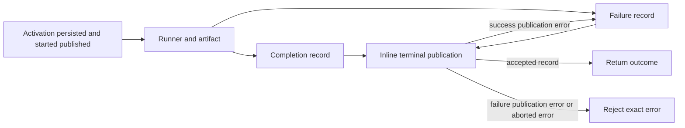

# Workflow node terminal publication

Bounded owner: `core/src/workflow/scheduler/node-runner.ts` terminal execution,
result projection and publication, with a private synchronous outcome projector.
Caller is `WorkflowGraphScheduler.run`; graph transforms, event log, planner,
permissions, runner policy and registry remain unchanged. The predecessor is exposed
and inventory-classified upstream-modified/unreviewed. Startup/child linkage and
fixed API/prose remain retained material; this slice makes no whole-file claim.

## Frozen contract

- `runWorkflowNode` immediately returns a native outcome promise with a separate
  native `started` promise. Activation persists before snapshot ownership changes;
  status journal and node_started event complete before started resolves. Startup
  rejection escapes and leaves started pending. No additional timeout or abort check.
- Runner request retains node, options/trace/session/event references, custom/default
  prompt, cwd, run/task and callback. Child linkage reads current snapshot, changes
  only an active matching activity, persists before setting, then publishes linkage.
- Success writes the artifact first using existing filename/directory rules. It
  reads the latest snapshot, completes node/activity, appends artifact metadata and
  preserves current graph/activity ownership. Timestamp and property evaluation
  order, optional field presence and public message bytes remain fixed.
- Terminal publication persists, sets the snapshot, appends status, then publishes
  artifact_written/node_completed for success or node_failed for failure. Every
  effect retains its receiver, supplied signal and await; no async projection helper.
- Runner/artifact/success-projection/success-publication errors enter the existing
  failure path unless the signal is aborted, when the exact error escapes. Attempts
  are based on the supplied node; maxAttempts determines pending versus failed.
  Failure reads current linked metadata and publishes its exact attempts/retry data.
  Failure-projection or failure-publication errors escape; never retry that path.
- Accepted completion has no new terminal abort check. Partial commits/events remain
  observable. No rollback, implicit stop, cache, new retry policy or second state owner.

## Design

One inline terminal publisher consumes either a completion or failure record. A
success-publication exception can select the failure record once; a failure-record
exception escapes. Synchronous projections build those records from invocation facts
and the current snapshot. The existing snapshotAccess remains the single persistent
owner. This replaces the duplicated publication decisions, rather than moving the
two old bodies into async helpers. Conventional fields/Map/array idioms are allowed.

Freeze compact representative direct-node and actual scheduler observations before
production changes. Use only bounded synthetic snapshots and owned runner/storage/
clock/event ports. Keep exact historical emitted/declaration bytes and assertions;
strict current selectors cover source, actual JS, declarations and the private helper.
Run affected source/emitted and direct consumers plus scoped types/lint/format only.
No broad build, product suite, exotic matrix, native acceptance or licence grant.
