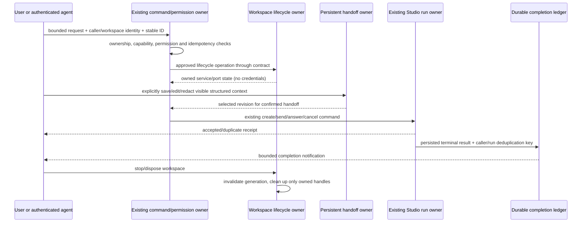

# Workspace runtime, durable handoff and agent orchestration integration

Date: 2026-10-07. This spec precedes integration implementation. It joins the three
authorized feature lanes into one stable desktop release and supplements their
individual specs; it does not assign their implementation files to this lane.

## Confirmed integration corrections

The aggregate production-composition test confirms that agent discovery cannot
depend on local `kernel-status` rows: the existing inspection owner returns local
statuses without persisting that kind. Agent discovery will call
`inspectStudioKernels`, use its verified local statuses and provider options,
and retain the existing command admission owner. It will check caller ownership
after each await, reject configuration changes during discovery, and recheck the
selected configuration after human approval and workspace preparation. These
checks add no accepted queue, status persistence or permission authority. Missing
or failed inspections remain explicit failures. Legacy caller inputs remain valid.
Tests must reach discovery without seeded local status rows, including an actual
Node composition/provider/MCP path and cancellation/configuration races.

The workspace adapter's selected environment must also follow process identity
inspection, group snapshots, verification and termination through normal stop
and recovery. Add optional `helperEnvironment` to existing process-tree options
and Windows taskkill requests. Unspecified options retain existing provider
semantics; workspace callers always supply the bounded environment. Existing
helper caches/flights may reuse work only within the same environment selection.
No environment is persisted or logged, and global `process.env` is not changed
by production code. Process birth proofs, deadlines, ownership and PID reuse
guards stay with their current owners. Actual POSIX helper sentinel tests and
Windows command/flight fixtures must cover the new path while existing default
cleanup tests stay unchanged.

The integration lane owns these corrections after feature PR review, as recorded
on PR42 and PR43. Root download/CI guidance will point to actual supported
Windows/Linux releases, retain unsigned status and describe the existing workflow;
this changes repository documentation without deploying the website.

## Scope and baseline

- Repository: `accomplish07zrh-eng/knorvia-studio`.
- Freshly fetched `origin/main`: `be610f46a7c34a500ec443cb6e335a531f12937b`.
- Root version: `0.8.8`; latest public stable release: `v0.8.8`, published
  2026-10-06, `draft=false`, `prerelease=false`.
- Existing release tag target: `89360e53105ce8c219d7533b08ae4f90813f4a75`.
  The subsequent main commit only aligns the repository website source links.
- Existing release: nine Windows/Linux x64 packages and 24 public assets,
  including per-package checksums, unified metadata, installation guidance and
  retained notices. These supported formats remain required.
- Initial checkout was clean. Workspace freshness reported ahead 0 / behind 0
  after fetching main. The initial `work` branch had no upstream tracking ref.
- Pinned tools are Node `24.14.0` and pnpm `10.33.2`, from `mise.toml`.
  The initial environment supplied different versions and no dependencies;
  verification must use the pinned tools and a frozen install.

The user authorizes implementation, checked merges and stable publication. No
mobile changes, website deployment, macOS build matrix, signing configuration,
new accounts or paid services are included. Existing UI, functionality, data,
Apache-2.0 identity and applicable third-party notices remain intact. No Paseo
implementation is copied. Signing remains inactive and artifacts remain unsigned.

## Lane ownership and interfaces

| Lane                | Authoritative state                                                                                           | Public boundary                                                                          | Integration responsibility                                                                         |
| ------------------- | ------------------------------------------------------------------------------------------------------------- | ---------------------------------------------------------------------------------------- | -------------------------------------------------------------------------------------------------- |
| Workspace runtime   | Workspace-scoped configuration, approved setup, owned services/process handles and preview/port lifecycle     | Its declared service/contract; workspace identity is separate from execution cwd         | Verify lifecycle isolation, credential filtering and owned-process cleanup                         |
| Durable handoff     | Persisted structured goal, constraints, decisions, files, failed attempts and progress                        | Its declared persistent contract and existing native V4 / external Studio handoff routes | Verify restart, editing/redaction, compatibility and single admission                              |
| Agent orchestration | Existing Studio runtime command admission and run/interaction ownership; persisted completion delivery ledger | Agent tool adapter through public Studio contract and caller/capability guards           | Verify authorization, bounded recursion/retries and durable deduplication                          |
| Integration/release | Integrated source revision, check evidence, release metadata and publication decision                         | Existing quality/release workflows and immutable release scripts                         | Review all lanes, add cross-feature tests, resolve confirmed integration faults, merge and publish |

Existing contracts are evidence, not permission to create alternate owners:

- `packages/services/src/studio-runtime/contract.ts`: `command`, `overview`,
  `timeline`, kernel inspection/options and workspace methods.
- Studio commands already express `create-conversation`, `send`, `answer`,
  `cancel`, `steer` and `resume`. New tools reuse admission and permissions;
  their receipt acknowledges acceptance rather than completion.
- `packages/services/src/studio-runtime/CONTRACT.md`: Host-owned accepted
  commands, transactional command IDs, fenced execution and uncertain recovery.
- `packages/services/src/session/contract.ts`: existing native session boundary;
  native Knorvia chat keeps its V4 owner.
- `specs/knorvia-session-handoff-export.md`: user-visible editable content only,
  stable external command IDs / native create-session envelope and late-result
  UI guards. The new structured handoff must preserve these guarantees.

Before implementation crosses a lane boundary, record the actual method/type,
owning module, caller context, revision/idempotency semantics and capability
failure behavior in the relevant contract. Do not share raw process handles,
provider credentials or private adapter internals across contracts. This lane
will review PRs and make minimal necessary fixes after the feature work exists.
Feature PRs and this integration PR remain drafts until their checks pass.

Shared-file coordination must occur through the parent before concurrent edits:

- The managed Studio runtime `contract.ts` currently exposes 11 methods; the
  repository limit is 12 methods per contract file and 300 contract lines.
  Multiple new services cannot simply append independent methods to this
  contract. Retain module/public-boundary policy and agree a focused contract
  arrangement before implementing shared changes; do not raise the limit.
- `StudioConversation` and `create-conversation` currently contain a workspace
  path without a separate identity field. The three lanes must agree how caller
  context, handoff source and workspace service binding carry the canonical
  identity, preserving existing local inputs and avoiding path-only authority.
- Public service exports/composition, Host/channel registration, protocol types,
  shared handoff UI and localization dictionaries are likely overlap points.
  The parent assigns one writer for overlapping edits; integration reconciles
  the final implementation after reviewing each lane's independent contribution.
- Version, changelog, final `licensing/current-files.json` reconciliation and
  release workflow edits belong to the integration lane. Feature PR inventories
  may be regenerated for their own CI, but their final generated diffs must be
  reconciled once against the complete integrated tree.

## Cross-feature invariants

1. Identity keys use `workspaceIdentity?.trim() || workspacePath`; paths remain
   filesystem cwd/display values. Equal paths with distinct workspace identities
   cannot share setup state, service ownership, handoff context or caller rights.
   Legacy local inputs keep path fallback. Existing remote identity constructors
   and owner/lease checks are retained, without changing mobile behavior.
2. One accepted command path remains authoritative. UI drafts, agent tool calls,
   notification projections and workspace status do not create another accepted
   task queue or silently replay commands with fresh IDs.
3. Setup and service execution preserve existing approval rules. New agent tools
   cannot widen permission ceilings, approve unrelated questions, substitute a
   different caller identity or autoexecute commands blocked by the owner.
4. Workspace execution receives a deliberately selected environment. Ambient
   credentials and captured credential metadata cannot leak into subprocesses,
   preview URLs, structured handoff, tool responses, logs or completion notices.
5. Cleanup acts only on live handles/process groups created and owned by the
   workspace lifecycle. It must not kill unrelated listeners by port or stale,
   reused PIDs. Late start/exit/readiness events cannot resurrect disposed state.
6. Handoff persists bounded, editable, redacted user-visible facts. No hidden
   reasoning, raw private prompts, credential values or tool dumps are stored.
   User edits are the submitted content; a draft alone cannot create/run a target.
7. Agent calls carry authenticated caller ownership and provider capability
   checks before side effects. Unsupported operations fail explicitly. Recursive
   orchestration, retries and payload sizes are bounded by declared policy.
8. Run state stays with its existing owner. Terminal completion produces a
   durable deduplicated notice keyed to its actual caller/run. Restart, duplicate
   events and receipt loss cannot publish duplicate effects or success before a
   terminal result. Cancellation/permission failures retain their real status.
9. Persistence changes are additive or explicitly migrated with continuity
   coverage. Missing new fields in older records retain valid old behavior;
   migrations preserve existing IDs, messages, configuration and user data.

## Required acceptance evidence

These are planned integration cases, not claims of executed coverage. Once each
lane supplies its PR/spec/tests, bind each case to real public symbols and tests.
Use local fake providers/process fixtures, not logged-in models or paid calls.

| Case                       | Setup/action                                                                  | Required assertions                                                                           |
| -------------------------- | ----------------------------------------------------------------------------- | --------------------------------------------------------------------------------------------- |
| Workspace separation       | Same cwd, distinct identities, separate service requests                      | State, ports and cleanup belong to the correct identity; legacy path fallback works           |
| Lifecycle and approval     | Denied setup; approved service; repeated start; late exit; dispose            | Denial has no launch; no duplicate launch; stale events ignored; only owned processes stopped |
| Credential projection      | Inject sentinel ambient secret, captured metadata and a deliberate safe value | Only approved values reach owned child; no secret in status, preview, handoff or notification |
| Handoff continuity         | Save all structured fields, restart, edit/redact and confirm                  | Facts and revision survive; confirmed edit is sent once; hidden/secret content excluded       |
| Native/external handoff    | Old record and new structured record, fake native/external target             | Existing owner route and IDs retained; cancellation/failed ACK does not navigate or duplicate |
| Agent authority            | Owned/unowned target, unsupported provider and pending permission             | Existing command succeeds only for authorized capable caller; approval policy is unchanged    |
| Bounded orchestration      | Nested calls, repeated transient failure, cancellation                        | Declared depth/retry limits stop execution; cancel reaches actual run; no unsafe retry        |
| Completion recovery        | Terminal event twice, lost response, restart before/after delivery            | Durable caller/run delivery semantics prevent duplicate accepted effects/notices              |
| Three-feature path         | Approved workspace + saved handoff + authorized agent create/message/status   | Correct workspace/revision/caller propagate; terminal notice matches real run result          |
| Upgrade/profile continuity | Existing SQLite/session fixtures and installed/portable profiles              | Old IDs/history/config preserved; installed and portable data directories remain correct      |

Existing regression candidates verified in this checkout include
`studio-upgrade-protection.test.ts`, `studio-runtime-continuity.test.ts`,
`studio-runtime-sequencing.test.ts`, `studio-remote-agent-identity.test.ts`,
`studio-workspace-recovery.test.ts` under `packages/services/test`,
`studio-session-handoff.test.ts`, `studio-native-handoff-transport.test.ts`,
`native-session-handoff.test.ts` under `packages/ui/test`, and
`packages/desktop/test/portable-upgrade-preserves-data.test.ts`. They establish
baseline behavior; new integration coverage must exercise the new interfaces.
UI interaction changes require the actual available E2E path and evidence; a
pure helper assertion does not establish interactive GUI acceptance.

## Integration and stable release gates

The integration fixture must enter through the real Node composition and existing
external handoff commands, without seeding local `kernel-status` rows. A local
synthetic Codex executable receives the actual thread MCP configuration and uses
the real stdio transport to list kernels, dispatch a child, read its durable
completion/result/artifact references and ACK the event. Only provider responses
are synthetic; discovery, admission, SQLite, snapshot placement and subprocess
transport remain the production owners. This catches disconnected discovery
paths that adapter-only fixtures can conceal.

The same scenario reloads version-1 composer data and the saved structured goal,
submits a redacted partial-history handoff, checks the child wrote only its
isolated workspace, and explicitly approves setup and a loopback service after
the parent and child finish. Real readiness and owned cleanup are required.
Synthetic environment sentinels must be absent in both setup and service
children and their saved reports; captured credential metadata never becomes a
handoff or completion payload. The same selected environment must also reach
process-inspection and termination helpers used for proof, stop and recovery;
global environment mutation is prohibited. A SQLite reopen must preserve the ACK and exactly
one timeline notification without dispatching another provider turn. No real
model, account login or human installed-GUI acceptance is implied by this test.

1. Record fresh main and every feature PR head; review specs/contracts, changed
   files, tests, migrations and provenance. No partial three-feature release.
2. Integrate all three checked lanes on an isolated branch. Recheck upstream
   before integration, readiness, merge and release. Concurrent changes require
   reconciliation and checks on the resulting source; no forced main push.
3. Run pinned-tool frozen install, relevant targeted/integration tests, root
   `pnpm fmt:check`, provenance regeneration plus `pnpm provenance:check`,
   `pnpm lint`, `pnpm typecheck`, full `pnpm architecture:check`,
   `pnpm build:cli-packages`, `pnpm test:studio`, and required icon/evidence gates.
   Baseline failures are recorded honestly; they do not waive final gates.
4. Keep PR CI successful on Linux and Windows and record each job's actual
   checked SHA. GitHub pull-request checks may inspect a synthetic merge commit;
   use branch workflow dispatch or main push to establish the final exact-head
   checks, then bind release quality to that full source SHA. Update provenance
   only after reviewing current changes; never refresh the architecture baseline
   to hide violations or alter frozen source evidence.
5. Select an unused stable semver immediately before versioning. `0.9.0` is the
   provisional compatible feature release, subject to current tags/releases.
   Write user-visible changelog/release notes and truthful upgrade limitations.
   Root version is authoritative; do not blindly change independent CLI versions
   or historical evidence. Repository download references may be updated after
   publication, but the live website deployment remains stopped.
6. Merge only checked heads through PRs. Run exact final-main CI and dispatch the
   existing `release-windows.yml` with the full integrated source SHA,
   `diagnostic_variant=all`, no diagnostic reuse and publication enabled.
   Both OS quality jobs, all four package jobs, immutable validation and publish
   must reach successful terminal states. Diagnose failures with bounded retries;
   missing, cancelled or skipped required stages are not passes.
7. Verify public tag peeled target equals delivered SHA; release is stable,
   `draft=false`, `prerelease=false`; nine expected package names and all 24
   expected assets are present. Compare public byte/hash evidence with accepted
   metadata and `SHA256SUMS`, and verify source/release links. Never overwrite an
   existing tag, release or asset. Preserve legal attachments and installation
   guidance; do not create signing credentials or silently claim signing.
8. Report actual command exits, PR/commit/release links and bounded package
   evidence. Installed human GUI, paid model behavior, signing and complete
   legacy-user migration acceptance are unverified unless explicitly performed.
   Login, security permissions, new agreements or credentials stop their
   dependent step and are reported without exposing secrets.

## Release-note source contract (before implementation)

The existing publication script emits package/acceptance guidance but does not
include version-specific product changes. The integration lane owns the root
changelog and a pure release-note renderer under `scripts/`; it does not edit
feature implementation files for this preparation.

- Read optional root `CHANGELOG.md` before any release creation/upload. Only
  `ENOENT` permits the existing generic notes for legacy checkouts without a
  changelog; other read failures propagate. The new stable integration must
  supply a populated changelog section for its exact root version.
- When a changelog exists, select one exact first- or second-level version heading,
  supporting plain, `v`-prefixed and conventional bracket/link/date forms.
  Preserve that section's authored Markdown and exclude other versions or
  unreleased sections. Fenced code examples do not form version boundaries.
- Missing, duplicated or visibly empty matching sections fail before remote
  publication. Never silently publish a different version's feature notes.
- Render a source link to the validated full delivered SHA in the actual GitHub
  repository, followed by the existing platform, checksum, upgrade/data,
  licensing, signing-status and acceptance limitations. Keep the existing
  release-channel owner and immutable-release decision path unchanged.
- Targeted offline tests cover version selection, malformed/missing/duplicate
  content, fences, source links, legacy omission and prerelease labels. Register
  these release tests in the existing `test:studio` explicit script list. Full
  final integration CI must execute them along with feature regressions.
  An isolated publisher fixture uses real asset hashes and file reads with
  mocked Git/GitHub commands to verify the selected notes reach the existing
  create command and invalid content/read errors cannot reach create/upload.

This is source-driven formatting, not a new release-state owner or alternate
publication path. The renderer performs no IO; the existing publisher owns the
file read and remote effects.

## Current coordination status

Initial remote inspection found no open feature PRs. The parent supplied the
three persistent lane IDs:

- Workspace runtime: `01a114d8-59c6-7735-9d3c-e6ca1009b00f`.
- Structured handoff: `01a114d8-e04e-71b7-8140-6d81b5b65028`.
- Agent orchestration/notifications: `01a114d9-8ba5-76ea-9e1c-9186dc652024`.

The parent coordinates their interfaces and supplies feature PRs. No
feature-owned source files were edited during initial baseline preparation.
After reviewing and combining PR42/43/44, the integration lane owns the confirmed
corrections above. Baseline checks and subsequent integration/release evidence
are recorded in the companion integration report.

## Isolated Windows diagnosis

The candidate a3bfe071 passes its complete local suite and Linux CI, while both
exact-head Windows runs fail at offline regression. Normal job-log downloads
return HTTP 403, which must not be bypassed. An isolated diagnostic branch may
run only the new workspace and combined integration tests on the existing
Windows runner and emit their failed TAP assertions as normal check annotations.
It checks out the immutable candidate, changes no product behavior or release
gate, and is not mergeable or qualifying release evidence. No raw log alternate
route, credentials, additional service, signing or GUI claim is involved.

The public job UI subsequently confirms seven related Windows failures. A second
bounded probe may inspect the existing Windows process helper against its own
long-lived synthetic child, report counts/timing/error codes as annotations,
and compare only explicit safe OS projections. It must not print or forward
ambient secrets, weaken birth identity checks or change product deadlines.

The second probe confirms the all-process CIM helper is killed at 2,500 ms with
zero rows under both selected and explicitly extended safe OS environments.
A final small probe measures successful query duration, root-filtered CIM at the
existing budget, and attribution of its own loopback listener. It distinguishes
whole-table cost from startup and port module cost before changing production.
