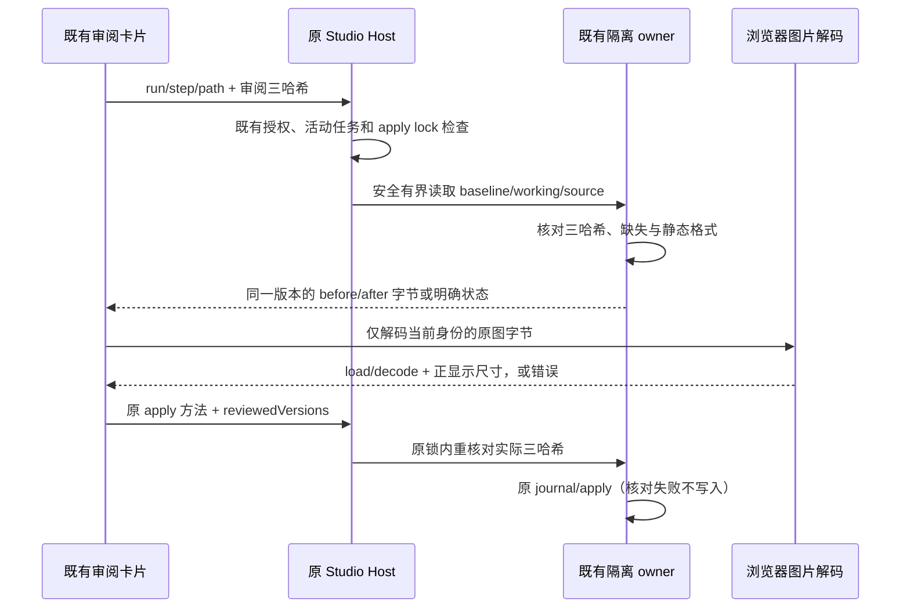

<!-- SPDX-License-Identifier: Apache-2.0 -->

# 工作区精确快照图片对比

2026-10-08。基线 main `34078257b5d9d1e78c40308b34dab8ff45565156`（v0.10.0）。独立实现，复用既有 Studio 差异审阅、隔离 baseline/working、Host owner 与 hash/journal 应用；不复制参考项目代码，不合并、定版或发布。

## 产品规则

- 在现有 `StudioWorkspaceReviewCard` 展开静态 PNG/JPEG 时并排显示本次隔离修改的旧图与新图，标明侧别、文件路径、浏览器解码后的显示尺寸和原始字节数。原图字节不重编码、不上传外部服务。默认适配视窗，也可按浏览器原始显示尺寸查看；容器留白与实际图像边界分开。
- 第一版仅支持 `.png`、`.jpg`、`.jpeg` 的相符字节格式。拒绝 APNG、MPO/多图片 JPEG、其他格式、无效结构和过大文件；浏览器解码失败与非正尺寸明确报错。`img.complete` 不作为可显示证明，须实际 load/decode 成功且自然宽高为正。自然尺寸是浏览器显示尺寸，不能称作 JPEG 编码栅格尺寸。
- 新增旧侧为 null，删除新侧为 null；UI 用“此版本不存在”表达，不能把缺失、失败或不支持当作空白成功。源哈希改变、隔离产物改变、基线损坏或应存在的文件缺失时拒绝该请求；保留旧审阅身份，不静默改读新字节。
- 不新增滑杆、叠加、差异评分、区域批注、SVG/图表编译、视频/动画或图像编辑器。文本 diff、行内批注、逐文件/批量应用及已有数据格式保持兼容。图片版本不允许伪造文本行号。

## 单一所有者与接口

Host 从已授权的 run/step 工作区记录解析物理 baseline/working/source，调用方仅提交相对 path 和 `StudioReviewFileVersion` 的 beforeHash/afterHash/sourceHash。同名不同目录、不同 Host、不同运行分别归属自己的记录；拒绝穿越、危险别名、symlink/junction/hardlink 和凭据路径。不接受任意 live path、cwd 或 URL。

保留 12 个公开方法：

- `workspaceChanges({runId, stepId, imagePreview?: {path, version}})`：普通请求返回现有列表；图片请求只返回该路径的一条变更及可选 `imagePreview`。图片结果携带同一 version，以及 before/after 单侧的原始 base64/媒体类型/字节数或明确不支持状态。二进制变更投影也提供真实 version，不增加持久图片记录。
- 已授权远端 peer 通过既有 `agentWorkspaceChanges` 透传同一可选请求；原 Host 校验其隔离元数据。旧 Host 未提供图片数据时明确显示能力不可用，绝不退化为本机读取路径。
- `applyWorkspaceChanges` 与既有 peer 应用方法增加可选 `reviewedVersions: [{path, version}]`。图片 UI 的逐文件与批量应用带上已审阅版本；Host 在原 apply lock 下用实际读取的 baseline/working/source 哈希核对，然后才创建 journal/staging。任一已审阅版本过期时零写入，保留源项目。旧调用方省略此字段时保留原应用行为。

图片读取仍使用已有只读服务/RPC，不进 command receipt 或 SQLite。domain 负责格式、版本及请求边界；app 负责既有授权、活动任务与应用锁；workspace adapter 负责安全、有界文件读取与哈希验证；UI 只持有暂时读取/解码状态。文件字节、base64、路径中的凭据与用户 profile 不落日志或持久缓存。

单侧图片读取上限为 25 MiB，与 `readBinaryPreview` / `readBinaryFilePreview` 默认及上限一致，不误用 `readMediaPreview` 的 4/8 MiB。现有隔离复制的 16 MiB 单文件、256 MiB 总量规则保持独立且不扩大；读取已拥有的图片快照可使用明确的 25 MiB 边界。读取在分配前限制大小，读取期间增长/替换须拒绝。

压缩字节数不能约束解码像素。2026-10-08 复核补充局部静态图片预览预算：每侧声明宽高最多 16384 像素、乘积最多 48,000,000 像素（含边界）。像素值与既有背景图接纳值一致，但这里从 PNG IHDR / 每个 JPEG SOF 头在 Host 结构检查时判断，不能等浏览器 decode 后再拒绝；边长另外限制极端长条图。常量归属本预览 domain，不修改全局背景图、模型转码或文件预算。超限返回 `unsupported` / `display-budget`，不返回该侧 base64，UI 明确显示上限且不创建该侧 img。约束是局部声明尺寸接纳规则，不宣称界定浏览器全部内存开销，不引入完整解码器、重编码或缩图。

## UI 请求与恢复

- 控制器按 service 实例、run、step、path 和三哈希创建，复用已有 `UiAsyncActionGate` 拒绝迟到响应。切文件、切运行或切 Host 时立即呈现新身份的 loading/error，不能短暂显示另一身份的旧图。关闭后迟到读取/解码不写状态；重复打开重新核验，不自动应用。
- 图片只在展开时读取，不随 timeline 刷新传全图；没有跨 Host 或 path 的全局图片缓存。关闭/切换释放 UI 对字节及解码 DOM 的引用。
- 白/黑主题采用现有语义颜色、紧凑文字、细边界与现有按钮。图片色彩属于原始内容；不改变产品主题或额外校正 ICC。

## 验收

合成图片测试覆盖两侧不同字节、新增/删除单侧、同名不同目录/Host、三哈希变化、损坏/缺失基线、越界及 symlink/hardlink、25 MiB 限额与读取竞态、正常/恰好边界/超界声明尺寸、极小文件声明极端 PNG/JPEG 尺寸时在 Host 拒绝且浏览器没有对应 img、格式/动画拒绝、浏览器解码失败与 broken complete、切文件/运行/Host迟到响应、反复开关、逐文件和批量应用前重新核验。真实浏览器验证并排侧别、自然显示尺寸、原图字节与容器/图像边界；不使用真实模型、用户 profile 或凭据。执行 fmt、lint、typecheck、完整/changed 架构、provenance 与相关旧工作区/审阅回归，记录通过、失败、跳过及未运行范围，由集成 owner 统一全量回归。
