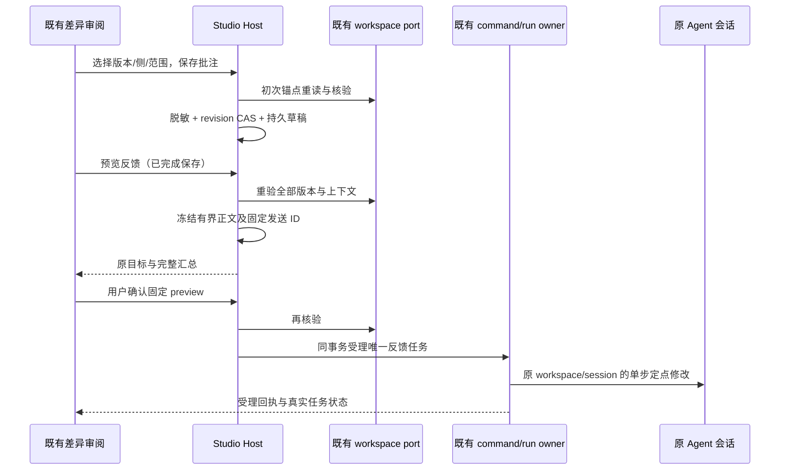

<!-- SPDX-License-Identifier: Apache-2.0 -->

# 工作区差异行内批注与原 Agent 反馈闭环

2026-10-07。基线为最新 main `a8f83c98baacefe18208ebfde136b3d0d3a1fdfd`，包含 v0.9.0 与后续网站提交。本项只扩展既有 Studio 运行历史差异审阅，不新增运行框架、手机、终端历史、额度或网站功能。Paseo PR #530 仅作为产品概念参考，不复制其实现。

## 产品与数据规则

- 用户在既有 DiffViewer 的旧／新侧选择单行或同侧连续上下文，添加、编辑、删除行内批注。新增文件只允许新侧，删除文件只允许旧侧；二进制不新增版本附件；二进制、缺失预览、无法证明版本的文件不得伪造行号或批注锚点。
- Host 从已有 run/step 工作区收据解析项目、物理工作区及原 Agent，拒绝 Renderer 提交绝对 cwd、会话或内核。批注绑定业务 run/step、规范化项目、文件相对路径、旧／新侧、行范围、基线／工作副本／源项目的真实 SHA-256 与有界上下文。全文变化即过期，不搜索类似文本或自动平移旧锚点；明确重选才能换锚点，过期批注仍保留。
- 草稿属于当前 Host 数据库的 `workspace-review-draft` 行，按业务 run/step 隔离，时间线只投影当前 target 的记录。已有 SQLite schema 与旧配置、正文／接力草稿保持；没有记录就是空草稿，未知草稿格式禁止覆盖。Renderer 只保留编辑中的乐观覆盖与请求状态。未知 Host schema 禁止覆盖；已保存批注的正文编辑／删除不要求原会话仍可用，预览及发送仍须重新核验原身份。
- 现有 `codeCommentContext`、`useCodeCommentContexts` 与 `codeCommentPreviewStore` 仍属于原生聊天 composer，旧附件格式与恢复保持；不清空、不自动迁移，也不把没有版本／run 归属的旧附件当成定点回改授权。新的 Studio 差异批注复用 DiffViewer 可选槽和共享脱敏，避免经当前可见聊天的全局事件误投另一个 Agent。
- 编辑中的未受理文字使用有版本的 UI 编辑缓存，以 Host 生成的草稿 UUID、项目/run/step/target 绑定；只保存脱敏后的待保存文字与固定编辑请求，不保存另一份 accepted queue，不改旧聊天／接力存储。明确保存或预览时同步 Host；界面显示未保存／保存中／失败及重试，未完成保存不能确认发送。确认取消、连接失败、传输 ACK 丢失、重载或切换任务不清空批注。并发窗口的本机缓存与 Host 草稿各自按 revision 检查，冲突不静默覆盖。丢 ACK 的旧请求回执若带有另一窗口后续保存的更高 revision，必须明确重新读取后才能再保存较新文字，不能自动采用那个版本覆盖对方。原批注被删除时，未受理的本机文字单独显示供复制／明确丢弃；界面同时可查看 Host 已保存正文。删除／丢弃编辑是用户明确操作；本机缓存和 Host 同时不可写时不得声称已保存。
- 原 Agent 身份由已有 turn 的 kernel/conversation/workspace 与对应 session 条目取得并冻结。后续 turn 补记其 nativeSessionId；旧 turn 可通过原 conversationId + workspace 的既有 session 条目续接，缺失或会话身份更替明确拒绝，不自动创建替代会话。配置权限取原 turn 与当前配置的更严格一方。
- 每次“预览反馈”由 Host 重读文件并核验锚点，生成有界汇总和固定 preview/发送 command ID；正文只包含用户批注、所选文件上下文及来源身份，不读 reasoning、工具载荷或会话全文。已知凭据路径拒绝，用户文本与代码上下文复用既有共享脱敏函数，在持久化及最终提交前处理；原始凭据不能进入 command receipt。
- 用户确认的完整汇总被冻结。确认前再核验文件／项目／Agent／原会话身份，受理时复用已有命令回执与 run/active 队列，在同一事务关联反馈任务；不会重跑整个群／工作流或派发其他成员。执行仍由原 owner/lease、取消和原生 adapter 管理，并使用原隔离目录与原 session。ACK 是受理，界面不把它显示为 Agent 已完成修改。
- 已接受的发送重试复用持久的同一 command ID，先查原回执；文件后来改变不能让丢 ACK 的重试创建另一任务。取消／失败／中断沿用原 run 状态与显式恢复策略，草稿和发送记录保留；结果不确定时不得自动另发。任务切换或旧请求的迟到响应不能导航或修改新任务。
- 远端版本证明、原会话或连接不可用时拒绝发送并保留草稿，既有远端 diff/apply 不变；不以本地绝对路径或新会话替代。
- 文本每批注最多 1,000 字符、最多 20 条，所选范围最多 20 行、上下文最多 2,400 字符，汇总最多 24,000 字符。超过限制明确报错，不静默截断用户批注。源文件与隔离文件都不由批注写入；应用仍走现有 hash/journal/冲突边界。

2026-10-08：图片审阅扩展为二进制提供可核验版本（见 `knorvia-workspace-image-compare.md`），仍禁止把二进制版本用于文本行批注。

## 所有者、接口与顺序

`StudioRuntimeService.command` 新增 `workspace-review` 类型（save-comment/delete-comment/prepare/send）；仍保留既有 12 个公开方法。`StudioCommandResult` 可带最新草稿投影，`StudioTimeline.reviewDrafts` 为可选字段，旧客户端／数据库可继续使用。`StudioWorkspaceChange.version` 为可选真实版本，缺失时不能创建可发送锚点。

domain 负责边界、脱敏、锚点比较与汇总；app 负责 scope、revision、命令受理和原会话绑定；workspace adapter 只扩展已有扫描的版本证据。反馈是已有 run 的一种单步执行输入，turnExecutor 复用原目录和 session，不引入第二个 accepted queue。UI hook／controller 通过同一服务读写，DiffViewer 增加可选选择／annotation 槽；既有使用方式和应用操作保持。

现有 DiffViewer 的适用来源／MIT 部分声明保留，只更新第三方清单的当前输入哈希；上游及复制快照摘要不追改。新增自有文件声明 Apache-2.0，不声称完成原组件的独立替换。

## 验收

- 非 Git 工作区、新增／修改／删除、旧新侧及多行上下文；文件变化／被删除／源项目变化均不悄悄错位，二进制和未知版本拒绝。
- 旧数据库无草稿、重载、两个任务／项目／窗口隔离；revision 冲突、保存失败与确认取消不丢已保存批注。
- 凭据路径、文本中的 token／私钥、代码上下文秘密均不落草稿、回执或发送附件；推理与工具记录不参与汇总。
- 单个原成员／节点、原目录、原 session；当前定义改变、会话 ID 改变、项目运行中／apply 锁、远端能力缺失失败关闭。
- ACK 丢失、重复确认、发送失败、取消、重启恢复／显式重试、切换任务与迟到 ACK：原命令不重复受理，不误投另一会话，草稿保留。
- 真实组件浏览器场景验证行选择、编辑保存、重载、过期、确认取消、一次发送和原目标；无真实模型、账户或付费请求。
- 根 fmt/provenance/lint/typecheck、完整与 changed 架构、相关离线回归；中文提交、推送草稿 PR，集成 owner 负责合并与发布。
